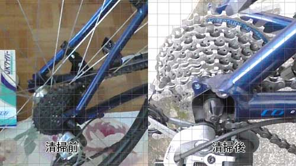

まずはじめに。勢いで掃除を始めてしまったので、ちゃんとしたビフォーアフターな写真はありませんのであしからず。

一応ウェアラブルカメラのHX-A500で掃除する様子を撮影はしていたので、それが参考になるかなと思います。それにしても、初めての分解でかなりグダってしまい、掃除は3時間くらいかかりました。更にブラシを使ってゴシゴシやってる様子がカメラがブレブレで見ていたら気持ち悪くなるので、YouTubeの動画は盛大にカットしたダイジェスト版となっております。

<iframe width="480" height="270" src="//www.youtube.com/embed/A5qUs15_9Gc" allowfullscreen></iframe>

分解自体は比較的簡単にできるのですが、掃除し終わった後の組み直し、特にチェーンをかけ直すのに非常に苦労しました。チェーンを外す場合は、どこをどう通っているかちゃんと控えておいた方がいいと思います。

## 準備しておくととても便利な使い捨てアイテムたち

まずは手袋です。

<a class="amazonjs_indicator_title" href="#">クイン ワーキングクイン ニトリル手袋 （パウダーフリー） L  50枚入り</a>

これがないと掃除どころではありません。油でベトベトになるので洗って再利用はムリですので、使い捨ての手袋が良いと思います。素手は油でべとべとになるのと、油落としのディグリーザーで手が荒れるんじゃないかと思うので、素直にこれを使っておくといいです。

次に拭くものですが、こちらも使い捨てできるものがいいです。おすすめはJKワイパーです。

<a class="amazonjs_indicator_title" href="#">JKワイパー 150-S 62301</a>

ティッシュのような感覚で使えて、それでいて紙質がしっかりしているのでギアの尖った部分に引っかかって簡単に破れたりしないのがいいところです。

似たようなものにキムタオルがありますが、自転車のギア掃除に関しては向かないと思います。すぐにボロボロになってしまいますし、厚みがあるのでギアの細かい部分まで拭くことができません。

この2つは自転車を分解せずに掃除する際にも必須アイテムです。自転車掃除以外にも使えるので、お家に1つ置いておくと何かと便利だと思います。

## 油汚れを掃除する（チェーン・ギア編）

油汚れは普通に拭いても落ちないので、ディグリーザーを使います。

<a class="amazonjs_indicator_title" href="#">FINISH LINE(フィニッシュライン) エコテック2 マルチディグリーザ- 600ml アルミボトル TOS08002</a>

私は100均で買ってきたアルミパッドにディグリーザーを移して、そこにギアやチェーンをつけながら洗いました。

スプレータイプのものもあるので、どちらを選ぶかは好みの問題だと思います。ただ、しっかりキレイにしようと思ったら分解しての掃除が必須だと思います。スプレーで組み上がった状態のままの掃除は、それはそれで面倒くさいです。

実はチェーンだけは分解せずに洗ったことがあるのですが、分解する手間はありませんが、洗いにくかったりボディにディグリーザーがつかないように気を使ったりで、それはそれで非常に面倒臭かったです。

分解するしないに関わらず、後輪ギア掃除用のブラシはあった方がいいと思います。後輪ギアは外側の1枚か2枚くらいが個別に分解可能なだけで、残りのギアはひとかたまりになっています。毛足の長いブラシと鎌のような形状のプラスチックで泥汚れをかき出すしかありません。

<a class="amazonjs_indicator_title" href="#">AZ(エーゼット) ギアクリーニングブラシセット KD053</a>

### 後輪ギア（スプロケット）の分解

後輪ギアを分解するには専用の工具が必要になります。

<a class="amazonjs_indicator_title" href="#">バイクハンド YC-501A チェーン式フリーホイール外し YC-501A</a>

<a class="amazonjs_indicator_title" href="#">SHIMANO(シマノ) TL-LR15 Y120092300 ロックリング締付け工具</a>

私はロックリング締め付け工具を買いましたが、取っ手と一体になったものもあるので、それを使う方が便利かもしれません。ロックリング締め付け工具の場合、別途モンキーレンチが必要です。

ロックリングを取り外すにはそれなりの力がいるのでちょっと大変でした。

### チェーンの分解

チェーンを分解する前に、自分の自転車のチェーンがミッシングリンクを使っているか確認しましょう。

<a class="amazonjs_indicator_title" href="#">KMC 8スピード用ミッシングリンク CL571R 2セット入 シルバー</a>

チェーンをじっくり観察して、チェーンに上記のような部品があったら取り外しは非常に簡単です。油で滑ってやりにくいかもしれませんが、手だけで取り外すことができます。私のクロスバイクは購入したお店のサービスなのかは知りませんが、最初からミッシングリンクだったのでありがたかったです。

チェーンを分解する前に、必ずチェーンがどこをどう通って繋がっているのかメモしておきましょう。何も考えずに外すと私のように泣きたくなります。（掃除時間の半分はチェーンのつなぎ方で迷っていたといっても過言ではありません）

ちなみに、チェーンを繋いだまま掃除するための道具があります。

<a class="amazonjs_indicator_title" href="#">自転車用チェーンクリーナー（チェーン洗浄器具） EEA-YW0536</a>

一度これを使って掃除しましたが、チェーンだけなら綺麗になります。が、この道具は3千円するやつはどうか分かりませんが、千円しないやつの作りはかなりひどいです。プラスチックの成形がなっていなかくて、しかもすぐに壊れるので使うなら使い捨てだと思って利用した方がいいでしょう。

ディグリーザーを使って油汚れを落とした後は、しっかりと注油しましょう。（もちろん組み直した後でですが）

<a class="amazonjs_indicator_title" href="#">FINISH LINE(フィニッシュライン) テフロン プラス ルーブ ドライ 120ml プラボトル TOS07001</a>

## ボディの洗浄

大変なのは油で汚れたチェーンとギアの掃除であって、他はそんなに大変ではないと思います。

私はチェーンとギアの掃除で力尽きて、ボディやタイヤの掃除はかなり手を抜きました。雑巾にバイクウォッシュという洗剤を吹き付けて軽く拭きあげて終わりにしました。

<a class="amazonjs_indicator_title" href="#">FINISH LINE(フィニッシュライン) バイク ウォッシュ 1リットル TOS08100</a>

匂いがなかなか独特で慣れませんが、チェーンから飛び散った油汚れ程度ならささっと綺麗にできます。面倒臭かったらJKワイパーで拭きあげるだけでも別にいいのではないかとも思います。

## 分解して掃除して初めて見た後輪のギアの銀色の輝き

分解しての掃除はなかなか大変でしたが、自転車に乗り始めて初めて後輪ギアが銀色に輝くのを見たような気がします。比較写真で分かる通り、掃除前は本当に真っ黒でしたので・・・。

こう輝いていると分解して掃除したかいがあったなぁと思えます。

  