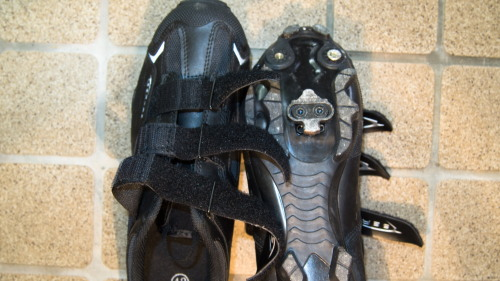

ビンディングペダルに付け替えたのは随分前で、既に導入してから1年くらいたっています。ビンディングというのは、スキーの板などで使われている機構で、自転車の場合<em>ペダルと靴をガッチリと固定</em>するためのものです。

何がいいのかというと、ペダルと靴が固定されるため、<em>足を引く力も自転車の推力にできる</em>ところです。通常ペダルをこぐ際には、ペダルを踏む力でしか自転車は走りません。ペダルと靴が固定されれば、踏む力だけではなく、足を引っ張り上げる力もペダルを回す力として使うことができるのです。

引き足を使えること以外にも、<em>ペダルを高速で回転させても足が吹っ飛ばない</em>というのもメリットです。普通の靴だと1分間に100回転くらいのスピードでこぐとペダルから足が滑り落ちてしまいますが、ビンディングペダルにすることでさらなる高速回転も可能です。

もっともメリットばかりではありません。ペダルと靴が固定されているので、<strong>とっさの時に地面に足をつくことができません</strong>。突然目の前に猫が飛び出てきて急ブレーキで停止→そのままコケるという未来が待っているわけです。これは怖いところですね。慣れるまでは立ちごけを経験しますし、<strong>慣れていようが急停止するとこけます</strong>。

## ビンディングに宏観するために必要なもの

ペダル交換のためにはビンディング用のペダル、ビンディング用のシューズ、そしてペダルレンチが必要になります。後はグリスも必要でしょう。

### ビンディングペダル

ビンディングペダルは、いろいろとタイプがありますが、主なものはSPDとSPD-SLという形式があります。私は<em>SPD形式</em>にしました。SPD-SLだと、歩くのには不向きということだったので。

<a href="http://www.amazon.co.jp/exec/obidos/ASIN/B005EGDV5G/illusionspace-22/ref=nosim/" rel="nofollow" target="_blank">SHIMANO(シマノ) PD-M530 [EPDM530] SPDクリート付ペダル ブラック</a>

posted with <a href="http://kaereba.com" rel="nofollow" target="_blank">カエレバ</a>

 SHIMANO(シマノ)     

<a href="http://www.amazon.co.jp/gp/search?keywords=PD-M530%20EPDM530&#038;__mk_ja_JP=%83J%83%5E%83J%83i&#038;tag=illusionspace-22" rel="nofollow" target="_blank" title="アマゾン" >Amazonで購入</a>

<a href="http://hb.afl.rakuten.co.jp/hgc/0e95387f.f2aef20d.0e953880.25e412bd/?pc=http%3A%2F%2Fsearch.rakuten.co.jp%2Fsearch%2Fmall%2FPD-M530%2520EPDM530%2F-%2Ff.1-p.1-s.1-sf.0-st.A-v.2%3Fx%3D0%26scid%3Daf_ich_link_urltxt%26m%3Dhttp%3A%2F%2Fm.rakuten.co.jp%2F" rel="nofollow" target="_blank" title="楽天市場" >楽天市場で購入</a>

### シューズ

ペダルに付属しているクリートを取り付けるための靴です。MTB用を購入しました。こちらも歩くことを考えてのことです。

<a href="http://www.amazon.co.jp/exec/obidos/ASIN/B004CLYKAE/illusionspace-22/ref=nosim/" rel="nofollow" target="_blank">SERFAS(サーファス) MTBシューズ  サドルバック 42 ブラック 160151</a>

posted with <a href="http://kaereba.com" rel="nofollow" target="_blank">カエレバ</a>

 SERFAS(サーファス)     

<a href="http://www.amazon.co.jp/gp/search?keywords=SERFAS%81%40MTB%83V%83%85%81%5B%83Y&#038;__mk_ja_JP=%83J%83%5E%83J%83i&#038;tag=illusionspace-22" rel="nofollow" target="_blank" title="アマゾン" >Amazonで購入</a>

<a href="http://hb.afl.rakuten.co.jp/hgc/0e95387f.f2aef20d.0e953880.25e412bd/?pc=http%3A%2F%2Fsearch.rakuten.co.jp%2Fsearch%2Fmall%2FSERFAS%25E3%2580%2580MTB%25E3%2582%25B7%25E3%2583%25A5%25E3%2583%25BC%25E3%2582%25BA%2F-%2Ff.1-p.1-s.1-sf.0-st.A-v.2%3Fx%3D0%26scid%3Daf_ich_link_urltxt%26m%3Dhttp%3A%2F%2Fm.rakuten.co.jp%2F" rel="nofollow" target="_blank" title="楽天市場" >楽天市場で購入</a>

### ペダルレンチとグリス

現在ついているペダルを取り外し、新たにビンディングペダsるを取り付けるためにはペダルレンチが必要です。<em>ペダルの取り外しにはかなり力がいる</em>ので、専用のレンチを購入するか、素直に自転車屋さんに取り付けてもらうのがよいでしょう。

自分で取り付けるなら、一緒にグリスも購入しましょう。新しく買ったペダルと一生添い遂げるなら別になくてもいいかもしれませんが、ペダルが取り外せなくなるかもしれません。

<a class="amazonjs_indicator_title" href="#">ACOR(エイカー) ペダルスパナ ATL-2613</a>

<a class="amazonjs_indicator_title" href="#">PARKTOOL(パークツール) ポリリューブ1000 113g・チューブ入 PPL-1</a>

## ビンディング導入にあたって注意点

### ペダルの取り外しは怪我しないよう気をつける

ペダルを取り外す際は<em>かなりの力が必要</em>です。<em>全体重をかけてようやく外れるレベル</em>の固さです。全体重をかけて思いっきり回した結果、<em>勢い余って手を怪我しないように</em>気をつけましょう。

### 自転車にペダルを取り付ける前にビンディングシューズを固定しない

靴とペダルを固定したらどうなるのかなと、興味本位で靴にクリートをつけてペダルに固定するのはやめましょう。ビンディングを外すには<em>ペダルが自転車に取り付けられていないとまず無理</em>です。私のように<em>ペダルに靴がくっついた状態で取り付けるはめになります</em>。ひねれば外れるんだろと安易につけたら、手の力では外すことができずに泣きかけました・・・。

### 金具の固定力はまず最弱から

ビンディングの金具の固さを調整できますが、まずは<em>一番軽い状態に調整</em>することをオススメします。慣れるまではビンディングがすぐに取り外せる状態にしておいた方がいいと思います。

ただあまりに軽すぎると想定していないところで外れてしまい、それはそれで危険です。慣れたら適切な固さに調整しなおしましょう。

### 停止状態でしっかり付け外しの練習をする

室内がベストだと思いますが、付け外しの練習はしっかりしましょう。決していきなり走り出さないでください。まずは停止した状態で外す練習をしっかりしましょう。

停止状態で外せるようになっても、実際に走りながら外すのはまた感覚が違います。せめて停止状態でスムーズに外せるようになるまでは練習して感覚をつかんでください。

### 実際に乗る際は利き足ではない方だけ固定する

慣れるまでは片足だけで練習した方が無難だと思います。両方固定するとまずこけます。

私の利き足は右足ですが、最初は左のペダルだけビンディングにして、利き足のペダルはフラットペダルのまま練習しました。両方のペダルをビンディングに付け替えてしまっていたら、利き足の靴だけクリートをつけずに練習するのが良いでしょう。

### 横着せずに外す

一時停止、交差点、信号待ちなど、<strong>止まる際には早めにビンディングをリリース</strong>してペダルから靴を離しましょう。ビンディングの付け外しが面倒だし、もうすぐ信号変わりそうだからとつけたままにしておくのは危険です。停止する可能性のある場所では事前にビンディングを外す心構えが大事です。

何が飛び出してくるか分かりません。ビンディングを外さずに停止すると間違いなくこけます。もし車が来ていたら死にます。人が飛び出してきたら相手にケガをさせます。<strong>横着しないでください</strong>。

### ペダルから靴を外したらクリートのない位置でペダルを踏む

私はいつもビンディングから靴を外したら、停止するまでの間は土踏まずのあたりでペダルをこいで、実際に停止する位置まで進みます。

というのも、いったんビンディングを外して普通にこいでしまうと、実際に止まろうとした際に意図せず金具が引っかかってこけそうになったことが何度かあったのです。それ以来、<em>確実に地面に足をつくまでは油断しない</em>ように気をつけるようになりました。

### MBT用シューズでも普通の靴に比べると歩きにくい

私の購入したシューズがそういうタイプなだけなのかもしれませんが、<em>普通の靴に比べると確実に歩きにくいです</em>。靴底が硬くてツルツルしている感じで、まるでスパイクシューズを履いているかのような感覚です。

ツルツルしたタイル貼りの床では<em>滑りやすそう</em>な気がしますし、歩くときに<em>かなり大きな音が出ます</em>。静かな図書館で歩くのがはばかれるほどには歩く音がやかましいです。

## 結局のところ買うべきなのか

ロングライドの際には安定して走れますし、フラットペダルと比較してペダルを<em>こぐのが楽になります</em>。スピードも出しやすくなったように思います。

ただ、街乗りなど<em>頻繁にペダルから足を離さなければならない状況が多い環境では、デメリットの方が目立つように思います</em>。特に<em>急停止できないのが致命的</em>です。街乗りがメインだったり、交通量の多い場所をよく走るという人は、メリットよりデメリットの方が大きく感じるため向かないかもしれません。

私の場合はスピードを出したいからというより、<em>せっかくスポーツタイプの自転車を買ったのだしちょっと試してみたい</em>という理由からビンディングペダルを買いました。ちょっとカスタマイズしたいお年ごろだったんです。そういう意味では「自転車に乗ってるんだぜ」という気分が味わえていますし、足のポジションを気にする必要がなく、ペダルを回すことだけに集中できて楽でいいです。

買うかどうかは、スピードが出るらしいからとか、楽になりそうだからという理由で安易に決めない方がいいと思います。危険な場面が増えるということを理解した上で、<em>それでも試してみたいかどうか</em>がポイントとなるでしょう。

一番いいのは自転車専門店で相談しながら導入することだと思います。私の場合はお店が遠いし、面倒臭かったので通販で済ませてしまいましたけど・・・。

危険なものだということを充分に認識して、安全に気をつけてくださいね。安全に気を配れば、自転車ライフを楽しくしてくれるアイテムであると思います。

  