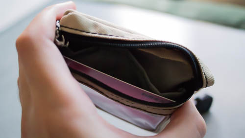
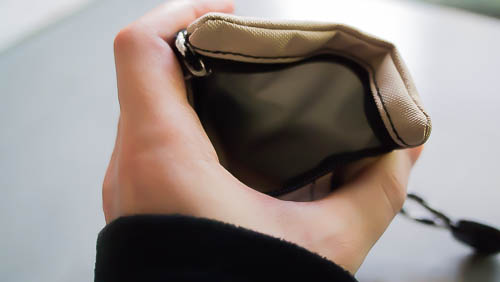

財布は長財布派のGenです、こんにちは。

長財布を使っているのは、お金持ちの人は大体長財布を使っているからという理由もありますが、単に長財布を使った方が<em>お札が折れ曲がらないから</em>です。
どうせ使うならお札はきれいな方がいいじゃないですか。
そのためお札は折れ目がついていたり、よれよれになっているものから優先的に使って、財布の中はキレイなお札で埋めたいんですよね。

ただ長財布だと、財布を持ち運ぶのに気を使います。
歩きの場合はズボンの尻ポケットに入れることができるのでまだなんとかなりますが、自転車に乗るときに非常に困るのです。
ズボンのポケットに入れていては確実に途中で落ちます。
最悪落としたことにすら気づかない可能性もあります。

サドルバッグに入れておくことも考えられますが、長財布だと大きいので入れるのは難しいかもしれません。
私の場合は無理でした・・・。

自転車でコンビニまで行って、ちょっとしたものを買うだけというのに、わざわざカバンを用意して財布を持っていくのも仰々しい気がします。
だったら自転車用に小銭入れを用意すれば解決するのではと思い、このチャムスキーコインケースという財布を購入しました。

## カード収納可能

こんな感じでカードが入ります。
仕切りがついているので、カードの後ろにお札を入れたりもできます。
お札を入れる場合は、さすがに4つ折りにしないと入りません。

小銭入れ部分です。
開け口が広いので、普段私が使っている長財布より中の小銭を取り出しやすかったです。

## 実際に使ってみて

自転車の鍵をこの財布に取り付けることができるので、サイクリングに持っていくのにちょうどよいです。

ただ自転車で移動する際に、財布の中身を入れ替える運用方法は非常に面倒くさいです。
小銭だけを常にこの財布に入れておくというような使い方がいいかもしれません。
  