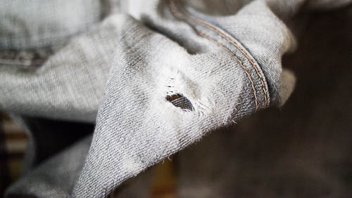

自転車で走るだけであればレーパンなどを使いますが、買い物に出かける際はそうはいきません。

今までインナーパンツを履いて、その上にジーパンを装着して出かけていましたが、ついに穴が開いてしまいました。ケイデンス高めで乗るせいで、股の内側の生地へのダメージがあっという間に蓄積されていってしまうんですよね。

さて、これから買い物に自転車で出かける際はどうしたらいいのかと悩むわけです。自転車用のボトムスを購入するしかないかなとも思ったのですが、自転車用とうたわれたズボンは高い。そもそも実物をどこに探しに行けばいいのかもよく分かりません。

どうしたものかと考えましたが、結局ユニクロで買えばいいかという安直な解決策に落ち着きました。

## スムーズに足が動かせて、しかも防風性能つき

見た目はジーンズそのものですが、生地は伸縮性に富んでおり、ペダリングがスムーズに行えます。今まで普通のジーンズで漕いでいましたが、ケイデンスが2割増しな感じです（当方思い込み）。

伸縮性がいいので、インナーパンツを下に履いても違和感ありません。写真は下にパッド付きのインナーパンツを履いています。

裾を絞る機能はさすがについていないので、別途ズボンクリップなどを使って裾を絞る必要があります。（裾がギアなどに引っかかってもいいなら要りませんが・・・）

<iframe style="width:120px;height:240px;" marginwidth="0" marginheight="0" scrolling="no" frameborder="0" src="//rcm-fe.amazon-adsystem.com/e/cm?lt1=_blank&bc1=000000&IS2=1&bg1=FFFFFF&fc1=000000&lc1=0000FF&t=illusionspace-22&language=ja_JP&o=9&p=8&l=as4&m=amazon&f=ifr&ref=as_ss_li_til&asins=B003RWSHE4&linkId=f07734b135b37126beb6c77835922a57"></iframe>

防風性能つきでかなり暖かく感じます。むしろ汗かいて暑いくらいでした。ズボンクリップで絞ったくるぶしから先との温度差がかなり顕著で、足首の寒さがが際立つくらいの防風性能をみせてくれます。

そしてカジュアルに履けるというのが最大のメリットですね。

## 手に入りやすいのがいい

ユニクロにいけば豊富なサイズを試着しながら選べますし、値段もお手頃なのがいいですね。

自転車用のものと比較すると、収納が少ない（普通のジーパンと同じポケットしかない）のと、股の部分が強化されているわけではないのが劣るところでしょうか。

使っていればそのうち股の部分が破けるのでしょうが、これくらいの値段なら気軽に買い換えられます。

自転車でちょっとお出かけ、お店に気軽に立ち寄れるようなズボンを探しているなら、とりあえずユニクロに行けばいいのではないかなと思いました。
