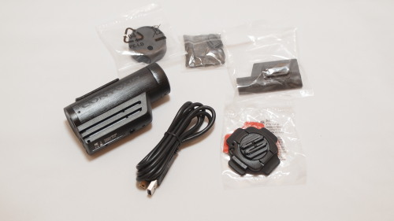
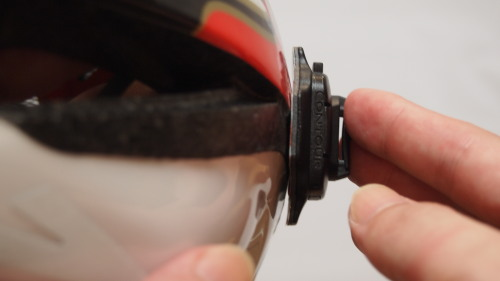

自転車で走るのは、バッタが突撃してきたり、微妙な段差でバランスを崩しそうになったり、近くを走る車が怖かったりといろいろ大変ではありますが、風を切る感覚が非常に楽しいです。普段であれば車で移動するような距離を自転車で走ると、普段堪能できない風景を楽しむことができます。

慣れてくると、ペダルをビンディングペダルに変えてみたり、サドルポジションなどを探りながら、より快適走りを追求したくなってきます。そうやっていると、次第に<strong>この走っている眺めを撮影出来たら面白いんじゃないだろうか</strong>と思うようになりました。

車載動画を見かけますが、あれを自分でやってみるのもおもしろいのではないかと。その閃きから今回は<em>衝動買いに近い形</em>で、Contour ROAMというカメラを買ってしまいました。

## カメラ本体の付属品

私が買ったContour ROAMというのは、Contour社の製品の中で<em>一番安いエントリーモデルのカメラ</em>です。本体には撮影スイッチだけがついていて、ややこしい設定が一切不要なとてもシンプルな作りです。特徴として、<em>豊富なマウント</em>（カメラを取り付ける土台）と、<em>堅牢性</em>（頑丈、防水）がウリということです。

カメラ本体には、回転式フラットサーフェイスマウントというマウントが標準で入っています。粘着テープで対象に貼り付けるマウントで、バイクのフルフェイスヘルメットなどなら取り付けが可能だと思います。

自転車のヘルメットには接着面が足らないため、取り付けるのは難しいでしょう。こんな状態で取り付けて走ると、いくら頑丈とはいえすぐに落ちてしまい撮影どころではなくなってしまうでしょう。自転車のヘルメットに取り付けるためには、別途自転車ヘルメット用のマウントを購入した方がいいと思います。

### こちらの記事もチェック

<a href="https://wantit.gcreate.jp/contour_roam_mount/" title="Contour ROAMの自転車用マウントを使って実際に撮影してみた">Contour ROAMの自転車用マウントを使って実際に撮影してみた</a>

## 記録はマイクロSDカードで

記録メディアは<em>マイクロSDカード</em>で、<strong>最大32GBまで対応</strong>。

<a href="https://www.amazon.co.jp/exec/obidos/ASIN/B0056TYX8U/illusionspace-22/ref=nosim/" rel="nofollow" target="_blank">【Amazon.co.jp限定】Transcend microSDHCカード 32GB Class4 (無期限保証) TS32GUSDHC4E (FFP)</a>

posted with <a href="https://kaereba.com" rel="nofollow" target="_blank">カエレバ</a>

 トランセンド・ジャパン     

<a href="https://www.amazon.co.jp/gp/search?keywords=TS32GUSDHC4E&#038;__mk_ja_JP=%83J%83%5E%83J%83i&#038;tag=illusionspace-22" rel="nofollow" target="_blank" title="アマゾン" >Amazonで購入</a>

大体の目安として、初期状態の画質で<em>1時間で4GBくらい</em>になります。

ちなみに、作成される映像ファイルは<em>最大4GBまで</em>で、それ以上のファイルサイズになる場合には自動的に分割処理が行われます。きちんとくっつける編集をしていないので確実なことは言えませんが、おそらく撮影が途切れたりはしていないと思います。

ただ<em>ファイル名には注意が必要</em>です。通常作成されるファイル名は、「<em>File0001.mov</em>」のようになりますが、4GBを超えて作成される続きのファイル名は「<strong>FI010001.mov</strong>」となります。これを知らずに撮影されたファイルを確認していて「おいおい、4GB超えた部分は消えてなくなるのかよ・・・」と焦りました。ファイルの並び順をファイル名順にしているとなかなか気づかないものです。

## 録画しながら充電できるのか？

連続稼働時間は約3時間ほどで、そうなると長時間自転車にのる場合にバッテリーが不足することが考えられます。そこで私はモバイルバッテリーも一緒に購入しました。

<a href="https://www.amazon.co.jp/exec/obidos/ASIN/B00CY6P968/illusionspace-22/ref=nosim/" rel="nofollow" target="_blank">cheero Power Plus 10400mAh DANBOARD Version マルチデバイス対応モバイルバッテリー</a>

posted with <a href="https://kaereba.com" rel="nofollow" target="_blank">カエレバ</a>

 cheero mart     

<a href="https://www.amazon.co.jp/gp/search?keywords=cheero%20Power%20Plus%2010400mAh%20DANBOARD%20Version&#038;__mk_ja_JP=%83J%83%5E%83J%83i&#038;tag=illusionspace-22" rel="nofollow" target="_blank" title="アマゾン" >Amazonで購入</a>

<a href="https://hb.afl.rakuten.co.jp/hgc/0e95387f.f2aef20d.0e953880.25e412bd/?pc=http%3A%2F%2Fsearch.rakuten.co.jp%2Fsearch%2Fmall%2Fcheero%2520Power%2520Plus%252010400mAh%2520DANBOARD%2520Version%2F-%2Ff.1-p.1-s.1-sf.0-st.A-v.2%3Fx%3D0%26scid%3Daf_ich_link_urltxt%26m%3Dhttp%3A%2F%2Fm.rakuten.co.jp%2F" rel="nofollow" target="_blank" title="楽天市場" >楽天市場で購入</a>

巾着袋が付属していて、自転車のハンドル部分にひっかけて、スマホやこのカメラを充電しながら走ることができそうです。

このカメラは、<strong>撮影開始　→　USB接続で充電開始の順番であれば、撮影しながら充電もできました</strong>。（充電ランプが点灯しているだけで、実際は充電できていない可能性もありますが・・・）

USBを先につないで<strong>充電中の状態からでは、録画スイッチを入れても撮影は開始されません</strong>。パソコンにマウントされてしまうからできないのかもしれないと、モバイルバッテリーにつないで録画スイッチを入れることも試してみましたが、録画中のランプはつかず、録画もされませんでした。

旅先で充電しながら使いたい場合には、録画スイッチを先に入れてからUSBケーブルを繋ぐようにすればいいでしょう。実際には充電されていない可能性もあるので、実際に試してみてまたご報告させていただきます。

## シンプルな作りでいて画質はかなりい

ズームも手ぶれ補正も何もついていない。あるのは録画スイッチと、回転するレンズ（撮影される映像の角度を変える）だけという、<em>清々しいまでのシンプルさ</em>です。

今までビデオカメラとは無縁の生活でしたので、一般的なビデオカメラで撮影した映像との画質の差についてはよく分かりませんが、撮影した映像は十分綺麗だと思います。こうやって動く映像をみるとなんか面白くなって、いろいろ撮影してみたくなります。

ただ1点弱点があるとすれば、撮影している映像をライブで確認する手段がないということでしょう。録画を終了して、<em>パソコンに取り込んで映像ファイルを再生してみないと、どんな映像が撮影されているか確認できない</em>・・・。るんるん気分で撮影したのに、再生してみたら上下が反対に映っていた、なんてことが起こりえます。

### こちらの記事もチェック

<a href="https://wantit.gcreate.jp/contour_roam_mount/" title="Contour ROAMの自転車用マウントを使って実際に撮影してみた">Contour ROAMの自転車用マウントを使って実際に撮影してみた</a>

あまりに記事が長くなるので、一緒に購入したマウントと、実際に撮影したサンプル映像は別記事としました。

  