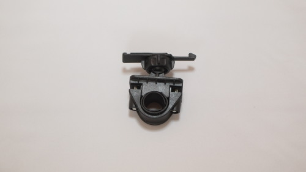

自転車に取り付けて風景を撮影することが目的だったので、さっそくContour ROAMを使って動画を撮影してきました。

## 撮影映像サンプル

初期設定ではハーフHD（1280&#215;720）での撮影となります。

ニコニコ動画とYoutubeに実際に撮影した映像をアップしたので、良ければご覧ください。<em>Youtube版の方が高画質</em>となっています。

<a href="http://www.nicovideo.jp/watch/sm22242980" target="_blank">【ニコニコ動画】【車載動画】Contour ROAMで撮影してみた【自転車】</a>

<iframe width="480" height="270" src="//www.youtube.com/embed/Z1iB6nJx7YQ" allowfullscreen></iframe>

Contour ROAMで撮影してみた（Youtube版）

けっこうきれいな画質で撮影できるので何かと面白いです。

スイッチが大きく、グローブなどをつけていても簡単に操作ができます。というより<em>シンプルな作り</em>をしているので、基本的に撮影スイッチをオンにする以外の操作は不要です。

カメラ自体も軽いのでとてもいい感じですが、<em>撮影しながら映像を確認できない</em>のが最大のネックですね。

## 自転車用ハンドルバーマウント

<a href="http://www.amazon.co.jp/exec/obidos/ASIN/B005OTVU88/illusionspace-22/ref=nosim/" rel="nofollow" target="_blank">【国内正規品】Contour バーマウント #2780</a>

posted with <a href="http://kaereba.com" rel="nofollow" target="_blank">カエレバ</a>

 Contour Inc. 2012-02-16    

<a href="http://www.amazon.co.jp/gp/search?keywords=Contour%20%83o%81%5B%83%7D%83E%83%93%83g&#038;__mk_ja_JP=%83J%83%5E%83J%83i&#038;tag=illusionspace-22" rel="nofollow" target="_blank" title="アマゾン" >Amazonで購入</a>

<a href="http://hb.afl.rakuten.co.jp/hgc/0e95387f.f2aef20d.0e953880.25e412bd/?pc=http%3A%2F%2Fsearch.rakuten.co.jp%2Fsearch%2Fmall%2FContour%2520%25E3%2583%2590%25E3%2583%25BC%25E3%2583%259E%25E3%2582%25A6%25E3%2583%25B3%25E3%2583%2588%2F-%2Ff.1-p.1-s.1-sf.0-st.A-v.2%3Fx%3D0%26scid%3Daf_ich_link_urltxt%26m%3Dhttp%3A%2F%2Fm.rakuten.co.jp%2F" rel="nofollow" target="_blank" title="楽天市場" >楽天市場で購入</a>

自転車などのハンドルバーにとりつけるためのマウントです。バーの太さに合わせて<em>スペーサーをかませて取り付けます</em>。スペーサーを<em>適切な大きさに切って</em>使う必要があります。横着して無理に下側の受け軸にスペーサーをかますと、ネジが締まらなくなります。（軸受けが広がって、垂直にならないせいだと思います）

ガタガタ揺れる路面でも、カメラの基本的な向きは動きません。<em>走行中に勝手にカメラが下にずれていくということはない</em>ので安心です。絶妙な固定力で、走行中にカメラの向きの調整をするのは楽です。ただし<em>撮影されている映像が、ガタガタ揺れてしまうのはどうしようもありません</em>。

バーマウントにとりつけると、カメラについている<em>マイクが役立たず</em>になります。<strong>ガタガタ揺れる音ばかり拾ってしまう</strong>ので、すぐ隣を走る車の音すらよく判別できなくなってしまいます。

## 自転車用ヘルメットマウント

<a href="http://www.amazon.co.jp/exec/obidos/ASIN/B0041ZB0NG/illusionspace-22/ref=nosim/" rel="nofollow" target="_blank">【国内正規品】Contour 自転車ヘルメット用マウント #2550</a>

posted with <a href="http://kaereba.com" rel="nofollow" target="_blank">カエレバ</a>

 Contour Inc. 2010-09-01    

<a href="http://www.amazon.co.jp/gp/search?keywords=%8E%A9%93%5D%8E%D4%83w%83%8B%83%81%83b%83g%97p%83%7D%83E%83%93%83g%20Contour&#038;__mk_ja_JP=%83J%83%5E%83J%83i&#038;tag=illusionspace-22" rel="nofollow" target="_blank" title="アマゾン" >Amazonで購入</a>

<a href="http://hb.afl.rakuten.co.jp/hgc/0e95387f.f2aef20d.0e953880.25e412bd/?pc=http%3A%2F%2Fsearch.rakuten.co.jp%2Fsearch%2Fmall%2F%25E8%2587%25AA%25E8%25BB%25A2%25E8%25BB%258A%25E3%2583%2598%25E3%2583%25AB%25E3%2583%25A1%25E3%2583%2583%25E3%2583%2588%25E7%2594%25A8%25E3%2583%259E%25E3%2582%25A6%25E3%2583%25B3%25E3%2583%2588%2520Contour%2F-%2Ff.1-p.1-s.1-sf.0-st.A-v.2%3Fx%3D0%26scid%3Daf_ich_link_urltxt%26m%3Dhttp%3A%2F%2Fm.rakuten.co.jp%2F" rel="nofollow" target="_blank" title="楽天市場" >楽天市場で購入</a>

取り付けると<strong>ちょんまげをつけている</strong>かのごとき見た目になってしいます。その代わりに、<strong>撮影できる画はダイナミックでいい感じになる</strong>ので悩ましいですね。

自転車用のヘルメットについている穴（切れ込み）を利用して、バンドで締め付けて取り付けます。そのため、取り付け位置はあまり自由にできません。（ヘルメットの横に取り付けたりするのは難しい）

<em>台座の部分がシリコーン</em>のようなものになっているため、ちゃんと押し付けられていれば撮影中の風圧程度は問題ないですが、<em>ベルトの締め付けによって固定しているだけ</em>なので、ちょっとした衝撃でずれてしまうかもしれません。

## 番外編：ハットマウント

結構手軽に、しかもかなり高画質で撮影できるものだから、楽しくなって<em>自転車以外でも使いたい</em>と思い、帽子にとりつけるためのマウントも別途購入してみました。

<a href="http://www.amazon.co.jp/exec/obidos/ASIN/B006ZG18FO/illusionspace-22/ref=nosim/" rel="nofollow" target="_blank">【国内正規品】Contour ハットマウント #3750</a>

posted with <a href="http://kaereba.com" rel="nofollow" target="_blank">カエレバ</a>

 Contour Inc. 2012-01-20    

<a href="http://www.amazon.co.jp/gp/search?keywords=%83n%83b%83g%83%7D%83E%83%93%83g%20Contour&#038;__mk_ja_JP=%83J%83%5E%83J%83i&#038;tag=illusionspace-22" rel="nofollow" target="_blank" title="アマゾン" >Amazonで購入</a>

<a href="http://hb.afl.rakuten.co.jp/hgc/0e95387f.f2aef20d.0e953880.25e412bd/?pc=http%3A%2F%2Fsearch.rakuten.co.jp%2Fsearch%2Fmall%2F%25E3%2583%258F%25E3%2583%2583%25E3%2583%2588%25E3%2583%259E%25E3%2582%25A6%25E3%2583%25B3%25E3%2583%2588%2520Contour%2F-%2Ff.1-p.1-s.1-sf.0-st.A-v.2%3Fx%3D0%26scid%3Daf_ich_link_urltxt%26m%3Dhttp%3A%2F%2Fm.rakuten.co.jp%2F" rel="nofollow" target="_blank" title="楽天市場" >楽天市場で購入</a>

<a href="https://wantit.gcreate.jp/contour-hatmount/" title="Contourのハットマウントを導入して、フリーハンドで動画撮影">ハットマウントの記事はこちら</a>になります。

  