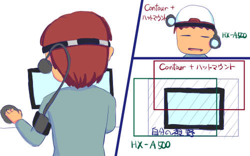

私はウェアラブルカメラとしてContour ROAMを所持しています。結構気に入っていてちょくちょく使っているのですが、1つ不満点がありました。

それはハットマウントを利用して手元の作業を録画するとき、肝心の手元が映っていないことが多いということです。それもそのはず、カメラはおでこの右上に位置しているので、自分の視野よりやや上の部分を映しているからです。

Cintiqを使ったお絵描き、コーヒーを入れる作業、芝刈りの様子。どれも蓋を開けてみたら映っていて欲しかった部分が見切れているのです。今ではこの手の使い方がメインとなっているので、Contour＋ハットマウントの撮影は厳しいものがあります。

後、撮影し終わらないと絵面が確認できないのも不満ですね。あ、不満点1つじゃなくて2つでした。

そこでこの不満点を改善すべく、前々から目をつけていたPanasonicのウェアラブルカメラを購入することにしました。

## ヘッドマウントはなかなか優秀

ヘッドマウントはなかなか優秀です。私はメガネを常時かけているのですが、その状態でも自然に取り付けることができます。重量もほとんど気にならないくらいです。Contour+ハットマウントの方が重く感じるかもしれません。

ただ、パッケージの男性のようにヘッドマウント単体では保持力が弱く心許ないです。それを解決するために、別途ゴムバンドが付属していて、これをおでこ部分に取り付けることで保持力を強化することができます。

私の頭の形の問題なのか、ヘッドマウントのみでは頼りなかったので、ゴムバンドも併用して使っています。ただし、ゴムバンドを取り付けると髪の毛がグチャグチャになるので、セットを気にする人は注意が必要です。

HX-A500はこんな感じで左頬のあたりにカメラがきます。そのため、画面の高さはちょうどいいくらいに収まります。

Contour ROAM＋ハットマウントだとカメラがおでこの右上にくるため、自分の視野よりやや上を映してしまいます。Cintiqでお絵かきしていると、肝心の手元が見切れます。

対してHX-A500はカメラは目よりやや下に位置しているので、録画された画面の高さはちょうどよい高さになります。ただ、左頬にカメラがあるため、画面もやや左寄りになってしまいますが、今までの映像に比べると格段に自分の見ている風景に近いものが撮れています。

## 中途半端さが目立つ

試し撮りしてみて感じたのは、なんか色々と中途半端だなということです。

<ul>
<li>カメラと本体を繋ぐケーブルが微妙に短い</li>
<li>本体の液晶画面が中途半端</li>
</ul>

もう1点付け加えるとしたら、ヘッドマウントしか標準で付属していないという点ですが、私はここは評価すべきところかなと思っています。

標準で入っているのは、本体を腕にとりつけるためのアームバンドと、カメラを左頬に固定するためのヘッドマウントのみです。潔すぎる。

正直なところ、ヘッドマウントを使って目線位置での画像を撮る以外の使い方をしたいのであれば、このカメラを選ぶべきではないと思います。このカメラはヘッドマウント以外での撮影には適さないと思います。

自分の目線での撮影はいい感じではありますが、それ以外のところで残念なとこが目立つので素直に喜べないなというのが正直なところです。

## 前モデル＋ヘッドマウントの方が賢いかもしれない

4K画質に興味がなく、本体に液晶画面がなくてもいいというのであれば、前のモデルのHX-A100に、HX-A500に標準でついているヘッドマウントを購入する方がいいかもしれないです。そっちの方が1万円ほど安くすみますし。

<a href="https://www.amazon.co.jp/exec/obidos/ASIN/B00BT8EX8C/illusionspace-22/ref=nosim/" rel="nofollow" target="_blank">Panasonic ウェアラブルカメラ ブラック HX-A100-K</a>

posted with <a href="https://kaereba.com" rel="nofollow" target="_blank">カエレバ</a>

 パナソニック 2013-05-01    

<a href="https://www.amazon.co.jp/gp/search?keywords=hx-a100&#038;__mk_ja_JP=%83J%83%5E%83J%83i&#038;tag=illusionspace-22" rel="nofollow" target="_blank" title="アマゾン" >Amazon</a>

<a href="https://hb.afl.rakuten.co.jp/hgc/0e95387f.f2aef20d.0e953880.25e412bd/?pc=http%3A%2F%2Fsearch.rakuten.co.jp%2Fsearch%2Fmall%2Fhx-a100%2F-%2Ff.1-p.1-s.1-sf.0-st.A-v.2%3Fx%3D0%26scid%3Daf_ich_link_urltxt%26m%3Dhttp%3A%2F%2Fm.rakuten.co.jp%2F" rel="nofollow" target="_blank" title="楽天市場" >楽天市場</a>

<a href="https://www.amazon.co.jp/exec/obidos/ASIN/B00KASFUFW/illusionspace-22/ref=nosim/" rel="nofollow" target="_blank">Panasonic ヘッドマウント VW-HMA100-K</a>

posted with <a href="https://kaereba.com" rel="nofollow" target="_blank">カエレバ</a>

 パナソニック 2014-06-12    

<a href="https://www.amazon.co.jp/gp/search?keywords=vw-hma100&#038;__mk_ja_JP=%83J%83%5E%83J%83i&#038;tag=illusionspace-22" rel="nofollow" target="_blank" title="アマゾン" >Amazon</a>

<a href="https://hb.afl.rakuten.co.jp/hgc/0e95387f.f2aef20d.0e953880.25e412bd/?pc=http%3A%2F%2Fsearch.rakuten.co.jp%2Fsearch%2Fmall%2Fvw-hma100%2F-%2Ff.1-p.1-s.1-sf.0-st.A-v.2%3Fx%3D0%26scid%3Daf_ich_link_urltxt%26m%3Dhttp%3A%2F%2Fm.rakuten.co.jp%2F" rel="nofollow" target="_blank" title="楽天市場" >楽天市場</a>

私自身、HX-A100にヘッドマウントを付け足して買おうかと迷っていました。ただ、本体だけで画角の調整などができる方が便利かなというのと、どうせ買うなら新しい方がいいかとHX-A500を購入しました。

しかし本体に液晶がついていても、思ったほど便利ではありませんでした。

カメラをヘッドマウントに取り付けた状態で、本体の液晶画面を確認するのが微妙にやりづらいのです。それはカメラと本体を繋ぐケーブルが微妙に短いせいです。本体を左上腕部に取り付けてちょうどいいくらいの長さのケーブルなので、ヘッドマウントつけた状態で本体を取り回すのにはやや窮屈なのです。

それに本体をアームバンドにしまってしまうと、画面が見えないので本体に液晶がついている意味がなくなります。アームバンドからの出し入れもやりにくいので、なおさら本体の液晶意味ない気がします。

正直なところ、スマホに接続してアプリから確認した方が見やすいのです。それだったら本体に液晶なくても一緒かなと思ってしまいます。

## 本体のみでの録画可能時間は2時間くらい

これは使用状況や画質などの録画条件にも左右されますが、頑張って2時間くらい撮影できると考えたらいいと思います。

私が試したのは1920x1080/30fpsの通常録画モードで試して、1時間52分連続で録画できました。

ちなみに、モバイルバッテリーで充電しながらの撮影も可能です。本体で録画中に、モバイルバッテリーの1Aのポートから給電することができました。モバイルバッテリーの容量にもよりますが、長時間の撮影が可能になります。（もっともそんな使い方をするとSDカードの容量がネックになりますが）

ただ、モバイルバッテリーと接続するためには本体の側面のパネルを開けておかなければならないため、本体をアームバンドに格納することができません。モバイルバッテリーから給電しつつ録画するには、本体とモバイルバッテリーを置いておく場所が必要になり、カメラの設置状況が限定されるという意味で不向きでしょう。

ちなみに、本体とスマホをWi-Fi接続した状態で撮影をしていると、結構な勢いでバッテリがなくなっていきます。長時間の撮影時には本体のWi-Fi機能をオフにした方がいいかもしれません。

ちなみに試し撮りしてみたものをYouTubeにアップしてみました。ホワイトバランスの具合を確認する目的で取りましたが、Cintiqを操作している手元がしっかり撮れていて、その点だけは満足できるところです。

<iframe width="640" height="390" src="//www.youtube.com/embed/I2njG3yBpLU" allowfullscreen></iframe>
