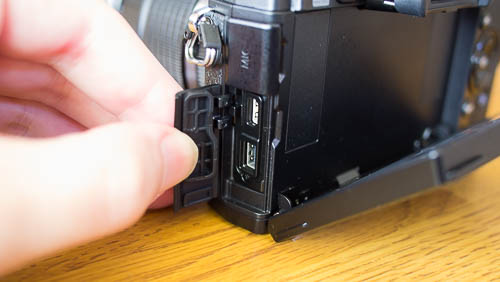

今までずっとOlympusのミラーレス一眼E-PL2を使って写真を撮っていたのですが、かなり以前からOM-D E-M1が欲しいなぁと思っていました。

購入した理由ですが、画質がいいとか機能がいいとかそのあたりのことはあまり考えませんでした。

一眼カメラで写真を撮るのが通っぽくていいよねという、私はそれくらいのレベルの人なので、ぶっちゃけた話どのカメラが画質がいいかとかあんまりよく分かっていません。

画質の良さを考えればセンサーサイズはフルサイズ一択だろとかいう情報を目にして、一時期フルサイズのデジタル一眼を買おうかとか悩んだりもしました。ですが私はすでにマイクロフォーサーズのレンズを2本ほど買ってしまっており、これが流用できないのは辛いものがあります。そもそも画質の違いも私自身が理解しきれていませんし。

そもそもカメラの使い道も、もっぱらブログに載せる写真を撮るくらいにしか使わないので、フルサイズのデジタル一眼を必要とする状況でもないです。

・・・それをいうと、OM-D E-M1も宝の持ち腐れではという話なんですがね・・・（むしろ買った今でも現在進行形でもやっとしてるところですし）。

そんなわけで、カメラの画質がどうのとか、機能がどうのといった意見はありません。よく分かっていない私が書いたところで何の参考にもならないと思います。

にもかかわらずなぜクソたっかいこのカメラを買ったのか。レンズ資産はあるのだから本体だけでもいいのに、わざわざレンズキットで買ったのか。今回はその辺りの話をしたいと思います。

## なぜ買ったのか

このカメラに惚れた最大の理由は、手に馴染んでとても持ちやすかったからです。極論するとこれだけなんです。

Olympus以外のカメラは検討しませんでした。すでに触れましたが、私には画質云々のち外はよく分からないし、他のメーカーと比較するのは面倒くさかったんですね。

家電量販店においてある実機で試し撮りしてみたとき、OM-D E-M1の持ちやすさは他の機種と比べ物になりませんでした。手にフィットする感じが最高です。これで写真撮るときっと楽しいだろうな。それが決め手なんです。

このカメラはミラーレスと言いつつ、全然コンパクトじゃありません。デジタル一眼に比べたらコンパクトですけど、ミラーレスの括りでみると大きいです。でもだからこそ、ちょうど持ちやすいサイズなんです。

今まで使っていたE-PL2もそうですが、ミラーレスはカメラ本体が小さいので持ち手が窮屈なんですよね。その点OM-Dシリーズは、右手でホールドする部分が出っ張っているので持ちやすい。中でもE-M1は私の手にジャストフィットしました。E-M1を触った後では、E-M5もE-M10もお話にならないです。次に買うカメラはこいつしかいないと、一目惚れならぬ一触り惚れです。

画質を考えたらフルサイズの方がいいのではないか。EVFがついているとはいえ光学ファインダーの方がいいのではないか。他の選択肢を考えたこともあります。

こんな高いカメラそもそも私には不釣り合いなのではないか。買ったところでまともに活用できないのではないか。今まで買うのをためらっていました。

それでもあの手にフィットする感覚が忘れられない。これで写真を撮ったらテンション上がりまくり間違いないというあのファーストインプレッションが、私を突き動かしたのです。

最後のひと押しをしたのは<a href="https://olympus-imaging.jp/event_campaign/campaign/c141121b/index.html" rel="nofollow">キャッシュバックキャンペーン</a>の存在です。私の買ったOM-D E-M1 12-40mm F2.8レンズキットの場合1万円のキャッシュバックが受けられます。（注：2015年2月20日までです）

さらに最近過去最安値圏内に迫るくらいに値段が落ち着いてきたのも追い風となりました。

お前にこのカメラは宝の持ち腐れじゃないか。

きっとそうだと思います。現在進行形で思ってるので、あまりほじくり返さないでください。それでも買ったんです。

だって欲しかったんだもん。

## カメラが届いた

ネット通販で購入しました。お店はカメラのキタムラです。

商品が届いたらまず箱の大きさにまず驚きました。ミラーレスとはいったい・・・うごごご。

レンズとセットなのでしょうがないのかもしれませんが、箱のサイズが幅28cm、奥行き18cm、高さ11cmで、重さもかなりずっしりとしてます。箱の写真を撮るのに、久しぶりに撮影ボックスを引っ張りだしてしまいました。

フラッシュは本体内蔵ではなく、外付けの小さいものが付属してました。

バッテリと充電器はこんな感じ。当たり前ですが、E-PL2とは違います。

ちなみにキットレンズのM.ZUIKO ED 12-40mmF2.8PROは、フィルター径62mmです。レンズプロテクターは純正の物を買いました。Kenkoのでも良かったんですが、まぁ気分です。

<a href="https://www.amazon.co.jp/exec/obidos/ASIN/B00F2BBDWQ/illusionspace-22/ref=nosim/" rel="nofollow" target="_blank">OLYMPUS ミラーレス一眼用 プロテクトフィルター 62mm PRF-D62PRO</a>

posted with <a href="https://kaereba.com" rel="nofollow" target="_blank">カエレバ</a>

 オリンパス 2013-10-25    

<a href="https://www.amazon.co.jp/gp/search?keywords=PRF-D62PRO&#038;__mk_ja_JP=%83J%83%5E%83J%83i&#038;tag=illusionspace-22" rel="nofollow" target="_blank" title="アマゾン" >Amazon</a>

<a href="https://hb.afl.rakuten.co.jp/hgc/0e95387f.f2aef20d.0e953880.25e412bd/?pc=http%3A%2F%2Fsearch.rakuten.co.jp%2Fsearch%2Fmall%2FPRF-D62PRO%2F-%2Ff.1-p.1-s.1-sf.0-st.A-v.2%3Fx%3D0%26scid%3Daf_ich_link_urltxt%26m%3Dhttp%3A%2F%2Fm.rakuten.co.jp%2F" rel="nofollow" target="_blank" title="楽天市場" >楽天市場</a>

<a href="https://atq.ck.valuecommerce.com/servlet/atq/referral?vcptn=shpg%2Fp%2FbJklbh6QH6IgN9lcoN5ofw--&#038;sid=2219441&#038;pid=877935733&#038;vc_url=http%3A%2F%2Fshopping.search.yahoo.co.jp%2Fsearch%3FuIv%3Don%26ei%3DUTF-8%26tab_ex%3Dcommerce%26slider%3D0%26va%3DPRF-D62PRO" rel="nofollow"  target="_blank" title="Yahooショッピング" >Yahooショッピング</a>

## 実際に撮影してみて

レンズの性能によるものなのだと思うのですが、オートフォーカスが早くて驚きます。今まで使っていたレンズではそんなに差を感じなかったので、やっぱりレンズがいいんだと思います。

ミラーレスのコンパクトさを真っ向から否定するようなフォルムと重量ですが、それだけのことはある気がします。

MFとAFの切り替えが、フォーカスリングを前後に動かすだけでできるのもすごいです。切り替えが楽でいい。

奮発してレンズとセットで買ってよかったなと思います。被写体にかなり近づいてもピントが合いますし、オートフォーカスも早い。これは撮るのが楽しくなります。

あまりにも高い買い物をしたせいで使うがおっかなくて、外で使うなんて怖くてしばらくできそうにありませんけどね。

1点めんどくさいなと思ったのは、パソコンとの接続でしょうか。USBケーブルでパソコンに繋いで写真データを取り込むことができるのですが、差込口のキャップを外すのにいちいち液晶をチルトさせないといけません。

これはちょっと面倒臭いなと思いました。

思いましたが、基本的には満足しております。やっぱ最上位モデルはすごいなぁ。
