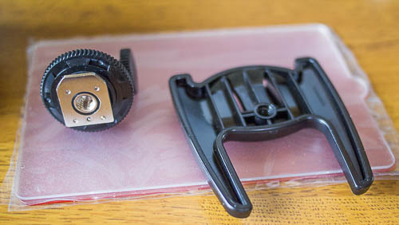
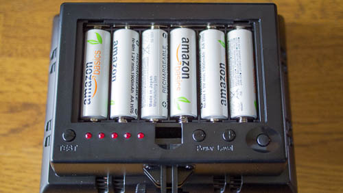
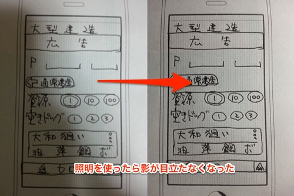

最近スマホのカメラで紙に書いた画面のラフをアプリに取り込む作業をよくやってます。この時にものすごく困るのが、自分の影がうつりこんで写真がちゃんと撮れないことなんですよね。

以前から写真撮影するのに照明がほしいなとは思っていたんですが、まあ我慢してたんです。カメラのフラッシュ使うなり、撮影場所を工夫するなりで乗り切ってきたのですが、もうそれも限界です。私はようやく撮影用に照明を買いました。

## 内容物

付属品は角度調整用の首と台座、後は照明を拡散させるためのディフューザーとなる透明のプラスチックの板（白とオレンジの二種類）です。ディフューザーの板は取り外しの際にキーキーと甲高い音がしてうるさいです。黒板を引っかく音が苦手な人は注意が必要です。

台座ですが、これ自体はあまり大きくもなく、重くもないので、この台座を使って照明を上に向けて自立させることはできません。頭（照明部分）の方が重いので確実に倒れます。

ちなみに、台座にも首の部分にも三脚を取り付けるネジ穴があります。角度の調整が必要な場合には三脚を使うのがいいと思います。

## 電源は単三電池でOK

単三電池6本で動作します。光量はそれなりなんじゃないでしょうか。直接見ると「うお、まぶしっ」となるくらいには眩しいです。地味に光量を調整することができて、照明強すぎるなと思えば弱めたりできます。

今回Amazonの充電池も一緒に購入して取り付けました。

ビデオカメラ用のバッテリでも動くらしいですね。持っていないのでよく分かりませんが・・・。

## 効果の程は・・・？

で、実際にスマホで紙に書いた画面を撮影してみました。

左が照明を使わない場合のもので、天井の蛍光灯の光が唯一の光源です。そのため、撮影しようとした手やスマホの影がバッチリ写り込んでいます。

対して右側が今回購入した照明を使ったものです。スマホが勝手に明るさ補正かけて、照明無しより暗く見えますが、それでも均一な明るさで撮影されているので見やすいと思います。これならば手元の撮影を行うのもストレスなくできそうです。

ただ、使えると言っても蛍光灯の照明でできる自分の影を打ち消せるだけです。これをメインの光源として使うには心許ないと感じます。三脚を使わないと思った位置に光を当てられませんし、これ1つだけではカバーできる範囲も限定的です。被写体をキレイに撮ろうと思ったら、もう1つ用意して別角度からも照明を当てるようにしないと厳しいなと思いました。

  