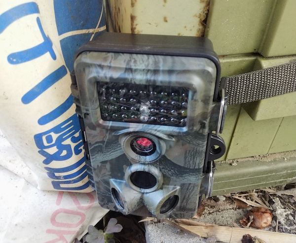

我が家には頻繁にイタチがやってくる。古い家屋でしかも田舎なので、つい先日まで家屋の屋根裏に住み着いていたのだから。

屋根裏以外にも、敷地内に毎日のように糞をしていく。対策をするにしても、まずは姿を確認してからだなということになり、トレイルカメラを買って設置してみた。

<!--more-->

## トレイルカメラ

テレビ番組で動物を撮影するのに使われているようなやつである。屋外に設置して、センサーで感知したら撮影するというあれだ。今回購入するにあたり、トレイルカメラという名前であることをはじめて知った。

今回購入したのはイーサプライという店が売っているトレイルカメラだ。

単三電池8本で動作する。防水で雨の日でも動作オッケー。センサーで感知して夜間だと赤外線モードでちゃんと撮影してくれる。

説明書がやや不親切ではあるが[^1]、そんなに複雑なものでもないのでなんとかなるとは思う。

## 設置してみた

商品にはカメラを設置するためのブラケットとベルトが付属する。

ブラケットは柱やコンクリートにビスで固定して設置するものだ。これは主に防犯目的で使うときに利用するものだろう。

ベルトは木などにカメラをくくりつけることができる。私の場合は動物を撮影する目的なので、こちらを利用している。ちょっとベルトは長すぎて使いづらい。短いよりはマシだけれど。

## 撮影してみた

こんな感じで撮影できる。



センサーが反応してから撮影するまでのタイムラグがあるので、動物がカメラの視界内に入り込むまでの間が撮影されていない。側面センサーを有効にするとマシになるらしいが、たぶん側面センサーは有効にしているはず。それでこの撮影状態なので、カメラの前を素通りされると姿を捉えきれないかもしれない。

撮影した動画を確認すると、もう少し早いタイミングから撮影できてたらいいのにと感じる。その点はやや残念なのだが、こうやって家の周りをうろつく動物が確認できるのは面白い。

3つめの野うさぎを撮影している日は、雨が降っていた日でもある。分かりづらいが雨が降っているのである。撮影しているタイミングはそうでもないが、この日は結構激しく雨が降っていた日だった。それでも問題なく撮影できているので、防水面に関しては特に問題はなさそうだ。

## 撮影した映像の確認方法

説明書には書いてなかったと思うが、本体のみで撮影した画像や映像は確認できる。

本体をセットアップモードにしてからリプレイボタンを押せば本体画面で確認できる。確認が終わったらもう一度リプレイボタンを押さないともとに戻らないので注意が必要。

## 面白い

面白がっている場合ではないが、面白い。ここまできたらある意味開き直るしかないのである。

我が家のようにクソ田舎で野生生物がうろちょろするような場所でないと、なかなか使おうなんて思わないだろうが・・・。

しかしあまり期待せずに買ったせいか、思いの外よく撮影できていて楽しい。とりあえずは設置場所を変えて試行錯誤していくつもりだ。

[^1]: 具体的にはカメラ本体のみで撮影した画像や動画を確認できるのだが、そのことについては一切説明がない。