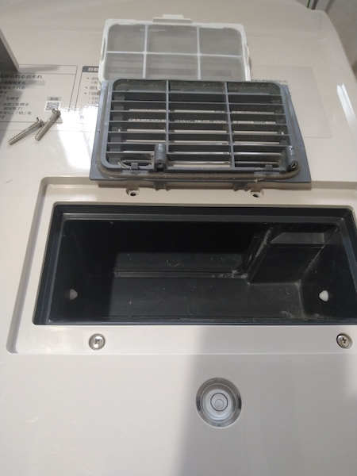
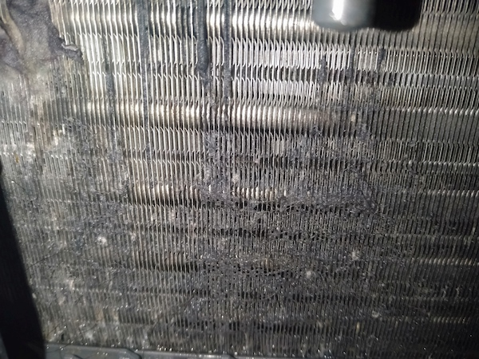
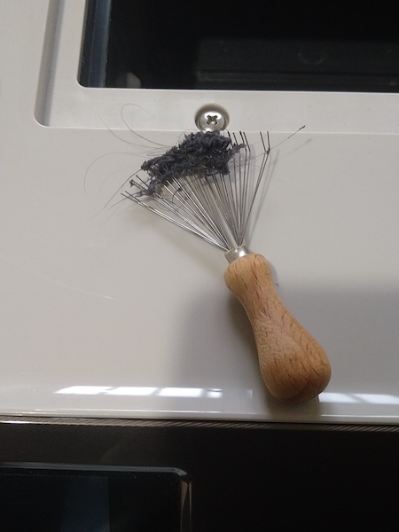

ドラム式洗濯機を使っている。細かい不満点はいろいろあるものの、非常に便利なものである。

しかし使っているうちに徐々に乾燥時間が長くなってきた。分解して掃除するしかないのかなと思って動画を漁っていたら、アルミフィンの掃除をするものを見つけた。これくらいなら比較的簡単にできそうなのでやってみた。

<!--more-->

## アルミフィンの掃除

まずはじめに、アルミフィンの掃除は自己責任になる。フィンは非常に折れ曲がりやすいので、壊すのが心配な人はやらないほうがいい。

きっかけはこちらの動画。



うちで使っている洗濯機のモデルとは若干違うのだけど、基本的な構造は同じだった。

はじめて掃除したときは、1年半くらい使った状態だったと思う。そのときはアルミフィンのほぼ半分が、ホコリで完全に詰まっている状態だった。まさにこの動画のような状態だった。

そのときは適当な道具がなかったので、ピンセットを使ってちまちまホコリを取った。塊になってるのは比較的簡単にはがせても、細かいのがフィンの隙間に残ってしまう。それをちまちまピンセットでつかむ作業はしんどい。さらに狭くてくらいので大変だった。

動画でブラシクリーナーが便利ということだったので試してみたら、たしかに便利。相変わらずフィンの隙間に詰まっているホコリは取りにくいが、ピンセットでちまちまやるよりは断然早いし楽だ。

## 実際の様子

ちなみに実際にどんな状態か写真を撮ってみた。ちょっと汚いので苦手な人は見ないほうがいいかも。

乾燥機能を使ったあとは毎回ホコリが溜まるフィルタ。この部分にあるビス2本を外すとアルミフィンにアクセスできる。

そうすると若干奥まったところにアルミフィンがある。暗いのでペンライトなどがないとまともに見えないと思う。比較的簡単にアクセスできる場所にあるが、奥まったところにあるので作業性は非常に悪い。

この写真は前回掃除してから1ヶ月弱くらい運用したあとの状態だと思う。それでも結構ホコリが詰まっている。写真の左側の部分は掃除しにくい部分で、ここは1年分のホコリが残っていると思う。

これをブラシクリーナーを使ってかき出す。

このようにごっそり取れる。コツとしては表面を撫でる感じで使うことだろうか。フィンの隙間に差し込もうなんてしてはいけない。フィンに引っかかって無理に引っ張ると危険だから。

ビスを2本外せばすぐ見れる場所にあるので、掃除するかはともかくとして状態を確認してみるのはありかもしれない。もっとも見てしまったら掃除したくなってしまうだろうけれど。

ともかく実際に掃除するなら自己責任になるので注意してほしい。ただでさえ繊細なことをしないといけないのに、奥まった見えづらいところにあるせいで手も動かしにくい。

掃除機で吸えばとれるかなと思われるかもしれないが、このホコリは水分を吸っているので掃除機は難しいと思う。大まかにホコリを取り除いたあとで掃除機使うといい感じにはなるけれど。

## 掃除した効果について

これに関しては、私が洗濯機を使っているわけではないので実感がない。乾燥時間が早くなったらしいが、それがフィンの掃除によるものなのかはよくわからない。フィンを掃除したのだから早くなってるはずだという思い込みのせいかもしれないし。

とはいえ掃除の効果はよくわからないものの、それでも1ヶ月くらいのスパンでちょくちょく状態を確認するようになった。1年使ったあのホコリの状態を見るとやっぱり気になってしまう。見るだけならビス2本外すだけなので早いからね。

あとはフィンの下部が常に湿っているのも気になる。湿っているというか普通に水が溜まっている。腐食しないんだろうか。

濡れていることを考えると、あまりこうやって掃除するのもよくないのかもしれない。フィンに傷がついてそこから腐食する可能性だってあるわけだから。そういう意味でも自己責任ではある。
