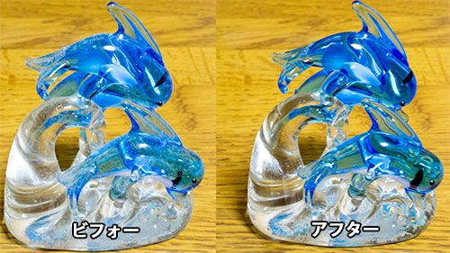

新しい年になって、気持ちを新たに過ごせているでしょうか？

私は年末に部屋の片付けをして、スッキリした気分で新年を迎えることができました。

しかしどんなにきれいにしようとも、生活していく上で<em>ホコリが積もっていくのは避けようがありません</em>。掃除、面倒くさいですね・・・。

今回はそんなホコリ取りを、少しでも楽しくできるような<em>面白掃除アイテム</em>を紹介したいと思います。

## ゴミやホコリをくっつけて取る

<em>スライムみたいな形状</em>で、パソコンのキーボードとかに<em>押し付けて使います</em>。ペタペタとした絶妙な粘着力で、ホコリをキレイに吸着してくれます。

ぷにぷにしていて意味もなくコネコネしてしまいます。消しゴムのカスを集めてコネコネするのが好きな人にはたまらないかもしれません。

一度ペタペタ掃除し始めると、<em>ついつい面白くなって</em>色んな所にくっつけて掃除してしまいます。

面白いだけでなく<em>効果も折り紙つき</em>。ホコリだけにとどまらず、手垢なんかも取り込んだりしてくれます。<em>キーボードの皮脂によるベタベタがとれるのは素晴らしい</em>。

## フィギュア掃除に最適かもしれない

このサイバークリーンは、<em>キーボードなどに押し付けて汚れを吸着させます</em>。掃除する対象に合わせてその形状が変化するので、<em>細かい部分の汚れも吸着</em>してくれます。

ということは、<strong>複雑な形状のものにも使えるのではないか</strong>と思い、実際に試してみました。私はフィギュアなどは飾っていないので、<em>ホコリまみれになっていたイルカの置物</em>（ガラス製）で試してみました。

こういう形状のものは、<em>ダスキンのモップなどではきれいにならず</em>、掃除するのが<em>非常に面倒くさい</em>ものです。それが、このサイバークリーンを使ったらこんなにきれいになります。

ということは、フィギュア、模型、プラモデルなどの掃除にも力を発揮するのではないでしょうか。あんまり細かいものだと壊してしまいそうなので、加減が難しいかもしれませんが・・・。

サイバークリーンはかなり弾力性があるので、強めに押し付けないと細かい隙間まで入ってくれません。ガンプラなんかだと<em>壊してしまうかもしれない</em>ので考えものかもしれません。

## デメリット

そんなサイバークリーンですが、使ってみて思ったのは、<em>コストパフォーマンスが非常に悪い</em>ということ。<em>値段の割に使える回数（期間）が少ない</em>のです。

私の場合は、手垢など気にせず掃除してしまったから、余計にそう感じたのかもしれません。<strong>手垢などの酸性のものに弱く、変質してしまうという注意書きがあります</strong>。しかし、手でコネコネしながら使うのだから、<em>皮脂をつけるなと言っても無理な話</em>な気がします。

できるだけ長く使うためにも、簡単に表面を掃除してから、仕上げとしてサイバークリーンを使うのがよいかもしれないですね。

## 注意点

### 粘着力が弱くなったら使わない

使用期限はサイバークリーンの色が目安となります。ただ色だとイマイチ判別しにくいので、サイバークリーンの<em>粘着度で判断するのがいいと思います</em>。コネコネするときに、手にぺたぺた張り付く感触がする間は大丈夫。

サイバークリーンはゴミを吸着していくと、次第に弾力がなくなってきます。粘度が高くなってきて、<strong>ベチョっとしだしたらもう使わない方がいいです</strong>。その状態で無理に貼り付けると、細かいところに入り込んだサイバークリーンが、<em>引き剥がす時にキレイにとれなくなり、掃除のつもりが汚してしまうというひどい目に合います</em>。

### 酸性のものに注意

酸性のものに弱いということで、汗とかは付けない方がいいらしい。思いの外早く使えなくなったのはこのせいかもしれません。

### 独特の匂い

私は気になりませんが、<em>人によっては苦手な人もいるかもしれません</em>。私は割と好きなニオイなんですけどね。

そんなに匂いが残るようなものではないですが、はじめての人はまずは袋タイプを試してみるのが無難な気がします。（量が少なくその分安いので）

<iframe style="width:120px;height:240px;" marginwidth="0" marginheight="0" scrolling="no" frameborder="0" src="//rcm-fe.amazon-adsystem.com/e/cm?lt1=_blank&bc1=000000&IS2=1&bg1=FFFFFF&fc1=000000&lc1=0000FF&t=illusionspace-22&language=ja_JP&o=9&p=8&l=as4&m=amazon&f=ifr&ref=as_ss_li_til&asins=B01NA8RN0K&linkId=d9c71b5b2ed1f9c377b42865c3aaf2f7"></iframe>

## 面倒くさい掃除も面白ければついやっちゃう

掃除しにくいものというのは総じて<em>細かい凹凸のあるもの</em>で、キレイにしようと思うと面倒くさい。このサイバークリーンは、そういった<em>でこぼこしたものの掃除にぴったり</em>です。

細かいくぼみなど、拭き掃除では対処しづらいところにこそ真価を発揮します。

<strong>汚いけど見ないふりしていたあの隙間</strong>。だからこそ、きれいになったらとても気持ちい。

コストパフォーマンスは悪いかもしれないが、それでもスッキリする感覚を味わえるなら、悪くない投資だと私は思います。
