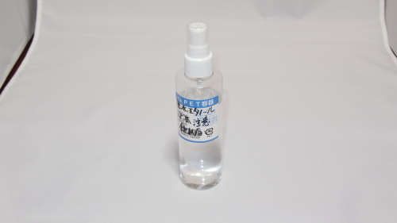

手垢。掃除どうしてますか？

マウス、キーボード、ゲームのコントローラーなどなど。気がついたら手垢がついてて汚くなっています。汚いだけではなく、ベトベトして気持ち悪くなります。

個人的に気になるのが、マウスの下に手垢みたいなものがついて、マウスの滑りが悪くなること。たまにティッシュでゴシゴシして掃除していましたが、なかなかとれないので、何かいい方法ないもんかと思っていました。

レンズの掃除とか精密機械に使えるらしいので、前々から気になっていた無水エタノールを試してみることにしました。

## 実際に使ってみる

このボトルそのままでは通常使用には使いにくいです。ちょっとだけ塗布したいのに、ドバーッと出てきてしまうので・・・。そこで私はこのスプレーボトルに詰め替えて使用しています。（Amazonで関連商品で出てたからですけどね）

<a href="http://www.amazon.co.jp/exec/obidos/ASIN/B001QVRPE6/illusionspace-22/ref=nosim/" rel="nofollow" target="_blank">AZ（エーゼット） PET容器 PETボトル スプレータイプ 200ml B248 （PS200）</a>

posted with <a href="http://kaereba.com" rel="nofollow" target="_blank">カエレバ</a>

 エーゼット     

<a href="http://www.amazon.co.jp/gp/search?keywords=B248%20PS200&#038;__mk_ja_JP=%83J%83%5E%83J%83i&#038;tag=illusionspace-22" rel="nofollow" target="_blank" title="アマゾン" >Amazonで購入</a>

<a href="http://hb.afl.rakuten.co.jp/hgc/0e95387f.f2aef20d.0e953880.25e412bd/?pc=http%3A%2F%2Fsearch.rakuten.co.jp%2Fsearch%2Fmall%2FB248%2520PS200%2F-%2Ff.1-p.1-s.1-sf.0-st.A-v.2%3Fx%3D0%26scid%3Daf_ich_link_urltxt%26m%3Dhttp%3A%2F%2Fm.rakuten.co.jp%2F" rel="nofollow" target="_blank" title="楽天市場" >楽天市場で購入</a>

私が買ったのは200mlのボトル。100mlがよかったけど、私が買ったときは品切れだったのです。200mlだとちょっと大きいですが、使用する分には何ら問題ありません。

シュッシュと適量噴きかければいいので掃除しやすくなります。このボトルだと綺麗に霧状になってくれます。100均とかで売ってるようなボトルよりは性能が断然いいと思います。噴きかけたエタノールは、すぐに揮発していくので、見ていてちょっと面白い。

ボトルに付いているラベルは剥がしにくいので、私はそのまま使っています。

無水エタノールのパッケージにも書いてありますが、ボトルを詰替えて使用すると誤用が怖いので気をつけましょう。私はボトルのラベルに注意書きを書き入れて使っています。

## さっとひと拭きよく落ちる

無水エタノールを吹きかけると、今までゴシゴシ拭いてとっていた汚れが、サッとひと拭きするだけで落ちて楽チンです。携帯の液晶画面も簡単に綺麗になります。

アルコールティッシュで事足りそうな気もしますが、長いこと使わなくてティッシュが乾いていたなんてことにならない分、こちらの方が経済的かもしれません。

お掃除を楽にしてくれるアイテムとして結構便利です。

## こんな掃除に使える

手垢、精密機械の掃除に非常に役に立つ。どれにでも言えることですが、力を入れてゴシゴシ拭かなくとも綺麗になるところが嬉しいですね。

よくセットで購入されるものにキムワイプがありますが、普通のティッシュでも充分に綺麗にできます。

<a class="amazonjs_indicator_title" href="#">キムワイプ 12×21.5cm /1箱(200枚入) S-200</a>

私も一緒に購入して使ってみましたが、ティッシュより紙くずがつきにくい、破れにくいというのが特徴です（絶対につかない・破れないわけではないので過信しないように）。

### キーボード

パソコンのキーボードにシュッ噴きかけティッシュなどを使ってゴシゴシすると、ベタベタしたキーボードもキュッキュッと肌触り爽やかになります。拭いたティッシュが黄色くなって、手垢がとれているのがよく分かります。

### 液晶画面

モニタなどの液晶画面を直に指で触ってしまうと指紋がついて汚くなってしまいます。無水エタノールを吹きかければ、軽く撫でるだけでキレイになります。

### スマホ

手汗などでベタベタしたスマホも、これで掃除をすれば手触りが気持ちよくなります。定期的に掃除をしたいアイテムの1つですね。

### 携帯ゲーム機等のボタン部分

十字キーとかの辺りにたまった手垢も無水エタノールを使えばキレイに掃除できます。

### カメラのレンズ

息を吹きかけて掃除をしようとすると、ツバが付いて余計に汚れてしまいます。そんなレンズも、無水エタノールを使えば綺麗にできます。

### メガネの鼻あての部分

別に鼻あてに限定するつもりはありませんが、メガネ掃除にも活躍します。意外と油でベトベトしているので、無水エタノールでぬめりがとれます。分解が必要ですが、鼻あての部分の汚れもキレイに取れるので、メガネをばらしてキレイにするのが病みつきになるかもしれません。

ネジが細かいので、なくしたりねじ山を潰したりしないよう気をつけよう。

### 精密機械

半信半疑で、グラフィックボードの掃除に使ってみました。基板に直接吹きかけて掃除しました。一応掃除後もちゃんと動いたけれども、絶対壊れないとは言い切れないので自己責任でどうぞ。

## 情報募集中

他に「<em>こんなものを掃除するのに使っている</em>」というアイデアがあったら<strong>ぜひ教えてください</strong>。

  