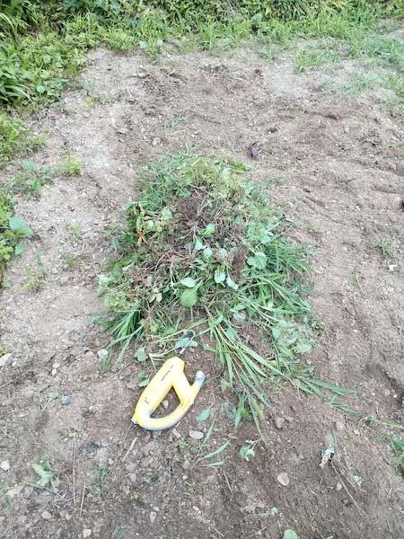

畑が雑草だらけになっているというSOSを受け、少し草抜きを手伝った。もはや作物が判別できないほど多い茂った雑草の群れに、これ手でやるのは無理すぎるということで、この除草バイブレータを買ってみた。

畑で使うのがメインなので、電源確保など不可能。よって買ったのは充電式モデルである。

使ってみると、あまりに楽に草が抜けすぎて、時間を忘れて草抜いてた。自分でもびっくりである。

<!--more-->

## 草が根から抜ける

これを使うともはや手で草を抜くなんて馬鹿らしくなる。それくらいに草抜きが楽なのだ。

はじめは半信半疑だった。ほんまに抜けるんかいなと。だがやってみると、ホンマに抜けるやんとびっくりである。

根っこから抜ける、というのはまあ抜ける。多少土の中でちぎれて残ってしまう根はあるだろうが、それは手作業でやっても同じである。だが確実に手作業に比べて圧倒的な速さで抜くことができる。その分広範囲の草抜きができるということだ。

ビフォーがないのであれだが、試運転のつもりで草抜きした結果の写真がこれである。

手作業でこれだけ抜こうと思うと、結構な時間がかかるが、これは多分作業時間10分とかそれくらいだと思う。バッテリの駆動時間が25分らしいので、それくらい作業したかったのだが、そこまではがんばれなかった。

ちなみにかなり根ががっつり張っている草であってもしっかり抜くことができた。この手の電動工具で大事なことだが、無理やり引っ張ったりしたら壊れるのでそういう使い方はしてはいけない。なんか負荷がかかったなと思ったら、そのまま引っ張るのは工具の寿命を縮めるのでやめよう。そういうときは違う方向からブレードを入れて、周りから徐々に掘り出す感じで作業するのである。ここは気をつけよう。

## 褒めた後は問題点を指摘する

この商品は、確実に私の草抜き生活に革命をもたらしてくれる偉大な製品であることは間違いない。それは間違いないが、使ってみて気になったところもちゃんと書いておく。

### 充電時間長すぎ問題

まず、充電に必要な時間が長い。長過ぎる。稼働時間25分に対して、必要な充電時間は4時間である。これはあまりに長すぎる。

稼働時間25分はまあ問題はない。そもそも草抜きを25分も続けていると休憩を入れたくなる。バッテリ切れが起こってくれれば、ちょうどよい休憩に入るタイミングがやってきたと思える。そこはいい。

だが、休憩中に充電しておこうかとなると、休憩時間中には満充電にできないのである。へたしたら草抜きの続きはまた明日、なんてことになる。これはいただけない。

差し替え式のバッテリであれば、予備のバッテリに切り替えて使うことができるが、この製品は製品に直接アダプタをさして充電する。よってあらかじめ広範囲の作業をやる予定があるのであれば、バッテリ式は向かない。

それでも電源のないところで作業をしなければならないのであれば、発電機でも別途用意して電源式を使うほうがよいだろう。

### 地面が硬すぎる場所に不向き

これは畑で使ったからこそ思うのかもしれないが、土が柔らかい畑などの場所であれば、こいつの力は十二分に発揮される。しかし地面が硬い場所だとたぶん刃が入りにくく、作業がやりづらいだろう。無理に刃を立てようとしたらブレードが折れる気がする。

たとえばねじりがまを使ってあまり地面に刃が入らないような場所、そんな場所での草抜きにはこの製品は向かないだろう。だろうというのは、私だったらそんな硬い地面の場所にこれは使いたくない。絶対にブレードが折れる。

ちなみにねじりがまというのはこんな感じのやつのことを指している。

<iframe style="width:120px;height:240px;" marginwidth="0" marginheight="0" scrolling="no" frameborder="0" src="//rcm-fe.amazon-adsystem.com/e/cm?lt1=_blank&bc1=000000&IS2=1&bg1=FFFFFF&fc1=000000&lc1=0000FF&t=illusionspace-22&language=ja_JP&o=9&p=8&l=as4&m=amazon&f=ifr&ref=as_ss_li_til&asins=B002SW31H2&linkId=6d3e68dddabbdf49e2c3041718180937"></iframe>

これが向くのは、家庭菜園とか地面がある程度柔らかい場所である。そこも気をつけよう。

まあ別売りのブレードに変えれば作業できないこともないかもしれない。

### 間違えて電源切る問題

私の持ち方が悪いのかもしれないが、作業中にしょっちゅう間違えて電源を切ってしまう。握り口の絶妙な場所に作動Offにするスイッチがあるので、ブレードを土に差し込み引っ張る際によくあたってしまうのである。

電源Offスイッチ兼電源ONにするためのロックスイッチを兼用したボタンであるが、ちょうど握り口のあたりにあるのでよく誤操作してしまう。まあ不意に動作が止まって「あれ？」って思うだけで済む話なのだがね。

### 結構振動がすごい問題

説明書にも書いてあるが、かなり厚手の作業手袋をつけることが推奨されている。これは律儀に守ったほうがいいと思う。

というのも、右手の親指の付け根の皮が若干剥けたのだ。結構力を入れて握って、かつ草の周りに指しては掘り出し・・・という作業を続けるので、作業手袋には気を配ったほうがいいだろう。親指付け根にあらかじめテーピングしておくのもありかもしれない。

## レシプロソーで使えるかもしれないらしい

Amazonのレビューでだったと思うが、レシプロソーで使えるというレビューがあった。

うちにもレシプロソーがあるので、とりあえずブレードだけ買って試してみようとしたが、私のレシプロソーでは使えそうになかった。使えるレシプロソーといっても、おそらく小型のレシプロソーが限度だと思われる。

私のレシプロソーはJR188DZKというマキタの大きいやつなので、この除草バイブレータの替刃は小さすぎてとりつけられそうになかった。

ブレードの長さは付け根からブレードが曲がり始めるまでのところまでで大体3cmといったところ。

<iframe style="width:120px;height:240px;" marginwidth="0" marginheight="0" scrolling="no" frameborder="0" src="//rcm-fe.amazon-adsystem.com/e/cm?lt1=_blank&bc1=000000&IS2=1&bg1=FFFFFF&fc1=000000&lc1=0000FF&t=illusionspace-22&language=ja_JP&o=9&p=8&l=as4&m=amazon&f=ifr&ref=as_ss_li_til&asins=B079D726WC&linkId=fcbae16eda23f5cfe768b968fcc5eaf3"></iframe>

小型のレシプロソーを持っていて、この除草バイブレータが気になっているという人限定になるが、ブレードだけ買って試してみるのもいいかもしれな。ただ自己責任でどうぞ。

レシプロソーで使えたというレビューは[これ](https://www.amazon.co.jp/gp/customer-reviews/RLS694WKSJ7IM/ref=cm_cr_dp_d_rvw_ttl?ie=UTF8&ASIN=B072K4KF7D)。ちなみに草抜きの感じは、本来の除草バイブレータを使っている様子とまったく変わらない。

まあ正直なところ本当にレシプロソーで使えるのであれば、そっちの方が充電や稼働時間の問題が解決されるから、除草バイブレータを使うより便利だと思う。

まあだからといって小型のレシプロソーを別に買うかと言うと、そんなことはしないけどね。まあ今使っている除草バイブレータが壊れたら、検討してみようかなっていう感じかな。

## 草抜き革命

なんか文句をつけた量のほうが多くなってしまった気もしないでもないが、これは私に草抜き革命をもたらした。これからめちゃくちゃ使い倒す気満々である。

土の柔らかいところであれば面白いくらいに草が抜ける。草を抜くというより土を掘り返している気分になってくるけれど、それでも根っこごと雑草を一掃できる感覚は爽快としか言いようがない。

充電時間が致命的に長いのと、草を抜く地面の固さに左右されるという弱点がクリアできるのであれば、これほど有益な製品はなかなかないと思う。条件クリアしているのであればぜひ試してみて欲しい。