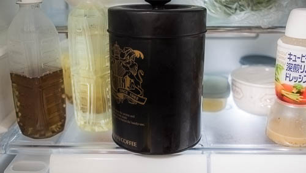
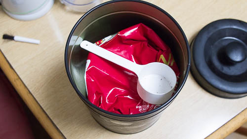

最近は水出しのアイスコーヒーばかり飲んでいたせいで、ホットコーヒーの入れ方を微妙に忘れていたGenです、こんにちは。

前回購入から約4か月、ようやく豆を使い切ることができました。途中夏だからホットコーヒー飲むのは微妙だなとしばらくコーヒーを飲まない期間が含まれていたため、使いきるまで時間がかかりました。

最近は若干肌寒くなってきたこともあり、そろそろホットコーヒーに切り替えるかとホット用の豆を購入しました。いつもなら一番安いものを選んで購入するのですが、今回は普段より1000円ほど高いものにしました。

私はほぼ毎回500gずつの袋が4つパッケージされた福袋を買います。ただ同じ福袋でも値段の安いものは豆の種類が2種類なので若干飽きるんですよね。500gを使い切った後に、また同じ奴か・・・という感じで。別に味が気に食わないわけではないのですが、こう新鮮味がないというか。早く使いきって次のを飲んでみたいというモチベーションに欠ける気がするんです。

そこで今回は4種類違う豆が入ったものにしたわけです。これなら次の豆はどんな味かなとワクワクしながら飲むことができます。

## 冷蔵庫保存で長持ちした

余談ですが、前回購入分から豆を冷蔵庫で保存するようにしました。

開封した袋は、袋のまま保存缶にいれて冷蔵庫へ、未開封のものはビニール袋でくるんで冷蔵庫へ保存してました。こうすることで、常温保存とくらべて新鮮味が長続きしたように思います。お湯を入れた時の膨らみ具合が、常温保存してたときより良かったんです。

さすがに購入当初の勢いで膨らむわけではありませんが、常温保存するよりはるかにマシです。

<table cellpadding="0" cellspacing="0">
<tr>
<td valign="top">

<a href="https://hb.afl.rakuten.co.jp/hgc/11be2770.9eec789a.11be2771.029f4a42/?pc=http%3a%2f%2fitem.rakuten.co.jp%2fsawaicoffee-tea%2fi-o-hozonkan-001%2f%3fscid%3daf_link_tbl&m=http%3a%2f%2fm.rakuten.co.jp%2fsawaicoffee-tea%2fn%2fi-o-hozonkan-001" target="_blank">澤井珈琲のコーヒーの香りが長持ちします【澤井珈琲】コーヒー専門店のコーヒー専用の保存缶</a>

</td>
</tr>
</table>

保存缶には500gの袋ごと入るので、保存缶の利用お勧めです。特に私のように福袋で毎回2kg買うような人だと必須アイテムかもしれません。

といっても終盤になるとお湯を注いだ時に粉が膨らまなくなってしまうので、完全に劣化せずに保管できるわけではないですけどね。
