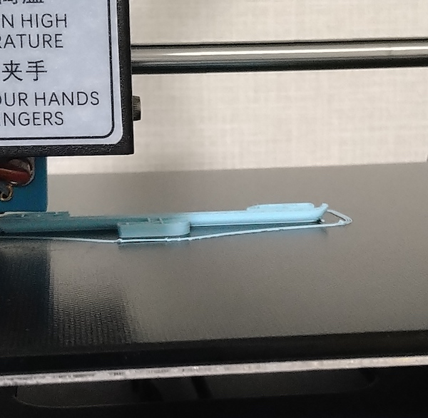

3Dプリンターを買ってしまった。前々から使ってみたいと思ってはいたのだが、買ったところで何を作るんだとか思っていた。

しかしそんなことをいったら、大量に買い集めているマキタの電動工具はどうなんだという話である。なぜ3Dプリンターだけそこで迷うのかということで、えいやってポチった。ちょうどプライムデーセールでお手頃価格だったのも理由の1つだ。

<!--more-->

## Anycubic Mega-S

他の機種との比較はほとんどしていない。ブログだったかYouTubeだったか忘れたが、入門機としてよいのではというのを見たのがきっかけで、買うならAnycubicのMega Sにしようと考えていた。

商品の内容物について説明が一切書かれていないのが気になるところではあったが、そのあたりの細かいことはほぼ考えなかった。ネットで検索すれば写真付きのブログ記事がいっぱい引っかかると思うので、そういったものを参考にはしたけれど。

ちなみに私のところに届いたものはテスト用のフィラメントがほんのちょっぴりだけ入っているものだった。ブログ記事ではリール巻のちゃんとしたフィラメントが入っているものもあったようだったが、そんなフィラメントが入っているとは一切書かれてないもんな・・・。テスト用のフィラメントは、テスト印刷用のフクロウと、あとは後述する自作のアイテムを印刷したらほぼなくなった。セールだからフィラメントをケチったのだろうか。本体の動作に問題はないから別にいいけれども。

組み立ては土台部分とアーム部分をビスでつなぐだけである。あとは動作電圧の切り替えと、ケーブルの接続くらいだろうか。

ブログでケーブルを噛んだトラブルについて書かれているものを見たので、その点だけは気をつけた。説明書では一切触れられていないがケーブルのチェックはひととおりやった。確かに梱包のためアーム部分の中にケーブルが押し込まれていて、そのまま本番動作させると動作に影響ありそうだった。説明書よりも先人たちのブログの方がよっぽど役に立つ。

一番大変なのはレベリング。ベッド（土台）とノズルの間の隙間をちょうどいい感じにする作業だが、そもそもベッドが平面でないのでこれが難しい。マニュアル通り4点で調整したが、正直適当である。ベッドのテーブルを4隅で固定してるから中央部分が膨らむような感じでたわむのかなと思っている。

印刷時に主に使われるのは中央なので、中央がいい感じになるよう調整すべきなのだとは思う。しかしながら高さを調整するのは4隅のネジでやるためこれが難しい。

## うるさい

動作音は正直うるさい。ファンの音がうるさいのだろうか、電源を入れるだけで結構な音がする。マンションで隣の住人が掃除機をかけてるような感じとでも言おうか。高周波音が常に鳴り響いていて、同じ部屋ではちょっと寝れないなぁと思う。

電源を入れただけでそれなので、印刷をし始めるとさらにうるさい。印刷するモデルの形状にもよるが、どだだだだと結構な爆音が鳴り響く。印刷を繰り返すうちに私自身は慣れてきたが、本人は良くても家族はうるさく感じるだろうなあという気はする。

テスト印刷用のモデルであるフクロウの印刷はだいたい1時間半で終了した。最初のうちはそばで見ていたが、うるさいしプリンタの近くは暑いので外で別作業していたら終わってた（印刷時にヘッドは200度、ベッドは60度になるので割と暑い）。ただ印刷が終わってすぐじゃないと印刷物をベッドから外すのが大変かもしれない。印刷物外すためだけにベッドを予熱するのも面倒くさかった（やり方がよく分からなかったともいう）ので無理やり剥がした。

後述する自前モデルは印刷後すぐに外したが、それと比べるとかなり苦労したので、印刷後すぐに外すのがいいと思う。

## モデリング

3Dプリンターを活かすには、自分でモデリングができたほうがよい。アップロードされたモデルを拾ってきて印刷するだけでも十分便利そうではあるが、それなら既製品を買うのと大差ない気がするから。

私は[Autodesk Fusion360](https://www.autodesk.co.jp/products/fusion-360/overview?term=1-YEAR)を使ってモデリングしている。

このソフトは3Dプリンターを買う前に触っていた。DIYで洗濯物干し場を作る際に設計図を作るのに使った。それもあって簡単なものなら自分でモデリングできそうという手応えを持っていた。だからこそ3Dプリンターを買う決断ができたのもあるかもしれない。

3Dモデリングというと難しそうな気がするが、単純なモデルであれば絵を書くよりずっと簡単だと思う。個人的な感想だけれどイラストを書いたりするより断然簡単だなと思った。寸法と位置さえしっかり思い描ければそれで作れるのだから。人の顔を書くより断然簡単だ。

スライサーソフトには[Ultimaker Cura](https://ultimaker.com/ja/software/ultimaker-cura)を使った。どちらもMacでも使えるのがいい。

モデリングを繰り返すうちに、複雑な形をわざわざ印刷しようとしない方がいいのかもしれないと感じてきた。単に平面図形をZ軸に引っ張り上げただけのモデルの方が、モデリングが楽だし印刷も安定する。

## 早速作る

3Dプリンタ買ったところで何を作るんだよとか思っていたのだが、実際手元に来るとちょっとした小物を作るのに便利と気づく。こういうのがあったらいいながすぐに作れるのがすごい便利だ。

ロフトベッドに網目状のワイヤーネットがあるのだが、ここに引っ掛けるフックを作ってみることにする。今はS字フックを使っているが、S字だと引っ掛ける際にフックが奥にずれるので、2段に渡って引っかかるようにすれば安定性が増しそうだなと思った。結果作ってみたのがこちら。

実際にワイヤーネットに引っ掛けるとこんな感じになった。

寸法に少し余裕を見たせいか横方向にずれてしまうが、まあいい感じではないだろうか。フック部分に強度をもたせたいと思って太くしたが、ちょっとやりすぎたかもしれない。

またモデリングの際に面取りを設定したのだが、5mm程度のものだと実物に反映されていなかった。フックの部分には5mmの面取りをモデリング状は設定してあるが、印刷物には反映されていないように感じる。印刷精度がそこまで細かくないので、そのまま真四角のまま出力してもよかったかもしれない。モデル上で面取りするより、印刷されたものをヤスリをかけて整形したほうがよいまである。

## フィラメント購入

テスト用のフィラメントではまったく足りないので、早速フィラメントを購入した。

どれを買えばいいかさっぱりわからなかったので、レビューが多い・安いのバランスを見て決めた。OVERTUREというところのマットライトブルーを購入。

<iframe style="width:120px;height:240px;" marginwidth="0" marginheight="0" scrolling="no" frameborder="0" src="//rcm-fe.amazon-adsystem.com/e/cm?lt1=_blank&bc1=000000&IS2=1&bg1=FFFFFF&fc1=000000&lc1=0000FF&t=illusionspace-22&language=ja_JP&o=9&p=8&l=as4&m=amazon&f=ifr&ref=as_ss_li_til&asins=B08LKP7TVH&linkId=0a3ad8347ef7917649f8b92e1981d3e2"></iframe>

テスト用フィラメントではうまくいっていたので、このフィラメントでもまったく同じ設定で印刷してみたが、見事なまでに印刷に失敗した。はじめての洗礼である。

途中から印刷物が反りはじめ、最初は土台に定着していたのに途中で剥がれてしまった。観察していると、印刷中に端の方が盛り上がっていて、どうもそこだけ定着が悪いようだ。

定着をよくするために土台にノリを塗るのがいいとか見たけれど、それは後回しにする。いきなりそんなことをするのもいやというのと、よくわからず手出するとろくなことにならないと思ったからだ。とにかく一度レベリングをやり直して何度か試す。

その後も2回くらい途中で印刷物が土台から剥がれてしまったので、印刷時のヘッドの温度を変えてみた。3度目の正直でなんとかできあがったのがこれ。途中でサポート材部分が吹っ飛んでしまって、フックの部分が変なことになっている。うにょうにょっとしている部分には、本当ならサポート材が支えるはずだった部分なのだが、印刷途中でサポートの部分が取れてしまっていた。

これはモデルを少し修正した影響もあるかもしれない。フックの付け根部分を強度と見た目を兼ねて円柱のような作りにしていたが、これをストレートに直した。結果サポート材が必要になって、そして途中でそれが剥がれた。ワイヤーネットに引っ掛ける部分にもサポート材は存在していたが、必要となる高さが違っていたからこんなことになったのかもしれない。

印刷物の反りに関してはテスト印刷の際にも起こっていたようだ。積層されたラインをよく見ると今回と同じような箇所で反りが見られる。テストフィラメントでやったときは土台もまっさらな状態だったわけで、だからうまくいっていただけなのかもしれない。

あとはフィラメントの品質による影響もあるかもしれない。品質の問題というよりは色がついているのとマットな質感なものを選んだというのもあって、材質が微妙に違うことが影響している可能性もあるだろう。

## サポート材が必要ない構造へ

発想を変えてそもそもサポート材を必要としない真四角な形状でやってみることにした。印刷途中で反っていた部分は、アールをつけていた部分であり、土台から浮いているわけだからそもそも反りやすかったのだと思う。全部の面がぴったりくっついている形状なら影響は少ないだろう。

ヘッドの温度を下げた場合と上げた場合で違いがあるのかも検証してみた。といっても190度と205度で試しただけだが。

左と下が190度で印刷したもの、右と上が205度で印刷したものである。長さが違うのは寸法を間違えたのを直した（短くした）からだ。どっちにしろ反っているのだけれど、205度の方がちゃんと印刷できているように見える。

温度が低いとベッドへの定着がよくない。上の層はどちらもだいたいきれいに仕上がっているが、印刷しはじめのところの出来がまるで違う。温度が高い方が最初から安定して出力されるようだ。

一方でヘッドの温度を高くすると今度は糸引きが発生し始める。205度でやると糸引きが少し発生した。熱くし過ぎもよくないということで、要するにちょうどいい塩梅のところを探し出せということである。結局回り回ってデフォルト設定の200度に戻ってきたという。

とりあえずしばらくは温度がどうのこうのというよりも、印刷しやすい形で印刷することで対処しようと思う。設定で回避できるかもしれないが、そもそも印刷に失敗してしまうと時間と材料の無駄になるので精神的なショックがある。設定を工夫するにしても、その検証自体（つまり実際に印刷してみてうまくいくかを試すこと）にも時間がかなりかかるから。

## 買ってみたらアイデアが湧いてくる

3Dプリンタなんて買ったところで何を作るんだなんて思っていたけれど、いざ蓋を開けてみるといろいろ作りたくなってくる。今は掃除機のノズルを引っ掛けるためのフックを制作している。

「こういうものがあったら便利だな」を即座に試せるのが面白い。100均に行ったらなにかに使えそうと思ってついついいろいろ買ってしまうあの感覚。3Dプリンタを手に入れてプリントしていると、その感覚に近いものを感じる。3Dプリンタの場合は100均とは違って使い方を工夫するではなく、そのものズバリな形を作り出せるのがすごいところ。

今は部屋の片付けに一役買うものを作っているけれど、そのうちDIYの工具で使うものも作ってみたい。集塵機や掃除機のノズルのアダプタは作るのが当初の目的でもあったしそのうち作ると思う。