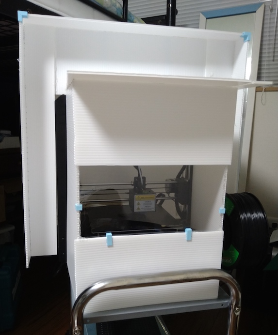
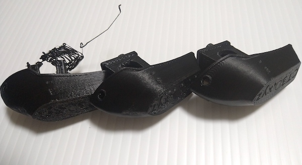
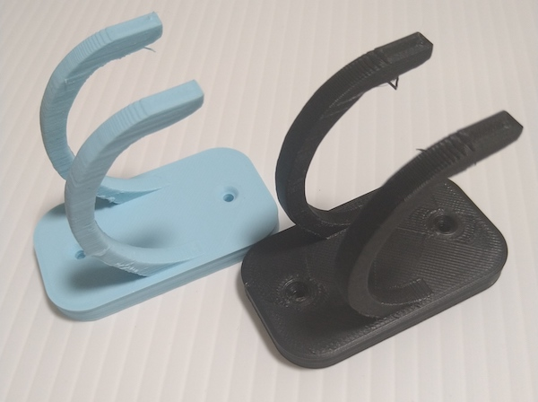
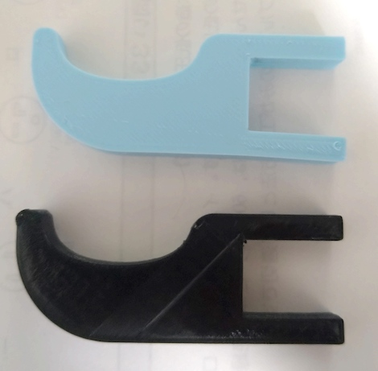

目的は3DプリンタのMODパーツの印刷。そのためには耐熱温度の問題からPLAで印刷したものは使えない。PETGかABSを使わなければならないらしい。

それにそのうち電動工具と組み合わせて使うようなものを作ったりもしたいし、それならばABSに挑戦してみるのもよいかとやってみることにした。

とりあえず以前買ったPLAと同じメーカーのものを買ってみた。

<!--more-->

## エンクロージャー

注文した品が届くまでの間に、まずはエンクロージャーを作ることにした。

ちまたには[洒落たエンクロージャーを自作する人がいる](https://norihiron.at.webry.info/201908/article_1.html)。そういうのを作ろうかなと私も考えはしたが、パーツの印刷時間がかなりかかることを見て断念。

とりあえず適当に囲えるものを作ればいいかなと思い、ホームセンターで1820ｘ910のプラダンを仕入れてきて工作することにした。さすがに全面をプラダンで覆うと印刷の経過を確認できないので、正面にはアクリル板を取り付けることにした。

印刷ステージさえ囲えばいいのだと、寸法も特に決めることをせずに勢いで作った。プラダン同士の固定にはグルーガンを使った。

ABSの印刷にはプリントヘッドが250度、ベッドは100度の高温となる。熱を逃さないようにする覆いにグルーガンを使うことの是非はあるが、いまのところホットスティックが溶け出すような気配は見受けられない。

断熱性についてはあるのとないのとではそこそこ違いそうではある。囲いを取るとムワッとした熱気を感じるので。

とはいえこれがないとABSの印刷がうまくいかないわけではないと思う。むしろこれで囲ったところで普通に反る。エンクロージャーの話は冬に印刷が安定しないという文脈でよく見かけるので、冬になったら恩恵を感じるのかもしれない。

## ABS難しい

ABSフィラメントを早速使ってみるが、しかしこれが予想以上に難しかった。

PLAだと余裕で印刷できていたものが、ABSを使ってみると門前払いを食らってばかりである。そもそもベッドに定着しない。ABSはベッドに定着しにくい、剥がれやすいとは聞いていたが、よもやここまでとは思わなかった。

観察してみると、印刷を始める最初の段階でフィラメントがしっかりと出ていないのが原因なように見受けられた。ほそぼそとしか出ておらず、そのせいでベッドに定着しない。そしてその定着しなかったものがそのままヘッドと一緒についてまわるせいで、後続の樹脂が絡め取られてしまっていた。

これに関しては次の3つを試してみた。

1. first layerの先の太さを太くする
2. リトラクションの量を減らす
3. エクストルーダのキャリブレーション

これらを試すとフィラメントの出力が比較的安定したように思う。

しかしそれでも反るのは止められない。Brimをつけるようにすると比較的マシになるようにも見えるが、印刷物本体のところがやっぱり反る。

これに関しては、印刷速度やクーリングファンの有無が影響しているかもしれない。

ベッドに定着しやすくするためにヘッドの移動速度を遅く、パーツクーリングファンを停止させるというのをよく見かける。私もそれに倣っていたのだが、全体を通してゆっくり・ファンなしで印刷すると逆に反るのかもしれない。

その後いろいろあってファーストレイヤーに関しては遅く・ファンなしで印刷するが、基本的にはヘッドの移動速度は早く、ファンも動かしてやるようにしたら印刷精度が上がった。ゆっくりやりすぎるのもよくないらしい。

かといって早すぎてもダメで、結局は印刷するモデルに合わせた最適値を探らないといけないらしい。難しい。

## カスタムModに付け替えたら精度があがった

ABSで印刷しようと思っていた[カスタムMod](https://note.com/newspeak/n/n293f08fbe8b9?magazine_key=m2eb1e7e9c908)が印刷できてなんとか取り付けることができた。これによって印刷精度がかなり改善された。

左から初期・カスタムMod印刷前、カスタムMod導入後の印刷結果だ。最初はベッドへの定着がうまくいかず、印刷途中で剥がれるような状態だった。カスタムヘッド導入前後ではあまり差がないように見えるが、穂先の部分で見るとかなり違いが出ている。

ヘッドパーツの取替作業のときに一番大変だったのはケーブルを抜くことだろうか。めちゃくちゃ固くて泣きたくなった。ラジオペンチで外したけれど、微妙にケーブルを損傷してしまった。ケーブルのカプラーを外すのに便利な工具ってあるんだろうか。

<iframe style="width:120px;height:240px;" marginwidth="0" marginheight="0" scrolling="no" frameborder="0" src="//rcm-fe.amazon-adsystem.com/e/cm?lt1=_blank&bc1=000000&IS2=1&bg1=FFFFFF&fc1=000000&lc1=0000FF&t=illusionspace-22&language=ja_JP&o=9&p=8&l=as4&m=amazon&f=ifr&ref=as_ss_li_til&asins=B00PC24Z5W&linkId=22ccca692ef02ed8804e6332997d1ea7"></iframe>

<iframe style="width:120px;height:240px;" marginwidth="0" marginheight="0" scrolling="no" frameborder="0" src="//rcm-fe.amazon-adsystem.com/e/cm?lt1=_blank&bc1=000000&IS2=1&bg1=FFFFFF&fc1=000000&lc1=0000FF&t=illusionspace-22&language=ja_JP&o=9&p=8&l=as4&m=amazon&f=ifr&ref=as_ss_li_til&asins=B000TGJSTO&linkId=3701057eb49e270f214a188e7d63d805"></iframe>

このあたりがいいんだろうか。とりあえず印刷して取り付けたものの、精度が悪くてやり直したいと思っているので、このあたりを買って改めて取り付けてみたいと思う。

## ABSの強度

PLAで印刷したものも十分に固いじゃんと思っていたが、ABSで印刷したものと比べると脆いのがよくわかった。それなりに厚みのある板形状であればPLAも十分に固い。しかし細い部分は簡単にポキっと折れてしまう。

これはPLAもそこそこ固いから大丈夫なのではと思ってフックの部分を細めに作ったモデルである。このようなフック状の形状だと、PLAで印刷したものはいとも簡単にポキっと折れてしまう。ABSはある程度しなってすぐに折れることはなかった。

次の画像はヘッドホンフックとして作ったもの。机の天板に挟み込むコの字型の部分は天板の厚みぴったりに作ったものだった。しかしPLAはヘッドホンをかけて1週間くらいで明らかに緩んできている。ABSはそこまでの変化は感じられない。

