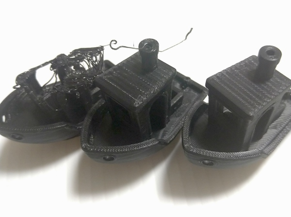

目的は3DプリンタのMODパーツの印刷。そのためには耐熱温度の問題からABSを使ってみることにした。ABSは印刷が難しいらしいが、やってみないことには何事も始まらない。

とりあえず以前買ったPLAと同じメーカーのものを買ってみることにした。

<!--more-->

## ABS難しい

印刷が難しいとは聞いていたが、予想以上に難しかった。

3Dプリンタを買って最初に印刷するのがABSだったら心が折れてたかもしれない。その点PLAは素直に印刷できて気軽でいいと思える。

PLAだと余裕で印刷できていたものが、ABSではまるで印刷できなかった。そもそもベッドに定着しない。ABSはベッドに定着しにくい、剥がれやすいとは聞いていたが、よもやここまでとは思わなかった。

観察してみると、印刷を始める最初の段階でフィラメントがしっかりと出ていないのが原因なように見受けられた。ほそぼそとしか出ておらず、そのせいでベッドに定着しない。ベッドにつかずにそのまま垂れ流された状態でヘッドと一緒に動き回るので、後続の樹脂が絡め取られてしまっていた。

運良く土台部分ができても、印刷が進むにつれて反りだし途中で剥がれてしまう。これは厳しい。

印刷物の形状によるが、接地面積に比べて頭でっかちな形状だと確実に剥がれる。頭でっかちでなくとも接地面積が狭いと剥がれる。では接地面積が広ければよいのかというと、それはそれで反ってしまう。印刷途中で完全にプレートから剥がれることはないものの、印刷終了時には見事に反り返っているのだ。

最終的にはフィラメントに付属していたシートを使うことでうまくいくようになった。レベリングし直しが面倒くさいものの、シートのおかげでベッドへの定着が改善した。しっかりと定着して剥がれないので、反りの問題も起きない。

代わりに印刷物を剥がすのに苦労するはめにはなったけれど。ヘラでガンガンやっても剥がれないくらいシートに食いついている。無理に剥がしたらシートが部分的に伸びて波打つ結果になってしまい、貼り直しを余儀なくされた。無理に剥がすのはダメ、絶対。

また、シートを使って印刷すると接地面が汚くなるのにも注意が必要かもしれない。接地面積が広いと特に気になるかもしれない。私の買ったABSフィラメントは黒色だが、剥がしたあとは白くなってしまっている。

## エンクロージャー

ABS印刷にあたって行った施策の1つがエンクロージャの作成である。

ちまたには[洒落たエンクロージャーを自作する人がいる](https://norihiron.at.webry.info/201908/article_1.html)。そういうのを作ろうかなと私も考えはしたが、パーツの印刷時間がかなりかかることを見て断念。

とりあえず適当に囲えるものを作ればいいかなと思い、ホームセンターで1820ｘ910のプラダンを仕入れてきて工作することにした。さすがに全面をプラダンで覆うと印刷の経過を確認できないので、正面にはアクリル板を取り付けることにした。

PLAのパーツで取り外し可能なように作ろうとしたが、無理そうなので全部グルーガンで固定してやった。青いパーツはその名残である。

印刷ステージさえ囲えばいいのだと、寸法も特に決めることをせずに勢いで作った。プラダン同士の固定にはグルーガンを使った。

これで囲うことで3Dプリンタの近くによったときに感じる熱感が変わる。こんな適当な作りではあるが、断熱性はそれなりにありそう。囲いを取るとムワッとした熱気を感じるので。

とはいえこれのおかげでABSの印刷がうまくいくわけではない。ないよりましかもしれないが、作ったからうまくいくほどの効果は感じない。だってこれを使ったところで普通に反るもの。

副次的な効果として、フィラメントのニオイの軽減にも効果はあるかもしれない。とはいえ完全に密閉してるわけではないので、熱と同じで漏れてくるけれどね。それでもなにもないよりはマシになってると思う。

## カスタムModに付け替えたら精度があがった

ABSで印刷しようと思っていた[カスタムMod](https://note.com/newspeak/n/n293f08fbe8b9?magazine_key=m2eb1e7e9c908)が印刷できてなんとか取り付けることができた。これによって印刷精度がかなり改善された。

左から初期・カスタムMod印刷前、カスタムMod導入後の印刷結果だ。最初はベッドへの定着がうまくいかず、印刷途中で剥がれるような状態だった。カスタムヘッド導入前後ではあまり差がないように見えるが、穂先の部分で見るとかなり違いが出ている。

ヘッドパーツの取替作業のときに一番大変だったのはケーブルを抜くことだろうか。めちゃくちゃ固くて泣きたくなった。ラジオペンチで外したけれど、微妙にケーブルを損傷してしまった。ケーブルのカプラーを外すのに便利な工具ってあるんだろうか。

<iframe style="width:120px;height:240px;" marginwidth="0" marginheight="0" scrolling="no" frameborder="0" src="//rcm-fe.amazon-adsystem.com/e/cm?lt1=_blank&bc1=000000&IS2=1&bg1=FFFFFF&fc1=000000&lc1=0000FF&t=illusionspace-22&language=ja_JP&o=9&p=8&l=as4&m=amazon&f=ifr&ref=as_ss_li_til&asins=B00PC24Z5W&linkId=22ccca692ef02ed8804e6332997d1ea7"></iframe>

<iframe style="width:120px;height:240px;" marginwidth="0" marginheight="0" scrolling="no" frameborder="0" src="//rcm-fe.amazon-adsystem.com/e/cm?lt1=_blank&bc1=000000&IS2=1&bg1=FFFFFF&fc1=000000&lc1=0000FF&t=illusionspace-22&language=ja_JP&o=9&p=8&l=as4&m=amazon&f=ifr&ref=as_ss_li_til&asins=B000TGJSTO&linkId=3701057eb49e270f214a188e7d63d805"></iframe>

このあたりがいいんだろうか。とりあえず印刷して取り付けたものの、精度が悪くてやり直したいと思っているので、このあたりを買って改めて取り付けてみたいと思う。

## ABSの強度

PLAで印刷したものも十分に固いと思っていたが、ABSで印刷したものと比べるとABSの強度がよく分かる。

PLAの場合はそれなりに厚みのある板形状であればそれなりに固いのだが非常に脆い。折り曲げる力をかけるとかんたんにポキっと折れてしまう。

これはPLAもそこそこ固いから大丈夫なのではと思ってフックの部分を細めに作ったモデルである。このようなフック状の形状だと、PLAで印刷したものはいとも簡単にポキっと折れてしまう。ABSはある程度しなってすぐに折れることはなかった。

次の画像はヘッドホンフックとして作ったもの。机の天板に挟み込むコの字型の部分は天板の厚みぴったりに作ったものだった。しかしPLAはヘッドホンをかけて1週間くらいで明らかに緩んできている。ABSはそこまでの変化は感じられない。

PLAだからすぐに壊れるわけではないけれど、瞬間的に力がかかるところには使わないほうがいい。継続的に力が加わるフック形状もあまり長持ちしないかもしれないので注意が必要だろう[^1]。

[^1]: 掛け時計を引っ掛けるフックをPLAで作ったけれど、半年程度ではまだ壊れていない。強度が出るようにやや太めに作ったおかげかもしれないけれど。それでも確認してみると少し形状変化してきていているので、いつか落ちるかもしれない。