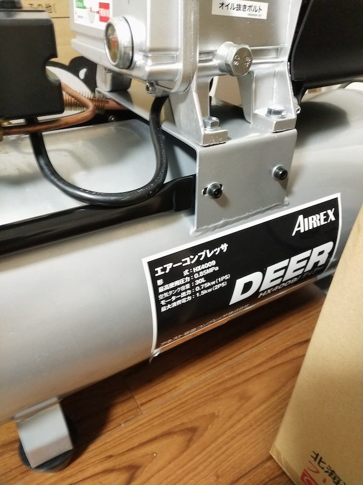
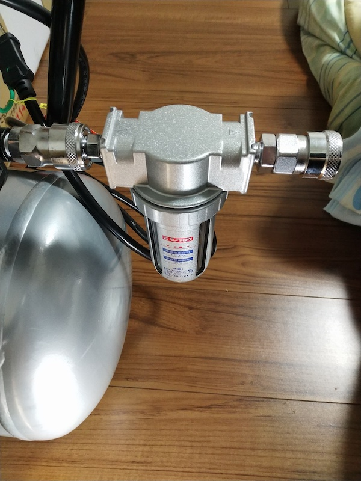
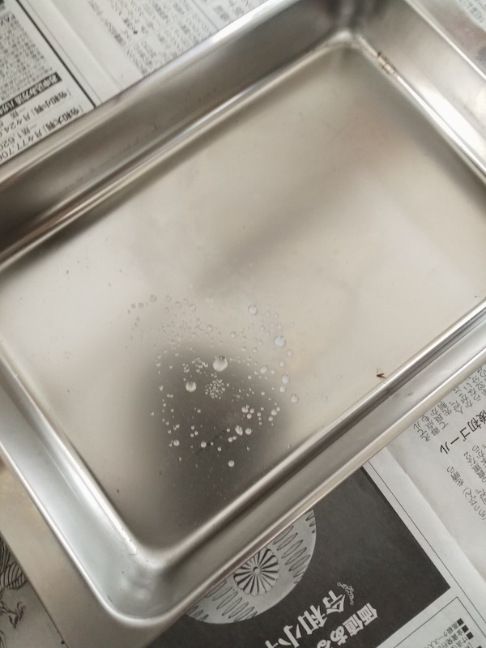

エアコンプレッサーを買ってしまった。本当はもっとタンク容量小さくて静音タイプのコンプレッサーを買うつもりではいたのだけれど。なんかホームセンターで安売りしてたので衝動買いしてしまった。買った後で「これオイル式やん」とか気づくなど、アホ丸出しである。

とりあえずエアコンプレッサー買おうかな程度からの衝動買いだったので、実際にちゃんとした運用ができるまでに非常に時間がかかった。おもに引っ越し作業の最中だったので、コンプレッサー自体はあるけど、その他の部品がないもしくは私自身が現場にいないかったのが原因だ。

今回ようやくちゃんと使える状態までしてみたので利用してみた感想を綴っておく。

<!--more-->

## エアダスターとは比べ物にならない威力

<!--textlint-disable-->
購入したのはアネスト岩田キャンベル オイル式ハイパワーコンプレッサー ディアー HX4009という機種。
<!--textlint-enable-->

今の所エアブロー目的がメインで利用している。さすがにエアダスターとは違って吹き飛ばす威力はかなりのものがある。

もともとエアダスターじゃ無理だなと感じたのは、VC750というマキタの集塵機のフィルタ掃除に端を発する。このフィルタ、細かい粉塵を吸うとものの30秒程度で目に見えて吸引力が落ちる。フィルタの周りにホコリがびっしり詰まってしまうからだ。

そのあたりは[VC750DZの記事]()で書いたので読んで欲しい。携帯できて便利なんだけども、フィルタがすぐに目詰まりするのが玉に瑕である。

で、このフィルタのホコリを吹き飛ばそうと思ったら、エアダスターでは若干無理がある。フィルタをまともにキレイにしようとすると、ダスターの半分くらいの量を使わないといけないほどの消費量となる。ホコリが細かすぎるので、エアダスターの威力ではなかなかきれいにならないのだ。何度もフィルタの掃除が必要になってくると、数回目でエアダスターが空になってしまう。いったいフィルタをキレイにするために何本必要になるのかという話なのだ。

そこでエアコンプレッサーを買ったというわけだ。さすがに吹き飛ばす威力も、残量も気にしなくていいのでフィルタの掃除が楽だった。ただし吹き飛ばしたホコリが、周りにものすごく拡散されていくので注意が必要だけれども。

タイヤの空気を入れるにも使えるなと思って、タイヤ用の先端工具と呼ぶのだろうか、部品を買って使ってみた。ただしこっちは製品の空気圧表示メーターがいまいち信用できず、もっとちゃんとしたの買わないとダメだなと思って返品予定である。

## とにかくうるさい

威力の方は申し分ないが、とにかく駆動音がでかい。室内での使用ははばかられるレベルである。もう室内で使う場合は室内用に静音タイプのコンプレッサーを別途買うべきかなと思うレベルである。

<!--textlint-disable-->
当初は高儀のEARTH MAN エアーコンプレッサーの13Lを買おうと狙っていたのだが、狙っているうちに市場から消えてしまった・・・。10Lのやつは静音といいつつ微妙に騒音値が高く、かといって25Lはでかすぎる。なぜ消えた13L・・・。
<!--textlint-enable-->

ともかく、私の買ったエアコンプレッサーは室内で使うのはちょっと厳しいレベルでうるさい。使えないことはないけれどもね。そもそも駆動音が大きいので、部屋の中で反響してしまい余計にうるさく感じるのだ。

それに室内で使うには大きすぎる。タンク容量が30Lあるのだが、その分でかいし重量もある。一応タイヤで転がせるので、動かすのにはあまり問題はないのだけれど、小回りがきかないのであまり室内向きではない。

それに外でタイヤころころして動かしたコンプレッサーを室内に持って入るのはやはりはばかられるので、もう室外用と割り切ったほうがいいかもしれない。室外で使うにしても取り回しが面倒くさいので、わざわざ室内に運んで使うなど以ての外かもしれない。

## オイル式

私の買ったコンプレッサーはオイル式だった。オイル式はオイル管理が面倒ではあるものの、オイルレスに比べると部品が長持ちするという話も聞くし、まあいいかと思っている。ただ、私の使用頻度だとオイルレスで十分だった気はする。安物買いの銭失いとはこういうことを言うのかもしれない。

まだ運転時間は1時間にも満たないので、オイル交換の手間などはまだ未知数である。というかいつ頃交換すればいいんだろうね・・・。目安では運転50時間で1度交換するようにとあったのだけれど、その50時間がいつ訪れるだろうかという意味である。

まあ引っ越しが落ち着いて作業をしだすようになると出番も増えてくるだろう、きっと。

## 本体と同じくらい周辺部品を揃えるのに金がかかる

エアコンプレッサーは本体があるだけでは使えない。やかましい音をたてて圧縮空気をためることしかできない。その圧縮空気を利用するには別途エア工具が必要だし、その工具に空気を伝えるためにエアホースが必要になる。何かと出費がかさむものなのだ。

特にエアコンプレッサーは仕組み上、吐出する空気に水滴がまじることがあるらしい。オイル式だとオイルが混じったりとかもあるらしい。そこでエアフィルターは必須だなと思ってまず最初に買った。

ちなみにこうやって接続して使えるようにするまでが長かった。エアコンプレッサーの知識ほぼ皆無の初心者なので、エアフィルターを買えば接続する部品もついているんだろうと思ったら、それは別売りだった。ちなみに写真で分かる通り、モノタロウで私は部品を揃えている。

「とりつける部品がねえじゃねえか」と怒りのメールを送り付けるも、単なる私の勉強不足、勘違いという始末だった。親切にもサポートの方が「この部品使えば取り付けられますよ」とわざわざ調べて教えてくれたので、この状態に仕上がったというわけである。

もっとも、引っ越し作業が間に挟まっていたため、部品は届けど実際に使うまでは1ヶ月以上の期間が空いてしまった。

ちなみに、今のところ吐出する空気に水分が含まれている様子はないし、エアフィルターに水が溜まっている様子もない。別にフィルタなくても良かったんじゃないかと思わなくもないが、使用しているうちに出るようになるのかもしれないのでお守り代わりとしてよいだろう。

事業者専用のモノタロウのサイトを紹介してもしょうがないが、使った部品は次のものである。

- [エアフィルター](https://www.monotaro.com/p/3489/1622/?displayId=5)
- [プラグカプラー(メネジ取付用)](https://www.monotaro.com/p/0992/6217/?displayId=5) エアフィルターのin側とエアコンプレッサーをつなぐ部品
- [ソケットカプラー(メネジ取付用)](https://www.monotaro.com/p/0992/6122/?displayId=5) エアフィルターのout側とワンタッチカプラーを接続する部品

ちなみに私の買ったエアコンプレッサーは1/4カプラータイプだったので、この組み合わせで接続できた。そのあたりはご自分の持っているエアコンプレッサーと相談しながら買われたし。

## ドレンの感じ

タンク内に空気を圧縮する以上、水滴がどうしてもタンク内に発生する。だから錆びるらしい。赤茶けたドレン水を放出している動画などをみて戦々恐々していたのだが、当たり前だが新品のエアコンプレッサーなのでドレン水というか水滴はこんな感じだった。

ああ、なんだこんな程度のものなのかとちょっと安心した。実はタンク内に水が溜まっていてそれが出てきていないだけなのではと疑い、ドレンバルブを緩めた状態でタンクを揺すってみたが結果は変わらなかった。まあ使いはじめだしね。そんなに使ってないし、ドレンの量はこんなもんなんだろう。

エア作業が終わったら、エアの吐出口、つまりダスターガンなどを使って空気を使い切るのではない。使い終わったらドレンの口から空気を抜くようにするのが基本らしい。そうやって使っていけば、そうそう水が溜まってタンクが錆びることはないのではと思っている。

さすがにタンク内に錆止めスプレーとかつけるのは不可能なので、こうやって丁寧につかっていきたいものである。せっかくのオイル式だしな・・・。メンテは持ち前の神経質さでちゃんとやっていきたい。ただしずぼらでもあるので忘れないようにしなければならないが・・・。

## 手軽さはエアダスターに勝てない

やはりエアコンプレッサーは、手軽さという面ではエアダスターに勝てない。ちょっとホコリやゴミを吹き飛ばしたいなというときに、さっと取り出して使えるエアダスターの手軽さには遠く及ばない。実際に今もエアコンプレッサーあるけどエアダスター使ったりしてるしね。

エアダスターとの違いは純粋に圧縮した空気をふきつけているかどうかだろう。エアダスターは可燃性のガスを使っているため、これで吹き飛ばしながら掃除機で吸い込むなとか注意書きがあるはず。エアコンプレッサーならそのあたりは気にしなくてよいのは利点だろうか。無理やり見つけ出した利点のようなものでもあるが。

ただ威力は圧倒的にエアコンプレッサーだ。残量を気にしなくてもいいのもGoodだ。下手な使い方して圧縮空気が入っている状態でタンクに穴を開けたりしない限りは爆発することもないだろう。

ただ、やはり室内用に別途エアコンプレッサーはほしいと思ってしまう。静音で、タンク容量も少なくていいから、取り回しのしやすいやつがあればいいなと思っている。なんか室内用でダスター用のコンプレッサーでいいのないすかね？　基本はホース類は使い回せるはずなので、本体さえあればいけるのではと思っている。

## やはりオーバースペック感が否めない

私の用途ではやはりオーバースペックすぎる感が否めない。VC750DZのフィルタ掃除用に買ったといいうか、ほぼそのためであるといえよう。一応他の用途にも使えるからという言い訳は用意しての購入だったが、ちょっと早まったかなという気持ちがどうしても見え隠れしてしまう。

そのうち車庫の土埃を掃除するときには大活躍するだろうが、うちの車庫は私の管理下にない。そもそも農作業の道具をそのまましまったりするから、常に土埃だらけなので掃除するだけ無駄な場所である。そうなると、エアコンプレッサーを買ったのはやはり行き過ぎではと思わなくもない。

ちなみに、今回記事を書くに当たり損益分岐点を計算することにしてみた。要するに、エアダスター何本以上使うことになると、今回のエアコンプレッサーの方がお得になるかである。

エアコンプレッサーはもろもろあわせて26000円くらいかかっている。エアホースを格納する回転式のリール[^1]なんかも買ってるので、そういうの合わせた金額である。リール抜いたら20000円くらいかな。

エアダスターはモノタロウで調達するならまあ400円くらいだろう。エアダスターを65本買うところで、エアコンプレッサーがお得ということになる。ちなみに、エアコンプレッサーを動作させるための電気代・メンテ用のオイル代は抜いてある。それを含めるならだいたい70本くらいと考えればいいだろうか。

エアダスターを70本か・・・。損益分岐点を迎えるまでは相当の期間が必要になりそうである。

もっとも、エアダスターでは根本的に威力が足りない場面もあるので、エアコンプレッサーで良かったという場面も出てくる。じっさい、VC750DZのフィルタ掃除は、エアダスター使うより圧倒的に楽に掃除ができた。残量を気にする必要がないのと、そもそも威力が違うのでね。あれくらいであれば、頻繁にフィルタ掃除が発生してもなんとかやっていけそうとは思った。

以上、エアコンプレッサー初心者からのレポートであった。ちなみにもろもろの部品を取り付けるのに、薄型のスパナがあると便利だった。特にエアフィルタ、エアコンプレッサーの空気取り込み口につけるもののとりつけには、21mmのスパナがあったほうがいいだろう。モンキーではちょっと入らないと思う。

<iframe style="width:120px;height:240px;" marginwidth="0" marginheight="0" scrolling="no" frameborder="0" src="//rcm-fe.amazon-adsystem.com/e/cm?lt1=_blank&bc1=000000&IS2=1&bg1=FFFFFF&fc1=000000&lc1=0000FF&t=illusionspace-22&language=ja_JP&o=9&p=8&l=as4&m=amazon&f=ifr&ref=as_ss_li_til&asins=B07HYTTR1N&linkId=8821cb1fd691f7582d88bb21e3e1b1d9"></iframe>

ちなみに私はこれを使った。メネジカプラーの取り付けなどもこれでカバーできたのでちょうどよかった。

## やっぱり使うときは使う

電動丸ノコを使ったんだが、びっくりするほど木くずまみれになってしまった。この片付けはエアコンプレッサーないと無理だわとさっそく大活躍してもらった。電源が近くにあって時間的に騒音の迷惑がかからない状況であれば、利用するのに躊躇はない。むしろエアダスターなどでは決して掃除しきれないので、コンプレッサー買ってよかったと思う。

だからエアコンプレッサーについて「あまり使わないかも」というのは、単にうちが使う環境的に使いにくいというだけの話なのだと思う。自分専用のガレージとかがあると、ものすごく活躍してるだろう。そう、自分専用の作業小屋というかガレージというか、そういう設備があれば気兼ねなく利用できるはず。場所的な問題でこういった作業をすべて屋外でしなければならないから、コンプレッサー使うのがためらわれるだけであった。

[^1]: 実際に使ってみて思ったが、ホースをそのまま管理するのは、ただでさえ面倒くさいエアコンプレッサーの取り回しを余計に面倒くさくさせてしまう。そこでリールを使ってホースの格納問題をクリアしたというわけである。基本はリールに巻いておいて、必要な長さだけ取り出す、使い終わったら巻くだけでしまえる。リールがなければ毎回手で巻き直してしまわなければならず、私は1度目でリール購入を決意したほどである。
