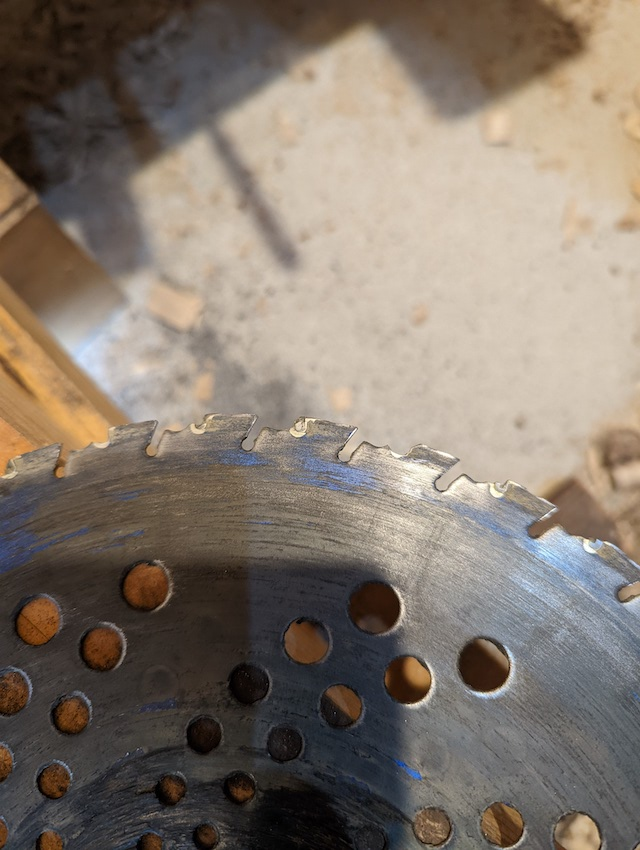

普段私はホームセンターで1枚500円くらいのチップソーを使って草刈りをしている。わざわざ高いのを使う気になれなかったのが理由だが、一方で安物を使うよりも高いのを使った方が作業が楽になるという意見も見かける。そこでちょっと高いチップソーを使ってみることにした。

高いと言っても1枚2000円のものである。そんなのは高いうちに入らないのかもしれないが、同じ価格で5枚入ったものを普段使っている身からすれば、十分に高い。

結論から言ってしまうと、安いので十分だという結果になった。

<!--more-->

## すさまじく軽い切れ味

ちょっとお高いチップソーの切れ味はどんなもんかなと試してみたら、あまりの切れ味の良さにびっくりした。なんの抵抗も感じない。まるでなにもないかのように草が刈れる。これは快適だ。さすがに高いだけのことはある。

また製品名が特徴となっているのか、サメの歯のようにチップソーが欠けたとしても尖った状態で欠ける。これは写真に撮ってないから何のこっちゃとなるかもしれない。あえて欠けやすくしているのかなと思った。それでも尖った状態が保たれるので、切れ味には影響しないということだろう。

しかし・・・。

それだけだったな。

一時間ほど刈っただろうか、チップが全滅していた。

## 石に強いとは一体・・・

石に強いというのは嘘なのか。それくらいあっさりと、すべてのチップがきれいに無くなっていた。あまりの速さに驚きである。

安物のチップソーでもまだチップは残っているぞ。たった一度使っただけで何たる体たらく。

確かに石に強いということで、普段よりも雑に扱っていたかもしれない。切れ味がよいのが気持ちよくて、調子に乗って際刈りしすぎて何度も地面に潜り込ませたのも悪かったかもしれない。だが、この程度で全滅するなら石に強いという謳い文句はなくしてもらいたい。

## しかも研ぎにくい

しかもである。このチップソーはとにかく再研磨して使うことが難しい。[^1]

そもそも最初の歯の形状が波打っていて複雑である。この時点ですでに研ぎにくい。

それからチップを保持している周りの部分ごときれいサッパリ吹っ飛んでいる場所もある。こうなると、チップがあった部分を尖らせようと思っても無理である。

これなら安物チップソーの方が総合的に長く使えるではないか・・・。

## 結論、安物でいい

確かに最初に使ったときの切れ味は良かった。こればかりは安物チップソーでは真似できない。

しかし耐久性は皆無である。長く使うこともできない。これではどちらが使い捨てなのか。高くて使い捨てとか救いようがない。

石に強くするためのコブ形状も、全然石に強くないし。逆に再研磨をしづらくしていて余計な機能である。

私はナフコとかカインズとかで売ってるノーブランドの5枚セットになったやつをよく使っている。ネットで買うならこれとかが近いのかもしれない。

<iframe sandbox="allow-popups allow-scripts allow-modals allow-forms allow-same-origin" style="width:120px;height:240px;" marginwidth="0" marginheight="0" scrolling="no" frameborder="0" src="//rcm-fe.amazon-adsystem.com/e/cm?lt1=_blank&bc1=000000&IS2=1&bg1=FFFFFF&fc1=000000&lc1=0000FF&t=illusionspace-22&language=ja_JP&o=9&p=8&l=as4&m=amazon&f=ifr&ref=as_ss_li_til&asins=B01HFVFN8A&linkId=60cbde02fe27f894b3f8c7d57b1a98d2"></iframe>

このチップソーを、チップがある間はチップを研磨して使う。すべてのチップが飛んでしまったら、チップがついていた部分を研磨して尖らせて使う。チップがなくなるとすり減りやすくなるが、チップがない状態でも研げば切れる。仕事で使うわけではないので、それで十分1年くらいは保つ。

余談だが、笹刈刃として使うことも可能らしい。実際試してみたけれど、これは流石に研磨する時間が無駄だと思う。刃の形を変えるのにそもそも時間がかかるし、専用のヤスリも必要だ。それでいて1回使ったら刃の形から直すくらいに研磨が必要で割に合わない。

<iframe sandbox="allow-popups allow-scripts allow-modals allow-forms allow-same-origin" style="width:120px;height:240px;" marginwidth="0" marginheight="0" scrolling="no" frameborder="0" src="//rcm-fe.amazon-adsystem.com/e/cm?lt1=_blank&bc1=000000&IS2=1&bg1=FFFFFF&fc1=000000&lc1=0000FF&t=illusionspace-22&language=ja_JP&o=9&p=8&l=as4&m=amazon&f=ifr&ref=as_ss_li_til&asins=B003EILB44&linkId=edd027d140941aa1f53a5f98f036c6c6"></iframe>

話がそれたが、安物でも研磨すれば長く使えるということ。その点このチップソーは高いだけで研磨して使えないので非常にコスパが悪い。まあ最初の切れ味だけはこれまで体験したことのないものだったから、それで満足ということにしよう・・・。

[^1]: もっとも、再研磨して使うなと注意書きに書いてあるから、研磨することを前提としていないのかもしれない。