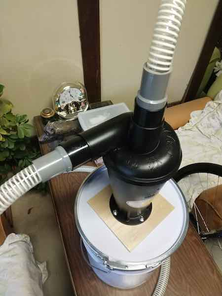

電動工具を使った作業、特にトリマーを使ったときの粉塵がかなり激しい。集塵機で吸えばいいのだが、この集塵機も結局はアダプタが必要だったりするので思うようにいかない。

なにより集塵機で吸ったところですぐにフィルタが目詰まりするので、集塵機のフィルタの手入れの手間が増えて何してるのかよくわからなくなってくる。

そんなときに、世の中にはサイクロンユニットを自作するという方法があるのだということを知った。これはいいぞと思って私も試してみることにした。

<!--more-->

## パーツを買うことに

本当に一からDIYする人もいれば、Amazonで売っているサイクロンユニットを使って作る人もいる。私は後者を選んだ。ゼロから作るのと金額的には大差なさそうだなと思ったからである。

選んだのはこれ。

<iframe style="width:120px;height:240px;" marginwidth="0" marginheight="0" scrolling="no" frameborder="0" src="//rcm-fe.amazon-adsystem.com/e/cm?lt1=_blank&bc1=000000&IS2=1&bg1=FFFFFF&fc1=000000&lc1=0000FF&t=illusionspace-22&language=ja_JP&o=9&p=8&l=as4&m=amazon&f=ifr&ref=as_ss_li_til&asins=B07GB88TM6&linkId=4fde2b9bb41fda76cf7cd573f6300db4"></iframe>

もっと安いのもある中これを選んだ理由は、粉塵を貯めるゴミ入れ（私の場合はペール缶を使っている）と固定するためのボルトやらナットがセットになっていたのが決め手となった。後からボルトを探すの面倒そうだなと、その程度の理由である。

## 必要なもの

このサイクロンユニット以外に私は次のものを追加で購入した。

- ペール缶（バンドで密封するタイプ）
- サクションホース（直径25mmのもの）
- TS継ぎ手（サイクロンユニットとホースをつなぐための30-25の継ぎ手）
- その他電動工具と接続するためのTS継ぎ手（工具側との形状により試行錯誤して選ぶ）

サクションホースは25mmにした。接続する掃除機が集塵機ではなく単なるハンディクリーナーなので、ホースの径が大きいと吸引力不足になりそうな気がしたからだ。あとは25mmだとハンディクリーナーや掃除機にちょうどいい感じにハマるので、継ぎ手を加工したりする必要がないのも良かった。

サイクロンユニットとホースは30−25の継ぎ手を使うことで変換した。30の継ぎ手だけではスカスカになってしまうのだが、サイクロンユニットに付属していた接続用のパイプをかませるといい感じにハマってくれた。このパイプは、サイズがかなりギリギリに作ってあるのでめちゃくちゃはめにくい。Amazonのレビューに「はまらない」というものがあったが、私の場合はなんとか入れることができた。

サイクロンユニットとペール缶の間にベニヤ板を挟んでいる。強度の問題がどうのというのを見かけたので、余ってるベニヤ板があったので一応つけてみた感じである。たしかにペール缶の蓋の部分だけではがっしり固定できないかもしれない。

ちなみに写真はないが、穴を開けた部分は裏側からコーキングして隙間をふさいで密閉してある。

## 面倒だったところ

ペール缶やベニヤにサイクロンユニットを入れる穴を開けるのが一番面倒な作業だった。

次点はホースの選定と各種器具をつなぐための変換コネクタ（TS継ぎ手）の選定に頭を悩ませたことだろう。作ってみた系の動画やブログは見かけても、どのホースを使ったとかどうやってつないだとか言う情報がないので、割と悩んだ。

最終的には出たとこ勝負だということで、うまくいかなかったら削ればいいやと出たとこ勝負に出た。結果的には意外とすんなりつながってくれて助かった。

マキタのトリマの集塵接続との繋ぐ部分にもTS継ぎ手30−25を利用した。こちらはシールテープをトリマの集塵接続カバーの周りにまかないとゆるすぎてすぐ抜ける状態だったが。

## 効果について

まだトリマーを使って木材を削りまくるとこまで試せていないので、電動工具仕様時の粉塵飛散をどの程度軽減できるかはよくわからない。

とりあえずハンディクリーナーでも普通に集塵するし、ゴミはペール缶にほとんど入っていって、クリーナーのダストボックスまでゴミはほとんど来なかった。このあたりはYouTubeなどで動画にしてる人が大勢いるので、そういうのを見ればいいと思う。

これなら集塵機側のフィルタのつまりを気にせず使うことができる。もっと早く知っていればVC750DZを手放すことはなかったかもしれない[^1]が、後の祭りである。

とりあえず集塵機使っているけど、フィルタの掃除がめんどくさいという人は、このようなサイクロン式ゴミ分別機を導入してみると世界が変わると思う。

集塵機を持っていなくとも、家庭用の一般的な掃除機をつないでも使えるのは利点だと思う。業務用の集塵機を買うと高いので、こういったもので代用するのも全然ありだと思う。

[^1]: フィルタがすぐに詰まって吸引力がすぐに落ちるので、フィルタの掃除の手間のほうが大きくなってしまった。電動工具と接続しようにも別途アダプタを買わなければならず、しかもホースの長さ的に取り回しがしづらいこともあって手放した。このサイクロン分離機があればそのまま使っていたかもしれないが後の祭りである。