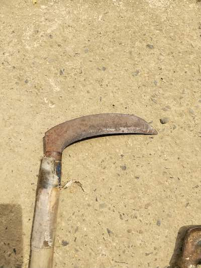
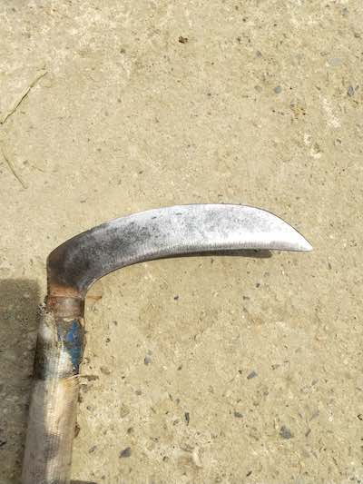
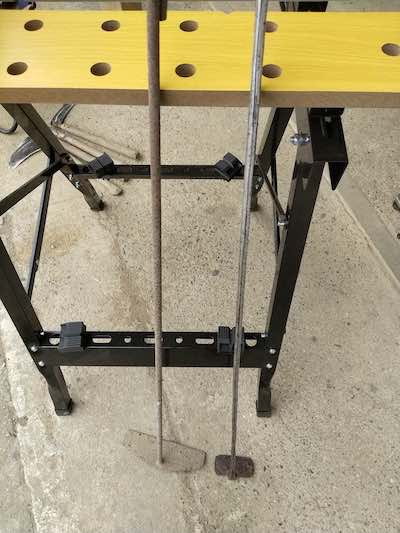

ディスクグラインダ自体はホームセンターに行けば5000円以下で買えるような代物である。実際うちにも古いグラインダが2台あった。自宅と祖父の家に1台ずつで2台という意味だ。どちらもホームセンターで売っている安物であるが、グラインダとして利用するのには十分なものである。

だが諸々の理由から、18Vのバッテリ式のディスクグラインダを購入した。マキタでかつ18Vなのは、最初に18Vのマルチインパクトドライバを買ったからである。だから18Vの中からディスクグラインダを選んだらこれになったというだけである。

ただ、これを選んだのにはちゃんとした理由があるのでそれを説明しておきたいと思う。

<!--more-->

## グラインダはすでにあったのに買った理由

その理由は、安物のグラインダが単純に「怖かった」からである。

試しにコンセントを繋いで電源を入れてみたが、まず出てきた感想が「怖い」だった。スイッチ自体はグラインダによって場所が違うだろうが、コンセントの根本、つまり手で握る部分の後方についていた。これ、何かあったときにスイッチ消すの難しくないかというのがまず1つめの感想。

そしてその回転速度。結構な風を感じる勢いで高速回転するそれを見て、これちゃんと制御できるのかと不安におもったのが2つ目。

極めつけは、スイッチを切った後である。ブレーキ機能なんてついていないので、電源を切ってもしばらく高速回転で回転し続けるのである。あ、これを使うのは私には無理だわと、たった一度試しに電源入れてみただけで思ってしまったのだ。

## スイッチはすぐに切れなければ怖い

ディスクグラインダは簡単に手に入る割にめちゃくちゃ事故りやすい製品でもある。よくあるのが軍手をしてディスクグラインダを使い、回転するディスクに軍手が絡まりそのままの勢いで指が持っていかれて吹っ飛んだというやつである。ディスクグラインダあるある事故である。

たとえばこのような状況に際したとき、先に述べたグラインダではもう巻き込まれた時点でおしまいである。巻き込まれたと思ってスイッチはグラインダの根本のコンセントのところにある。左手はすでに巻き込まれている。スイッチが切れるわけがない。

幸運にもスイッチが切れたとしよう。しかしディスクは惰性で回転を続ける。やっぱり巻き込まれたままである。最悪コンセントを引き抜いて電源供給が止まっても、この惰性による回転は続く。巻き込まれた時点でジエンドなのだ。

もっとも、ディスクグラインダを使用するに当たって軍手を使うなというのは常識中の常識である。もっというと、回転工具全般について、軍手を使うなというのは当たり前のことなのだ。軍手は巻き込まれやすく、大惨事になる恐れがあるからだ。

他にもたとえばキックバック現象[^1]というものがある。グラインダで削っている対象に、変な当たり方をして大きな反発力が発生し、グラインダ自体が後方に弾かれる現象をキックバック現象という。これも怖い。

普通に作業してたらいきなりグラインダが跳ね返ってきたりするわけである。想像して欲しい、そんなときにもスイッチが入りっぱなしで回転を続けているわけである。恐怖以外の何物でもない。

こうした理由から、私はマキタのGA418DZという型番のグラインダを購入したというわけだ。

## 型番がややこしい

さて、マキタもいろんな種類のグラインダをだしている。購入にあたっては型番をしっかり見比べて、自分が買おうとしているものと合致しているかを確認するのが大事だ。

GAというのがディスクグラインダの型番を表す。

続く4or5がグラインダのディスクの径を表す。4が100mmで5が125mmである。私は扱いやすさの面から100mmを選択した。上述の理由から怖いとか言ってるやつが、さらにでかい125mmのグラインダを扱えるとは思えなかったからである。

ちなみに100mmと125mmの違いは、サイズが大きいので切断砥石を使う場合は125の方が1枚の砥石で多く切断できるとかそんな感じだ。ただ、市販されている多くの砥石は100mmの方が多いのではないだろうか。入手しやすさや扱いやすさから100mmの方がいいのではないかとは思う。

型番数字の2桁目はよくわからない。Bluetooth対応とかだっただろうか。ここはあんまり気にしなくていいと思う。集塵機とBluetoothで連動できるよとかそんな機能だから。

そして3桁目がスイッチのタイプだと思う。1〜4までだとスライドスイッチタイプ。6〜8はパドルスイッチタイプだと思えばよいのだと思う。このあたりはカタログをしっかり見て確認して欲しい。間違ってる可能性もあるので。

ちなみにマキタのスライドスイッチは握りの部分と回転部分との間にあるので、比較的緊急時にもスイッチを切りやすいと思われるが、どうせ買うならパドルスイッチタイプにした方が絶対にいい。特に初心者が買うならどう転んでもパドルスイッチタイプにすべきである。扱いやすさが段違いだからだ。

## パドルスイッチの利点

握っている間だけディスクが回転する、ただそれだけに尽きる。そしてマキタの製品はブレーキ付きなので、パドルスイッチを離せば、つまり握りを離せばディスクの回転はすぐに止まる。

握ったらすぐにスイッチが入るわけではなく、ロック機構というか、握りの手前にぴょこんと飛び出た部品がある。これを倒すことでスイッチが握れるようになる。だから単に持ち上げるつもりで持っただけで回転をはじめたりはしない。

たまにこのロック機構が外れてると思っても、倒したまま握りきれてないから回ってないだけみたいな状態になることがあるので過信は禁物だが、誤動作を防ぐ機構はきちんとついている。

作業の間は握っていないといけないので疲れるのだが、正直なところそれはスライドスイッチでも同じだと思う。グラインダ自体が2.5kgくらいと結構重いので、しっかり保持するにはそれなりに力がいるし、作業中は握りに力が入る。パドルスイッチだとちょっと力を抜けば止まるわけだから、作業がしやすいのだ。

特に頻繁にスイッチの入切りをするような細かい作業をするときはこれが便利でいい。たとえば農具のカマの刃先を研ぐときとか、パドルスイッチだとやりやすい。

あとは私の買ったGA418はスピードダイヤルがついているので、回転速度を制御できるのもちょっとした魅力である。低速回転が適した作業にも使えるし、高速回転で切断砥石を使うのにも使える。そういう便利さがある。

あとは数字の後ろにもいろいろ型番がついているが、だいたいマキタの場合DZで終わっている製品はバッテリなどがセットになってない本体のみのであることを表す。私はすでに充電器やバッテリを持っているので、GA418DZとグラインダ本体のみのものを買ったわけである。

もしこのグラインダがはじめてのマキタ製品購入になるのであれば、バッテリ・充電器付きのDRGを選ぶといい。

ともかく、そういう違いで型番が違うので、マキタのホームページなりカタログなりをしっかり確認して間違わないように買うようにしよう。

## 何に使うのか

グラインダを買ったのはいいが、一体何に使うのか。そこを聞かれると私も若干返答に困る。

たとえばサビた鉄製品の錆落とし。先の例でいえば、錆だらけのカマを再生させるわけである。

ピカピカになるのが気持ちよくなり、つい熱中してしまう。他にも錆だらけになった火かき棒なんかの錆も落としてみた。

右側のきれいなやつは、もともとは左側のものと同じように錆だらけになっていたものだ。これもやっぱりあまりにきれいになるものだから熱中してしまった。

ちなみに、この錆を落とした状態のまま放置すると、びっくりするくらいすぐに錆が湧くので錆止めを塗るのを忘れないようにしたい。私はサビを落としたこれらのものを、再度錆落としする羽目に陥った。

こんな感じで鉄製品の錆落としに使える。

カマに関しては砥石をダイヤモンド砥石に変えて、刃先を研ぐことも可能である。カマの刃は湾曲しているので、欠けていたりするとグラインダでざっと研いだほうが早い。鎌研砥石を使うくらいなら、新しいのを買ったほうが早いくらいだろう。

カマの用に湾曲した刃物を研ぐのに適した、アールのついた砥石[^2]もあるのでそういうのを使うのもありだ。

<iframe style="width:120px;height:240px;" marginwidth="0" marginheight="0" scrolling="no" frameborder="0" src="//rcm-fe.amazon-adsystem.com/e/cm?lt1=_blank&bc1=000000&IS2=1&bg1=FFFFFF&fc1=000000&lc1=0000FF&t=illusionspace-22&language=ja_JP&o=9&p=8&l=as4&m=amazon&f=ifr&ref=as_ss_li_til&asins=B01L8EF880&linkId=98d9594d1c5aba81a0fb93c944d7c5e8"></iframe>

<iframe style="width:120px;height:240px;" marginwidth="0" marginheight="0" scrolling="no" frameborder="0" src="//rcm-fe.amazon-adsystem.com/e/cm?lt1=_blank&bc1=000000&IS2=1&bg1=FFFFFF&fc1=000000&lc1=0000FF&t=illusionspace-22&language=ja_JP&o=9&p=8&l=as4&m=amazon&f=ifr&ref=as_ss_li_til&asins=B005YSTK54&linkId=b132612730cc5515a1c31378dbe7aff4"></iframe>

## 砥石の種類多すぎ問題

さてそうやって豊富な砥石を使っていろんな作業ができるわけだが、今度は砥石の種類が多すぎて何をどれに使うのかがよくわからなくなる。

新品を買う場合や、切断砥石はまあ何をするものかは見たら分かる。ちなみに切断砥石はちゃんと専用砥石カバーを付けて使うように。これも事故が起きやすいアイテムなので。

問題はうちに残された何に使えばよいのかわからない砥石たちである。金属に使っていいのか、木材に使っていいのかパッと見ではわからない。

その辺りがよくわからないので、自由研削砥石なるテキストを入手して調べてみたのだが、結論から言うとやっぱりよく分からない。

たとえばこういう本だ。

<iframe style="width:120px;height:240px;" marginwidth="0" marginheight="0" scrolling="no" frameborder="0" src="//rcm-fe.amazon-adsystem.com/e/cm?lt1=_blank&bc1=000000&IS2=1&bg1=FFFFFF&fc1=000000&lc1=0000FF&t=illusionspace-22&language=ja_JP&o=9&p=8&l=as4&m=amazon&f=ifr&ref=as_ss_li_til&asins=4805917660&linkId=5acaad87bbb0d390d10c6ca7e1b89fb4"></iframe>

しかしながらこういった本は、ディスクグラインダ用だけではなくグラインダ全般について書いてあるので、自分が欲しい情報はあんまりなかった。砥石自体にはいろんな表示があって、それにはこういう意味があるんだぞということは分かったけれど。ではそれが、どういったワークに対して使うべきものなのかが結局分からずじまいなのである。

ただこういった事故の多い製品に対する知識を深めるという意味では、一度読んでみるのはいいことだと思う。図書館とかで借りて読んでみてはどうか。私はメルカリで教本を安く手に入れた。

## 最後に失敗談をば

さて、最後に失敗談を書いて締めようと思う。あまり締まらないけれども。

グラインダの砥石はフランジとナットと呼ばれる部品の間に挟んで固定して使う。で、このナットの取り付け・取り外しには専用の工具を利用する。

私はこの工具を使うのではなく、電動道ライバーのビットでこういう作業ができるものがないのかと思って探したことがある。特に切断砥石カバーを付けていると、レンチとカバーに手が挟まれて痛い思いをしたことがあったので。

実際そういう製品はある。私の検索力が低いのか探すのに苦労した。

<iframe style="width:120px;height:240px;" marginwidth="0" marginheight="0" scrolling="no" frameborder="0" src="//rcm-fe.amazon-adsystem.com/e/cm?lt1=_blank&bc1=000000&IS2=1&bg1=FFFFFF&fc1=000000&lc1=0000FF&t=illusionspace-22&language=ja_JP&o=9&p=8&l=as4&m=amazon&f=ifr&ref=as_ss_li_til&asins=B001HPKRPA&linkId=97a97f1fed194afa45871758bbd70aeb"></iframe>

ベッセルのディスクナット用ピンレンチという。ただ、これを使うのは砥石を外すときに限定したほうがいい。間違っても砥石を取り付けるときに使ってはならない。それが私が犯した失敗である。

というのも、砥石を取り付ける際は、砥石の穴とフランジなどがしっかり噛み合っているかを確認しながらやらなくてはいけない。しかしこのビットを使って取り付けようとすると、実際には砥石の穴がずれていても力ずくでナットを締めることができてしまう。取り付けた後にやけに切断砥石の減り方に偏りがあるなぁなんて思いながら作業をしたのだが、そう思ったら作業をやるべきではないのだ。何のことはない、砥石が中心に固定されておらず、ナットで無理やり固定されているだけの状態だったのである。

そのときはまだ教本で勉強したりしてなかったので、完全に無知な状態だった。それでもさすがにこれは砥石を取り外す際にゾッとしたので、以来このビットの出番はほとんどなくなった。ナットがどうしても固着して手では外せないときに出動してもらうくらいだが、普段使うレベルではもう出番がない。

せっかっく苦労して探して買ったのにもったいないと思うかもしれない。微調整しながら締めることはこれでも可能だけれど、それなら手で締めたほうが確実というものである。しかしこの失敗を経たおかげで、以降砥石の取替え時は砥石の中心とフランジがしっかり噛み合っているか確認しながら取り付けるようになった。

本当に、あの中心軸がぶれた状態で切断砥石で作業したのに無事故だったのは幸運としか言いようがない。補強つきの切断砥石だったのでまだ大丈夫だったのだろうが、下手をすると事故っていただろうと思う。

## まとめ

そんなわけで危険性を伴う製品ではあるので、使用には最新の注意を払う必要がある。特に砥石に関しての説明はほぼ皆無なのに、その砥石の取扱がもっとも注意が必要というタイプのものなので、あまり気軽に買うのもどうかと思う。

買うなら絶対にパドルスイッチタイプのものをオススメする。安心感がまるで違うからだ。

その上で、必要性に迫られない限り買う必要のない工具でもある。あったらあったで非常に便利なのだがね。バリをとったりとか錆や塗装を剥がしたりとか。鉄パイプを切断して粗大ごみ回避に使うとかもできるしね。

ただ下手をすると本当に事故る危険性を秘めた危ない工具であることは認識しておくべきで、取り扱いには最新の注意が必要だ。最後に書いたような失敗談のような状態では使ってはならない。私の場合は幸運だっただけである。

[^1]: キックバック現象は回転工具全般に起こる現象で、他に丸のこなんかでも起きうる。丸のこも使い方を間違えると怖い工具である。
[^2]: 砥石と言うからには石であるべきなのだが、ペーパータイプのものも多い。これを砥石と呼ぶべきなのかがよくわからない。