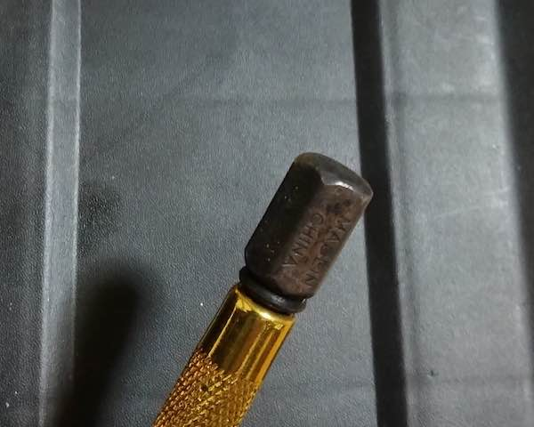

以前物置の片付けをしていたら、戸の開き具合があまりにも固く、片付けをそっちのけにして戸の修理を始めたことがある。その戸は戸車を使っているタイプなのがわかっていたので、そのうち直そうと戸車だけは用意していたのだ。

戸車の修理工程自体は、それはそれで大変だったのだが、なかでも戸車を釘で固定するのが難儀した。戸の底は平らではなくレールが通る部分が凹んだ形状をしていたため、どうやっても金槌で釘をたたけないのである。そのときは適当な細長い金属を当て木ににして釘を打ち込んだのだが、こういうときに使えるアイテムとして万能釘締め機を購入したのである。

<!--more-->

## 使えることは使える

今のところまだそんなに活躍しているわけではないのだが、ハンマーの叩く力をピンポイントで釘に伝えたりするのに使える。具体的には、古い釘を打ち込むのに、ハンマーだけではなかなか入り込んでくれなかったところ、これを使うといい感じに力が集約されて釘を打ち込むことができた。ちなみになぜ古い釘を打ち込んだかというと、本当は抜きたかったのだが錆によって抜けず、仕方がないから打ち込んで邪魔にならないようにしたのである。

先端部分には磁力がついているので、ボロボロの釘のサビ成分が吸着して汚くなった。商品説明を見ると、この部分が凹んだりしたら削って使ってくれと書いてあるので、そこまで硬い素材ではなさそう。マグネットを仕込んでいるからそのせいかもしれない。

## それ以前の問題

ところでこいつを見てほしい。私は新品で購入したのだが、ヘッドの部分が最初からこんなに錆びていた。

新品のはずなのにこの状態・・・ちょっとひどくない？

さすがに購入したところに文句を言ったのだが、製品製造上の都合上どうしようもないらしい。これはメーカーの問題なのか、それとも販売者の製品管理がおざなりなのか。まあ両方なんだろうけれど。

ヘッドの部分はハンマーで叩くから錆止め加工してもしょうがないのかもしれないけれど、それにしたって錆止めくらい塗っておいてくれてもいいじゃないと思う。

販売店は販売店で、品質チェックをちゃんとしておけよと思う。メルカリで中古買ったほうがマシレベルのものが送られてくるなんて思いもしなかった[^1]。さすがにこれはないだろうと文句をいうだけは言っておいたけどね・・・。

でもこの品質なら、別にこの製品使わなくても適当な金属を当て木にして使ってもいいんじゃないかという気がする。実際に狭い部分に釘を打つ場面に出くわさないと便利さがわからないのだが、そうそう出番がないのでいまいち便利さがわからない。が、戸車直すときにかなり困ったので、とりあえず持っておいて損はないかなと思って買っておいた。

これから買う人へのアドバイスは、通販で買うなら錆びたやつが送られてくる可能性があることは念頭においておくべきだろう。交換を申し出ても、交換された品も錆びている可能性があるので、そもそもあんまり期待せずに買ったほうがいいと思う。実物を見て買えるならそれが一番。

ただ、ハンマーが届かない部分に釘を打たなければならない場面に出くわしたときはどうしたものかと途方に暮れてしまうので、転ばぬ先の杖として持っておくのも悪くはない。でもやっぱり、この値段でこの品質だとちょっとなぁと思わざるを得ない。

[^1]: 実際メルカリで検索してみたら、見た目キレイそうなものの取引履歴があった。