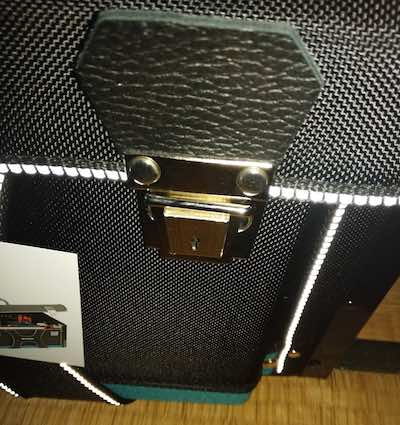

電動工具を買い漁るようになり、徐々に収納・運搬に困るようになってきた。これまではプラスチックケースに収納していたのだが、持ち運びが面倒くさいのでマキタの巨大なツールケースを購入することにした。

元々は電動工具をまとめて収納・運搬する目的で購入したのだが、電動工具をこのツールケースいっぱいになるまで入れると重すぎて持ち運べないレベルになった。

<!--more-->

## 購入前の収納方法

購入前は適当なプラスチックケースに収納していた。

「なんだよ余裕じゃん」と思われるかもしれないが、付属品とか先端工具とかを取り出した状態で撮影しているので、本来はもっとパンパンになっている。ついでにいうとこのプラスチックケースでは入り切らないレベルに育ちつつあったのである。

これはもう限界だと思ったので、マキタで一番大きいツールケースを購入したというわけだ。でかい分、お値段も張るが・・・。

ちなみにマックケースと言って四角いケースもあるのだが、そちらは選ばなかった。そっちを使うと手提げはあるものの、プラスチックケースに収納するのとあまり変化がないかなと思ったからだ。

<iframe style="width:120px;height:240px;" marginwidth="0" marginheight="0" scrolling="no" frameborder="0" src="//rcm-fe.amazon-adsystem.com/e/cm?lt1=_blank&bc1=000000&IS2=1&bg1=FFFFFF&fc1=000000&lc1=0000FF&t=illusionspace-22&language=ja_JP&o=9&p=8&l=as4&m=amazon&f=ifr&ref=as_ss_li_til&asins=B01HO40U4K&linkId=15039b130c3e3efefac8fabeb5599dc8"></iframe>

ちなみにツールケースはこんな感じのやつである。真四角で結構頑丈な作りをしている。

これだけだとサイズ感がわからないかもしれないが、プラスチックケースと比較できそうな画像がこんなのしか残ってなかった。とりあえずでかい。ちなみにこの写真はツールケースの底面で、鋲があるので地面に地面に直置きしてもケースの底面が汚れにくい構造になっている。

## ツールケースに収納

ツールケースに収納した姿がこれだ。

さすがにまだまだ余裕がある。ちなみにバッテリはサイドポケットに入っているように見えて入っていない。サイドポケットが小さすぎてバッテリが入らないのだ。先端の細くなってるところをポケットに引っ掛けてあたかもしまわれているように見えているに過ぎない。

これはレシプロソーとグラインダを入れた状態。なぜレシプロソーがいきなり出てきたかと言うと、こちらは専用のケースに入っていたからだ。さらに見えにくいが、さり気なく電動インパクトドライバーも入っている。ちなみにこのような入れ方をするにはパズルのように入れる順番を気にしながら収納しなければならない。

もうちょっと工夫して最終的にこんな感じに。

電動工具をまとめて入れようと思ったが、電動工具だけあっても先端工具がないと何もできないので、先端工具の収納に頭を悩ませることになってしまった。

## しかし収納は一筋縄ではいかない

このツールケース、まったくもって遊びがない。まったくは言い過ぎか。多少はあるが、基本的には真四角のままちょっと膨らんだりとか柔軟な対応はしてくれない。

こんな感じで広がったり膨らんだりはしないので、そこがいいとも考えられるし、悪いとも考えられる。

まずツールケース自体がかなり頑丈なので、中に入れた電動工具はしっかりガードできそうである。1人くらいならツールケースを椅子代わりにできそうな頑丈さはある。壊れたら嫌だから試したことはないけど。

一方でまったく遊びがないので、レシプロソー、インパクトドライバー、グラインダーを入れるにはパズルのように入れる順番を気にしながら収納していく必要がある。かなり面倒くさい。しかもここまでくるとサイドのポケットが収納の邪魔をしてくる。

## 電動工具を入れすぎると重い

電動工具3つを入れてしまうとさすがに重い。しかもケースが固くそして角ばっているので、持ち運びの際に結構大変。軽トラの荷台にどんと載せるならいいが、普通車のトランクにしまおうとすると結構気を使う。

そしてこの蓋をしめているのは2箇所のロックである。さすがに上蓋の手持ちハンドルだけで持ち運ぶのは怖いレベルになる。

ちなみに肩掛け紐はツールケース全周を巡っているので、こっちはベルトがブチ切れない限り落ちたりしないので、基本は肩掛け紐で持ち運ぶ。しかし身体にケースの角が食い込んでくるのでちょっとつらいものがある。

## 現在の使用方法

しばらく電動工具専用入れものとして使っていたが、この使い方には無理があると悟った。ある程度の電動工具を入れるに限定すべきだと。さらに先端工具が増えてきた電動ドライバーは専用のバッグに移動することにして、グラインダとレシプロソーを入れるケースとして活躍してもらうことにした。

問題はグラインダの砥石をどうしまうかなのだが、それは答えが出ていない。グラインダ用のプラスチックケースを用意したのだが、それがこのツールケースには入らないので結局1つにまとまらないのである。なかなかうまいことはいかないものだ。

レシプロソーに関しては、一緒に入れるのはブレードくらいなので、このケースでちょうどよい。今はまだ持っていないが、丸のこを一緒に入れてやるのがいいかもしれないなと思っている。

## サブ収納について

サイズはでかくて頑丈であることは間違いないが、微妙に融通が利かない上に、ポケットが邪魔くさく感じる。というのもポケットのサイズが絶妙に小さいのだ。しかもポケットが有ることによってその下に物が置けない。せっかくのツールケースのサイズ感を最大限活用できないのだ。特にバッテリをすっぽり入れられるポケットがないのはいただけない。

一方で、クリアファイルを入れたりするポケットがついているのはグッドである。書類を入れるポケットがあって、何ならiPadとかも普通にはいる。とりあえず説明書を入れるのに利用している。基本的に読む必要が出てくるのはグラインダぐらいなのだけど。

総評として、思ったよりは使いにくいというのが正直な感想である。質実剛健であるのは間違いないが、その分融通が効かず、結局マックパックと大差ないのではないかという気がしないでもない。違いがあるとすれば、横幅が広いので長物も入るということだが、長すぎると入らないからこれまた難しい。

電動工具を入れればポケットが邪魔になり、ポケットを活用しようとすると自然入る電動工具の量が減る。なかなかうまくはいかないものである。もっとも、隙間なく収納すると凶器レベルの重さになってしまうので、ほどほどの収納にするのがいいだろう。専用ケースだと持ち運びがかさばるものをまとめる程度の使い方がよいのかもしれない。