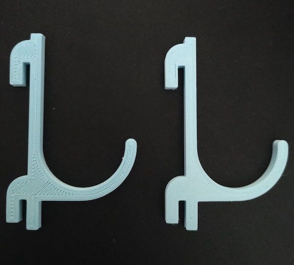
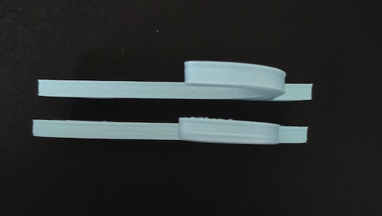

Mega-Sを購入してからプリントするのが楽しくて仕方がない。

しかし一方で、印刷物が歪むことが気になってしまう。歪むだけならまだしも、最初はうまく印刷できてるなと思ってしばらく目を離していたら、いつのまにか土台から剥がれて印刷に失敗することもちらほら起こるようになった。

印刷時の設定を見直すことで改善することもあるが、そもそもベッドに定着しない、反るというのはレベリングの問題である場合が多いらしい。

しかし初期状態ではベッド自体の歪みに対応することができない。そこでカスタムファームウェアを導入することにした。

<!--more-->

## カスタムファームウェアの導入

[Mega-S カスタムファームウェア](https://www.thingiverse.com/thing:3249319)

[カスタムファームウェアのドキュメント（英語）](https://kore.cc/i3mega/doc/)

カスタムファームウェアの導入には、少なくともプリンタとUSB接続できるパソコンが必要になる。これはCuraを使うのでMacでもWindowsでもいい。Curaでなくともよいのだろうが、カスタムファームウェアのドキュメントではCuraが挙げられているのでそれにならった。

パソコンとプリンタのUSB接続が必須なので、USBドライバをインストールする。

[ドライバ](https://www.silabs.com/developers/usb-to-uart-bridge-vcp-drivers)

SDカードの中に入っているが、最新版をインストールしたほうがよいのかもしれない。一応私はサイトからダウンロードしてきて最新版をインストールした。

カスタムファームウェアのプリンタへの適用自体は一瞬である。Curaを使ってUpdate Firmwareのボタンを押すだけなので。

その後プリンタに対してコマンドを送信する必要がある。これはCuraを使ってもできるし、人によってはコードを書いたテキストファイルをSDカードに保存してそれを読み込ませるやり方をしている人もいるらしい。

私はドキュメントで推奨されているやり方をとるべく、OctoPrintをインストールしてコマンドを送信した。

OctoPrintとCuraでコードを送信する違いは、プリンタからのレスポンスが確認できるかどうかである。念の為と思ってOctoPrintでやったが、特に確認しなければならないようなレスポンスは返ってこなかったので、これだったら何も考えずにCuraだけでやってもよかったかもしれない。ただしOctoPrintはあったらあったで今後便利になるので用意しておくのはありだと思う。

ファームウェアのインストールが終わったらメッシュレベリングの実行に移る。

### 余談：OctoPrintについて

OctoPrint＝Raspberry Piを使うみたいな記述が多いが、別に普通のパソコンでできる。私はMacbookにOctoPrintをインストールして使った。

Python環境があればインストールは非常に簡単である。

ラズパイが一緒に取り上げられているのは、OctoPrintにカメラを使った中継機能などがあり、それを活用するのにラズパイがちょうどよいからだと思われる（私もラズパイ導入してみたくなった）。

ただそれをやりはじめるとラズパイの電源をプリンタから取るようにしたり、そのためには電子工作に手を出す必要がでてきたりしそう。電子工作はいずれやってみたいことの1つではあるので、そのうち手を出す気がする。

ちなみにカメラなんて使わないという固い意思があるのなら、安いRaspberry Pi Zero Wでも使えるらしい。Zeroは買えるのなら2000円以内で買えるのでそれもありかなぁと思うが、ラズパイ入れたら間違いなくカメラ機能もつけたくなるだろうから難しいものだ。

余談終わり。

## メッシュレベリング

メッシュレベリングに入る前に、プリンタとUSB接続していたパソコンはこの時点で取り外したほうがいいかもしれない。私はつないだままメッシュレベリングを行っていたのだが、PCとの通信が割り込んできたのかメッシュレベリング作業中にファームウェアが反応しなくなる自体に陥った[^1]。

メッシュレベリングはベッドの高さを調整するのではなく、ノズルの高さを各XY座標ごとに調整する機能である。

初期状態でやるネジを使った4隅でのレベリングは、ノズルの位置を固定してベッドの高さを調整する方法だ。しかしMEGA-Sのベッド自体が歪んでいるのでこの方法では必ずどこかの地点でノズルとベッドの間の距離が大きく離れてしまう。私の個体だと、ベッドの中央が高くネジで調整する4隅は低い状態だった。4隅をギリギリに合わせるとベッドの真ん中ではノズルとベッドが思いっきり接触してしまう。

メッシュレベリングは反対にベッドの位置を固定してノズルの高さをソフトウェア的に調整する方法である。それまで直線移動しかしなかったXY座標の移動にZ座標の微調整が加わる。これによってベッド自体の歪みに対応するわけだ。

そのためには25地点分の調整が必要になるわけだが、これ自体がそこそこ大変な作業である。UIがあまりよくないので余計にしんどい。ノズルを下げる操作を連続でしようと思ってもいちいち毎回下げる量を選択してから実行しないといけない。さらには予熱をかけた状態で作業するので、汗だくになりながらの作業となる。

そもそもレベル調整自体が難しい。最初はA4用紙を使ってやっていたが、どうにも安定しないのでシックネスゲージを導入してやってみた。

<iframe style="width:120px;height:240px;" marginwidth="0" marginheight="0" scrolling="no" frameborder="0" src="//rcm-fe.amazon-adsystem.com/e/cm?lt1=_blank&bc1=000000&IS2=1&bg1=FFFFFF&fc1=000000&lc1=0000FF&t=illusionspace-22&language=ja_JP&o=9&p=8&l=as4&m=amazon&f=ifr&ref=as_ss_li_til&asins=B001EQDYX4&linkId=d992b8618930447104b5f6279f39f257"></iframe>

しかしシックネスゲージを使ったところでやっぱり難しい。使い方がよくわかってないせいもあると思う。ベッドとノズルの隙間にシックネスゲージを入れた際に、隙間がピッタリできついのかそれともきつすぎてノズルが押し上げられてるのか判断に困る。

明らかにノズルが押し上げられているのが分かるときもあるが、地点によってはそれが微妙だったりする。そのときにどっちで調整しようか迷うことが多々ある。結局の所ある程度は感覚による適当調整になってしまう。しかもそれが25地点で行われるわけで、その感覚も全部の場所で同じかといわれると微妙に違っている気がしてならない。

そして結局は適当になっている。それなら別にシックネスゲージをわざわざ用意しなくても、紙や目視でもいいんじゃないかという気がしないでもない。ただその「目視でいいんじゃね？」というのはシックネスゲージを使ったから思えるのであって、買った意味がないわけではないと思いたい。

ちなみにシックネスゲージを使って厚みは0.14mmが入らない（きつい）くらいで調整した。だいたい0.1mmくらいがいいらしいので、それより少し厚い状態でチェックを行った。印刷結果を見るともうちょっと攻めてもいいかもしれないなと思った。しかし狭すぎても逆に印刷に失敗するらしいからやっぱり調整は難しい。

メッシュレベリングがすべて終了したら設定をプリンタに書き込み再起動する。そして最後に、スライサーソフト側でこの設定を使うようにスタートコードに追記が必要なのも忘れてはいけない。

## メッシュレベリングの成果

メッシュレベリングによって土台とノズルの隙間が場所によってまちまちになってしまう問題は緩和できるようになった。実際に印刷品質がぐっと良くなった。特にファーストレイヤー（土台の上に直接乗っかる一層目）の出来が段違いである。

明らかに線がのたうちまわっているだけのカスタムファームウェア導入前の左に対して、メッシュレベリング調整後の右側は品質がぐんと良くなっている。

ちなみに反対側、つまり印刷終了面に関してはどちらもあまり違いは見られない。溶けたフィラメントの上に次のを乗っけていく分には、ノズルとの隙間はあまり影響がないのかもしれない。しかしやはり最初から安定する方が印刷品質はきれいになる。

横から見た感じにもそれは現れている。

メッシュレベリングによって反りがまったくなくなったわけではないが、第一層目からきれいになる分、反りは少なくなっているような気がする。

ただレベリングの精度がよくなったからといって慢心してはいけない。きれいに印刷できるようになって気分良く印刷しまくっていたら盛大に失敗した。いくらノズルとベッドの隙間が一定に保てようと、ベッドの状態をきれいにしておくのは怠ってはならないらしい。

そのためアルコールティッシュを使って土台をきれいにしてから印刷するようにした。土台をアルコールで掃除するのはコーティングを剥がしてしまうからやめたほうがいいという話がある。しかし軽く水で湿らせたティッシュで掃除しただけではまるで効果がなかったので、アルコールウェットティッシュで拭き上げてみた。定着率がぐっとよくなったので、やっぱり拭き上げが大事なのかもしれない。

## 耐えられない騒音

このようにメッシュレベリングの導入で印刷品質はよくなったと思う。だがよいことばかりではない。メッシュレベリングによる調整を反映して印刷をかけると、今までの比ではないレベルでうるさくなった。

それも当たり前で、この調整方法はZ軸0の高さをシステム側で微調整するようにする設定だ。そのため今までは単なるXY軸の移動だったものに、微細なZ軸の移動が常に加わるようになるわけである。これがもう、めちゃくちゃうるさい。なんか常にピロピロ言ってる。ステッピングモーターが発している音らしい。

カスタムファームウェアの導入について調べていると、ステッピングモーターの交換による静音化のことについても触れられていたが、さもありなん。素の状態でもやかましいのに、メッシュレベリングを導入するとさらにうるさくなるのだから。そりゃ交換しなきゃやってられないと思う。

まずは初期投資無しでできることをと思ったが、このままズルズルと改造沼に陥ることになりそう。カスタムファームウェアを入れたらとてもじゃないが静音化改造なしでは使えない。これはちょっとなれたら大丈夫とかいう問題ではない。

こうして沼にハマっていくわけだな・・・。ファンの音もうるさいからこれも交換したいなんて言い出すと、歯止めが効かなくなりそうだ。

ともかく、レベリング調整の大事さが今回カスタムファームウェアを導入してみてよく理解できた。印刷品質がまるで変わってくる。これまでの印刷物は、印刷はじめの部分がスカスカだったりぐにゃっとなっていたが、それはテーブルとノズルの間が一定ではなかったからだろう。

やかましくなるし導入のハードルが人によっては難しいと感じるかもしれないので誰にでもオススメできるわけではないが、印刷成功率向上のためにも導入したいものである。

[^1]: 今思えばUSB接続したパソコンがスリープに入ったせいでおかしくなったのかもしれない。OctoPrintをインストールしたパソコンはスリープ無効にしておいたほうがいいかもしれない。