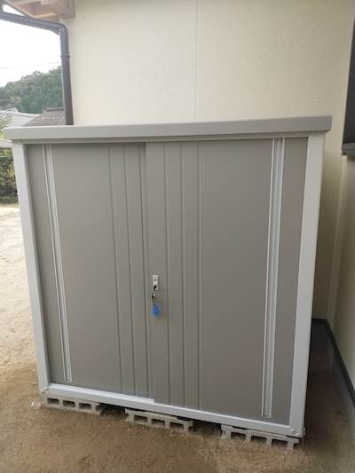
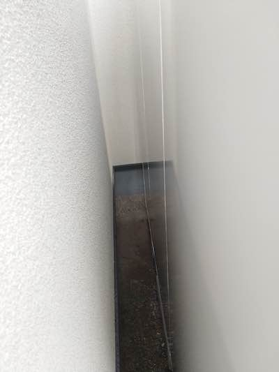
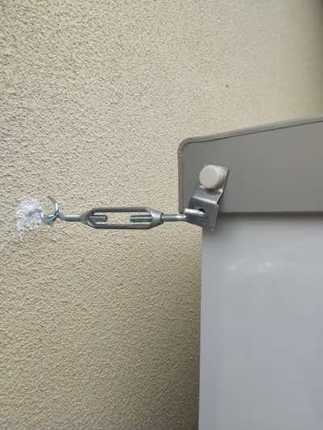
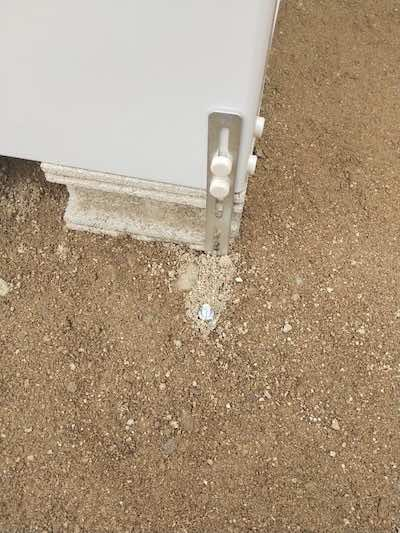
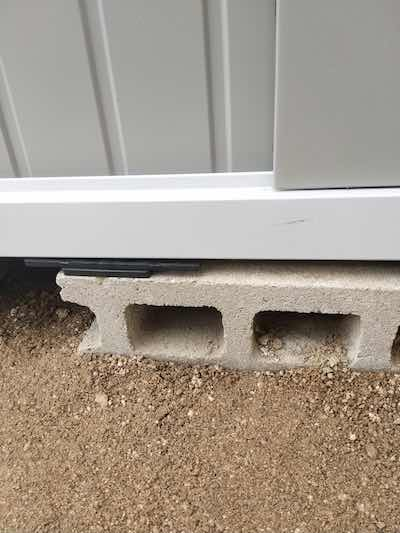
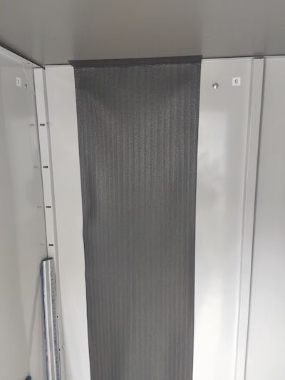
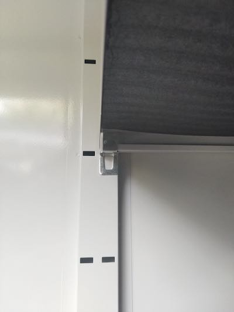

納屋があって収納する場所には困らないように見えて、実はほぼ外と変わらなかったりボロボロだったりで、自分の荷物を置きたくない。そんな状態だったので、物置を用意してそこに収納しようというのはかなり前から決めていた。

本当は引越し元にあった立派な物置を持ってきたかったんだが、その気力はなかった。まあ今から分解しに行くのも手ではあるが、残念ながら設置するスペースがない。こんなに敷地は広いのに。

ともあれ、物置を買うことは決めていたけど設置場所に困っていたのである。そんなときにホームセンターでの安売りと設置場所にちょうどよいサイズという幸運が重なり、このKSLB-1515を購入することになった。

<!--more-->

## 外観

まあこんな感じでちょうど家のくぼみと言うか、隙間というか、そんな場所にピッタリと収まった。完全に偶然であるが。高さも絶妙に低く、窓を阻害していないのがまたよい。

ホームセンターの在庫処分なのかは知らないが、ほぼネットで売ってる半額くらいの金額で買った。当然ながら設置は自分でやることに。そもそも物置代をケチっているのだから、設置作業のために業者に頼むわけがない。

## 設置作業

購入前にブロックを仮置して大体のサイズを測っておき、ある程度の水平を出しておいた。特にこの設置場所微妙に傾斜地になっており、家側が高く家から離れるに従い低くなっているような状態だった。そのため、砂利を敷き詰めてできるだけ平らになるような感じに調整した。土だけよりマシかなという考えだったが、そもそもそういう場合は地面を均すよりブロックを2段重ねにするなどして水平をとるものらしい。そもそもブロックもそのへんに放置してあったものを使う感じだったので、次やるときはもうブロック設置する時点からモルタル使ってちゃんと水平になるように調整すると思う。

物置の設置は水平取りがすべてである。もうこの最初の基礎部分ですべてが決まるといってよい。実際に物置の床板をおいて水平を見るのが一番手っ取り早いらしいけれど、ある程度の水平は最初からとるべきだったなと思う。なぜなら、物置を置いた後ではこのブロックの水平調整は不可能だからだ。

ともかく、そんな下準備をして設置をしたわけである。組立自体は特に難しくはない。さすがに2人で作業は必要だったが、時間はそうかからなかった。材質は薄っぺらいので重くもない。物置の隙間をコーキングしたかったのでブロックの上で設置作業はしなかったが、完成してからブロックの上に持ち運べるくらいには軽い。

ちなみに見づらいだろうが、背面側の板の隙間を全部コーキングで埋めている。隙間から虫とか入ってきたら嫌だから。しかしながら、扉の部分が思いっきり隙間だらけなのであまり意味はなかったかもしれない。

<!--textlint-disable-->
そもそも生まれて初めてのコーキング作業だったのだが、ちゃんとマスキングテープを使ってやるとキレイにできるというのが理解できたのでやってよかったと思う。
<!--textlint-enable-->

意外とというか思いっきりネチャネチャしていて、何度の押し入れの隙間を埋めるために使った木部補修材などとはまるで違った。ちゃんとマスキングして、ヘラで均していかないとダメなんだなというのが分かったのが収穫である。

## 問題発生

ともあれそんな感じで設置したわけだが、ブロックの上に乗せて扉を設置して、開閉もスムーズにいったぞと喜んだ。しかしそれもつかの間、ちゃんと扉が締まらないのである。左右に微妙に隙間が生まれてしっかり締まらない。鍵も締まらない。

原因としてはブロックの上で水平が取れていないことが上げられる。水平の精度が適当すぎたのである。扉は開閉しても端に当てると躯体が歪んでいるせいでちゃんと締まらないのだ。ちなみにその躯体自体もえいやと力を入れて動かすとちゃんと扉が閉まったりするので、ブロックの水平もあるが躯体自体が歪んでいるせいもあるんじゃないかと邪推している。

もっとも、完全にブロックの水平がとれていないせいである。もはやブロック3点で設置されているようなものなので、浮いてしまっているところにとりあえずブリキ板の切れ端を挟んでごまかした。

これが次回からはブロックちゃんとしようと思った原因である。ちなみに土の上にブロックで、しかも傾斜地を微妙に平らにしたこともあって、雨なんかでまた徐々に傾くんじゃないかなと思っている。今のところは設置して時間もたっておらず、大きな雨も来ていないから平穏無事だが。

## 固定作業

家の隙間にすっぽり埋まっている状態なので、アンカー作業などは必要ないかもしれないけれど一応やることにした。

家の壁側はこんな感じで転倒防止用にフックで固定。部品名はなんていうのか忘れた。

物置手前側はアンカー作業を行った。L字アングルで土の上なので、穴をほってセメント流し込んで固定である。L字アングル自体をセメントで埋めるには短すぎるので、アンカーボルトを埋めてそれを使ってL字アングルを固定することにした。

<!--textlint-disable-->
ちなみにセメントを練るのも初めてである。初めてだらけの作業であるが、だいたいその場のノリと勢いだけで作業している。ちなみに初めてなのでインスタントセメントを買って使った。
<!--textlint-enable-->

インスタントとはいえ、結構練るのは大変である。しかも買った量が4kgとめちゃくちゃ少なくて全然足りなかった。買ったときは4kgもあるんだから余裕だろうと思ったのだが、4kgは本当に少なかった。穴を掘りすぎたせいもあってまるで足らなかった。4kgで作業できる量などはたかが知れているので、次からは改善できるだろう。何事も経験だ。

ちなみに足りない分はどうしたかというと、何年前から放置されていたのかわからない家庭用セメントがこのゴミ屋敷には放置されており、処分に困っていたのでここで使った。強度が足らないとかは知らない。そもそも強度計算が必要なほどの物置ではないし。とりあえず固定されてればいいんだよという程度のノリでの作業だ。

これも次回からはちゃんと計画した上で作業ができるという、いい勉強になったと思えばよい。そもそも安物なのだから、そんな本格的なアンカー作業が必要とも思えないし。

ちなみにアンカーボルトをセメントとモルタルのようなもので固めて固定し、それをLアングルでボルトで連結して後は土をかけて踏み固めた。土の中に入れてると腐食するんじゃないかとかあるけど、それをいったらセメントの強度はどうなんだという話になってくるので気にしないことにする。

## 完全に浮いてる

そうした設置作業を終えて、ブロック6つおいてるうちの真ん中の2つが完全に浮いていることに気づく。いや、だいぶ前から気づいてはいたんだが。さすがにこの状態で中に重量物をしまうと床板がたわむだろうと思い、レベル調整用のプレートを入れて調整した。

しかしこれもブロックが水平になってないせいで、プレートを入れたら今度は扉が閉まらなくなるとかいうオチが待っていたりして大変だった。

これも厚みをとっかえひっかえ調整しながらやった。まあ完全に浮いている状態でなくなればいいやという適当な作業である。もう最初の基礎水平取りがダメだったので、今更やることはすべて付け焼き刃というものよ。

## 湿気対策

最後に湿気対策に備長炭シートを貼り付けてやった。意味があるかはわからないけれど。

<iframe style="width:120px;height:240px;" marginwidth="0" marginheight="0" scrolling="no" frameborder="0" src="//rcm-fe.amazon-adsystem.com/e/cm?lt1=_blank&bc1=000000&IS2=1&bg1=FFFFFF&fc1=000000&lc1=0000FF&t=illusionspace-22&language=ja_JP&o=9&p=8&l=as4&m=amazon&f=ifr&ref=as_ss_li_til&asins=B004NOBKBM&linkId=a8ae0d9ea48e3ecfa17590bc2cb6bfe8"></iframe>

そもそも屋外で使う用途のものではないような気がするが、説明書に電気製品や湿気に弱いものを入れるなと書いてあったので、気休め程度にはなるかなと。

薄っぺらくて信用性が微妙なところではあるが、そもそも屋外で使うことを想定したものではないだろうからそこに文句を言うのはお門違いというものである。薄っぺらいおかげで切って加工しやすかったので、適当なサイズに切って物置内に貼り付けた。

両面テープが途中でなくなって普通に梱包テープで止めたりする辺り、私の行き当りばったりな作業がよく現れている。

## 棚板が微妙にもうちょっと欲しい

棚板が2枚ついているが、もう1枚くらい欲しい。ほしいのだが、売ってるのが高い。

<table border="0" cellpadding="0" cellspacing="0"><tr><td>
<table><tr><td style="width:240px"></td><td style="vertical-align:top;width:248px;">
<a href="https://hb.afl.rakuten.co.jp/hgc/1964bb79.5a84c9d0.1964bb7a.7cfc4684/?pc=https%3A%2F%2Fitem.rakuten.co.jp%2Fe-kurashi%2F60551%2F&m=http%3A%2F%2Fm.rakuten.co.jp%2Fe-kurashi%2Fi%2F10035615%2F&link_type=picttext&ut=eyJwYWdlIjoiaXRlbSIsInR5cGUiOiJwaWN0dGV4dCIsInNpemUiOiIyNDB4MjQwIiwibmFtIjoxLCJuYW1wIjoicmlnaHQiLCJjb20iOjEsImNvbXAiOiJkb3duIiwicHJpY2UiOjEsImJvciI6MSwiY29sIjoxLCJiYnRuIjoxLCJwcm9kIjowfQ%3D%3D" target="_blank" rel="nofollow noopener noreferrer" style="word-wrap:break-word;"  >追加棚板 1枚 物置き用 KSLB-1515(NV)専用 オールネイビー 山善 YAMAZEN ガーデンマスター 【送料無料】</a> 価格：4599円（税込、送料無料) (2019/10/12時点)

<a href="https://hb.afl.rakuten.co.jp/hgc/1964bb79.5a84c9d0.1964bb7a.7cfc4684/?pc=https%3A%2F%2Fitem.rakuten.co.jp%2Fe-kurashi%2F60551%2F%3Fscid%3Daf_pc_bbtn&m=http%3A%2F%2Fm.rakuten.co.jp%2Fe-kurashi%2Fi%2F10035615%2F%3Fscid%3Daf_pc_bbtn&link_type=picttext&ut=eyJwYWdlIjoiaXRlbSIsInR5cGUiOiJwaWN0dGV4dCIsInNpemUiOiIyNDB4MjQwIiwibmFtIjoxLCJuYW1wIjoicmlnaHQiLCJjb20iOjEsImNvbXAiOiJkb3duIiwicHJpY2UiOjEsImJvciI6MSwiY29sIjoxLCJiYnRuIjoxLCJwcm9kIjowfQ==" target="_blank" rel="nofollow noopener noreferrer" style="word-wrap:break-word;"  >
楽天で購入
</a>
</td><tr></table>
 

</td></tr></table>

しかもなぜかネービーしか見つからない。

棚の軸受がこんな感じの金具を使っているので、木の板を自分で用意しても固定できないのが辛い。

## とりあえず完成とする

そんな感じで設置した後もいろいろ補修したり、いろいろやってたせいでなかなか荷物をしまうことをしなかったのが、もうこのへんでいいだろうということで荷物を入れてやった。エアコンプレッサーとか置き場所に困っていたからこの中にしまっている。思いっきり電気製品だが、そもそもエアコンプレッサーなどをしまうために買ったのだからしまわなくてどうする。

そうやって荷物を入れていくと、意外とすぐにいっぱいになった。やはりサイズが微妙に小さいだけのことはある。しかし、汚い納屋にしまうよりは数百倍マシだと思うのでこれでよい。

雨水の侵入などが若干気がかりではあるのだが、あまりに浸水がひどいならもう少し追加で作業をしよう。具体的にどうするかは一切考えてないが、どこから雨水が入ってくるかにもよるので今から考えても仕方がないのだ。

## 教訓

とりあえず基礎がすべて、以上だ。

あと無計画でやりすぎたのも反省点とすべきかもしれない。

これからDIYで何かを作るときは、ちゃんと図面を用意したり準備をして取り掛かるべきだろう。今の所全部いきあたりばったりでやってるからな・・・。もっとも廃材を使って何かを作るみたいなことしかしてないからそうなってはいるのだけど。

何かとはじめての作業が多かったが、学びの多い作業であったことは間違いない。セメント練ったりするのももう抵抗がないから必要とあらばササッと作業できそうな気がするしな。ただし量はちゃんと計算しなければならないが。