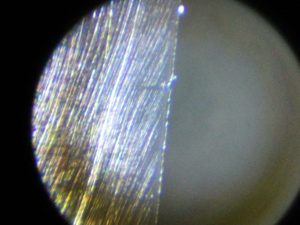
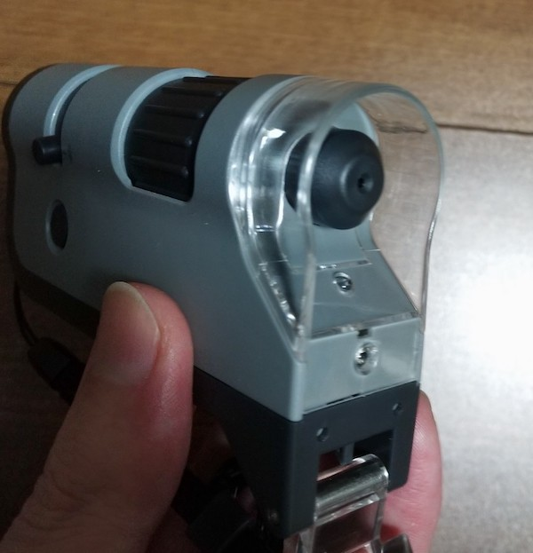
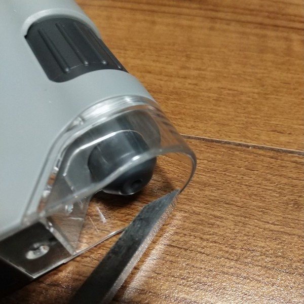
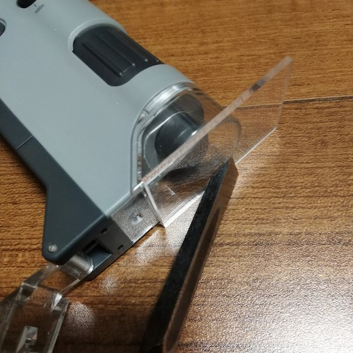
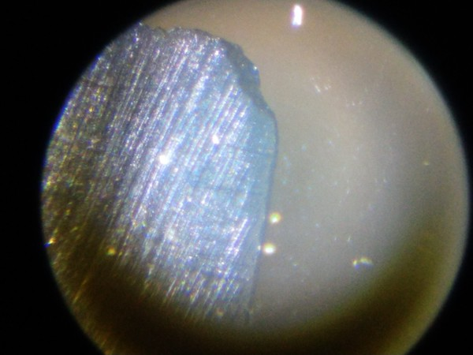

YouTubeで刃物を研ぐ動画を見ていると、ときおり顕微鏡で拡大した映像を見せてくれる人がいる。こうすれば研げているか一目瞭然という体で紹介されているアレだ。私も解いだ刃物の状態を見てみたいと思って顕微鏡を買ってみることにした。

<!--more-->

## 必要な拡大率

同じタイミングでジュエリールーペも購入した。こちらの拡大率は、商品説明では40倍ということであった。しかしながら、40倍の拡大率[^1]では肉眼で見るのに毛が生えた程度の見え方でしか無い。

<table border="0" cellpadding="0" cellspacing="0"><tr><td>
<table><tr><td style="width:240px"></td><td style="vertical-align:top;width:248px;">
<a href="https://hb.afl.rakuten.co.jp/hgc/1a95aebc.cf9d97fb.1a95aebd.cd8bbec8/?pc=https%3A%2F%2Fitem.rakuten.co.jp%2Fshopworld%2F000000118110%2F&link_type=picttext&ut=eyJwYWdlIjoiaXRlbSIsInR5cGUiOiJwaWN0dGV4dCIsInNpemUiOiIyNDB4MjQwIiwibmFtIjoxLCJuYW1wIjoicmlnaHQiLCJjb20iOjEsImNvbXAiOiJkb3duIiwicHJpY2UiOjEsImJvciI6MSwiY29sIjoxLCJiYnRuIjoxLCJwcm9kIjowfQ%3D%3D" target="_blank" rel="nofollow noopener noreferrer" style="word-wrap:break-word;"  >ルーペ 携帯 LED 拡大鏡 ジュエリールーペ ライト ライト付き 40倍 ケース入り ブラックライト 2種類 拡大 小型 宝石 ジュエリー 鑑定 読書 工作 修理 裁縫 校正 校閲 観察 昆虫 花 虫眼鏡 自由研究 微細品 精密作業 精密機器 時計 送料無料</a> 価格：1000円（税込、送料無料) (2020/2/28時点)

<a href="https://hb.afl.rakuten.co.jp/hgc/1a95aebc.cf9d97fb.1a95aebd.cd8bbec8/?pc=https%3A%2F%2Fitem.rakuten.co.jp%2Fshopworld%2F000000118110%2F%3Fscid%3Daf_pc_bbtn&m=%3Fscid%3Daf_pc_bbtn&link_type=picttext&ut=eyJwYWdlIjoiaXRlbSIsInR5cGUiOiJwaWN0dGV4dCIsInNpemUiOiIyNDB4MjQwIiwibmFtIjoxLCJuYW1wIjoicmlnaHQiLCJjb20iOjEsImNvbXAiOiJkb3duIiwicHJpY2UiOjEsImJvciI6MSwiY29sIjoxLCJiYnRuIjoxLCJwcm9kIjowfQ==" target="_blank" rel="nofollow noopener noreferrer" style="word-wrap:break-word;"  >
楽天で購入
</a>
</td><tr></table>
 

</td></tr></table>

顕微鏡として購入したのはレイメイ藤井のハンディ顕微鏡だ。単に「ちょっと見てみたい」レベルだったので、あまり高い顕微鏡を買うのもなぁと思ったところ、とてもお手頃な値段だったのでこれを選んだ。

こちらは拡大率が最低でも100倍からである。100倍あると刃物の状態がよく見える。

こちらがその100倍で見た刃物の状態である。左側が刃物の先端部分になる。ところどころ細かい欠けがみえるし、表面の傷もよく認識できる。とりあえず100倍程度で見ることができれば、刃物の状態を確認する目的には足りる。

ただし100倍まで拡大するとなると、ちょっとした手ブレでピントがズレるし、目的の切っ先部分を見るのも一苦労することになる。

特にこのハンディ顕微鏡は見えている像が上下左右反対に映るので、位置調整に苦労する。

それ以外にもう1つ、特にノミなど刃先が細いものを見るのには適さないという問題があった。

## 距離を固定できない

このように対物レンズの前の空間はオープンスペースとなっている。この顕微鏡より大きい刃物、たとえば包丁などに関しては特段問題にならない。しかしこれがノミのように刃先が細いものを見ようとすると、対物レンズの周りのプラスチックより刃先が狭いので、レンズと刃物との距離を固定できない。そのため手ブレによってピントがズレてしまうのである。

100倍の拡大率で見ているので、数ミリ動いただけでピントはぼやけてしまう。これでは刃裏はともかくしのぎ面の状態を見るのは不可能である。

## ちょっと改造

そこで私は対策をとった。レンズ周りのプラスチック部分にアクリル板を取り付けることにしたのである。

刃物とレンズの距離が固定できないのが問題なので、アクリル板で刃物との距離を固定できるようになれば問題は解決する、はずである。まだハンディ顕微鏡に固定しているわけではないので、手でアクリル板を抑えながらの運用ではあるが、少なくとも中空で悪戦苦闘するよりは随分見やすくなった。

アクリル板経由で見ると、アクリル板自体の傷や付着しているホコリなどで像がきれいに見えない。これについては、アクリル板に穴をあけることで回避しようと思っている。対物レンズの周りにぽっかり空洞がある状態から、ほんの小さな穴が開いてるだけの状態にするわけだ。穴の位置の調整が大変そうではあるが、そうすれば刃物との距離はアクリル板で固定でき、見る像自体はダイレクトな像にできる。

## 研ぎの練習のためならディスプレイ付きのマイクロスコープがよい

そういった改造が必要ということもあり、刃物の研いだ状態を確認する目的であるならば、そもそもディスプレイ付きのマイクロスコープを買うべきだった。

レイメイ藤井のハンディスコープ自体は決して悪い商品ではない。むしろいい商品である。LEDライトで光を当てながら対象を観察できるし、何よりとてもリーズナブルな価格である。刃物の画像をこの記事にも貼っているが、スマホのカメラとハンディ顕微鏡を接続するためのアタッチメントもついていて、スマホで拡大画像を撮影することも簡単である[^2]。

ただ、刃物の刃先をチェックする目的だと手間がかなりかかる。最初は研ぎながらチェックしようとか思っていたが、そんなことは不可能である。不可能ではないが労力に見合わない。

しかしせっかく買ったのだし、ちょっと工夫して使っていきたいと思う。

[^1]: 本当に40倍の拡大率で見えているのかは疑問があるが、それはさておく。
[^2]: ただしカメラと接眼レンズとの位置調整がすごい大変。