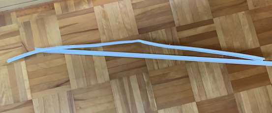
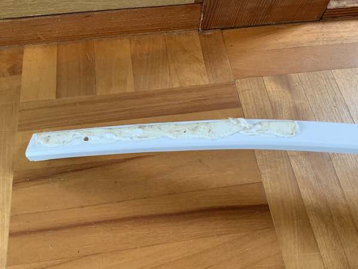
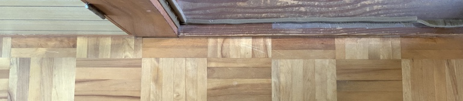
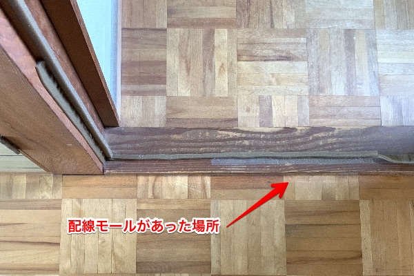

配線モールをはがすのにヒートガンを使ってみた。モールの粘着剤を剥がす方法としては、シールはがしのような溶剤を使う方法もある。しかし私の場合は木材の床に直接はりつけていたため、溶剤を使って剥がすのは少し抵抗感があった。そこでヒートガンを使ってみることにしたのだ。

熱することで粘着剤が劣化して粘着力が弱まり、それによって剥がしやすくしようという作戦である。

<!--more-->

## 今回の作業で使ったもの

- ヒートガン
- スクレーバー（私が使ったのはステンレス製）
- 消しゴム

最後に触れるが、実のところ一番重要だったのは消しゴムだった。ヒートガンの記事だが、消しゴムが主役になるかもしれない。

## 配線モールを剥がす

ヒートガンで温めながら床とモールの間にスクレーバーを差し込む作業を繰り返す。

最初のうちは勝手がわからなかったので、おっかなびっくり温めながらスクレーバーを差し込み、モールを端から持ち上げながら取ろうとしていた。温め過ぎたらプラスチック製のモールが変形するかなと思って思いっきり加熱できなかった。またモールの強度を過信して、端から持ち上げながら取ろうとしたのがよくなかった。

結果、外した後のモールはこんな感じになってしまった。

上側にある折れ曲がっているのが床に貼り付けていたモール本体である。下にある真っ直ぐになってるやつはモールの蓋だ。

今回の作業は配線モールを再利用する目的もあったのだが、ここまで折れ曲がってしまっては再利用は不可能だ。

ただこれは、モールを端から持ち上げながら剥がそうとしたからこうなっただけだと思う。

ヒートガンで粘着剤部分を温めながらスクレーバーを差し込むだけにしていたら、もうちょっとキレイにはがせたと思う。実際、後半はそのようなやり方で作業を進めた。次に剥がすときはもっとうまくできそうだ。

ちなみに粘着剤はこんな感じで、結構ごつかった。

このような分厚いゴムのような粘着剤が、一部はモールに、一部は床に残った。床に残ったやつはヒートガンで温めながらスクレーバーで簡単にこすり取れた。

## ヒートガンは必要か

たとえばこの作業はヒートガンを使わなくとも、どこの家庭にでもあるドライヤーを使ってもできる。そこをあえてヒートガンを使ってやる意味は、時間の短縮ということになる。ドライヤーでもできるだろうけれど時間はかなりかかるはずだ。ヒートガンの方が確実に熱量が多いので、作業が手早く進むのは間違いない。

ちなみにヒートガンだが、私はモノタロウで買った。しかし別にAmazonとかで買っても問題ないと思う。というかAmazonの方が安いし、アタッチメントやスクレーバがついているやつもあって便利な気がするね・・・。

<iframe style="width:120px;height:240px;" marginwidth="0" marginheight="0" scrolling="no" frameborder="0" src="//rcm-fe.amazon-adsystem.com/e/cm?lt1=_blank&bc1=000000&IS2=1&bg1=FFFFFF&fc1=000000&lc1=0000FF&t=illusionspace-22&language=ja_JP&o=9&p=8&l=as4&m=amazon&f=ifr&ref=as_ss_li_til&asins=B07L6XVJLM&linkId=b16555cb0986a1a8b014b3abc1be6b6f"></iframe>

モノタロウのやつは高いうえにアタッチメントの数は少ない、ケースがついているが作りがめちゃくちゃ甘いといった感じで「この値段でこれ？」と思ってしまった。

ただ、本体自体はちゃんと動く。電源ケーブルが分厚く本体の作りはしっかりしているので、使用する分には問題ない。が、あえてモノタロウで買う必要はない気がする。

## ヒートガンで剥がした後

配線モールを剥がした後はこんな感じである。床の木目のせいで若干わかりにくいが、モールを貼り付けていた場所だけ色が明るくなっている。

## 最後の仕上げは消しゴムで

ヒートガンとスクレーバーを使っても、微妙なベタベタが床面に残ってしまった。ステンレス製スクレーバーでこそぎ落とすにも限界がある。

剥離剤は使わない方針だったのでそもそも用意がない。そこで消しゴムを使ったわけである。どこかで消しゴムでこすると粘着剤がきれいに取れるというのを見たので試してみた次第である。

そしてこの作業こそが、今回のモール剥がしにかかった時間の大半を占める重労働であった。

微妙に残ったネバネバは、消しゴムで軽くこするだけではきれいに取れない。かなり力を入れてゴシゴシとこすることでようやく取り除けた。取り除いた後はサラサラとした手触りが戻り、粘着剤があったとは思えない仕上がりとなった。

だが、かなりの重労働である。壁際でそもそも作業がやりにくい箇所に、かなりの力を込めて消しゴムでゴシゴシするわけだ。しかも作業範囲が1mある。小学生時代でもこんなに使わなかったぞという勢いで消しゴムが小さくなっていく。ほぼ新品に近いくらいの大きさの消しゴムが、作業完了後には半分以下にまでちびていた。

ただまあ仕上がりはとてもキレイに仕上がった。モールがあった場所は床の色がちょっと違うくらいにしか見えないし、触ってもそこに粘着剤があったことすらわからない。

だが消しゴムで粘着剤をキレイに落とせるというのは、あくまでシールとか小さい範囲をする場合に有効なものであろう。かなり力を入れてこすらないと、微妙に残った粘着剤を取り除くのは難しい。配線モールの粘着剤を剥がすのに、仕上げに消しゴムを使うのは間違っている。二度とやりたくない。

消しゴムで粘着剤を剥がすときに、ヒートガンを使うともっと楽にできたのかもしれないが、次に剥がすことがあったら試してみようと思う。配線モールはあと2箇所に貼り付けているので、それを剥がすときにでも。

## ヒートガンで配線モールを剥がしてみて

大まかに剥がすだけならヒートガンを使うとすぐにはがせた。粘着剤の大部分もヒートガンとスクレーバーで対処可能だ。しかし最後の仕上げにはやはり剥離剤を使うのが楽なのではないかと思う。

しかし配線モールを剥がすのに使える剥離剤は、いったい何を使えばよいのやらというのが問題である。

<iframe style="width:120px;height:240px;" marginwidth="0" marginheight="0" scrolling="no" frameborder="0" src="//rcm-fe.amazon-adsystem.com/e/cm?lt1=_blank&bc1=000000&IS2=1&bg1=FFFFFF&fc1=000000&lc1=0000FF&t=illusionspace-22&language=ja_JP&o=9&p=8&l=as4&m=amazon&f=ifr&ref=as_ss_li_til&asins=B00EXBTD7S&linkId=b4e26ff9b96703a2c6f52ac4eb04e929"></iframe>

このあたりの商品を使うのがよいのだろうか。私の使っていた配線モールのメーカーが出してる剥離剤がこれだった。木材に対して使ってもあとが残らないかが気にはなるが、剥離剤を使ってみるのもいいかもしれない。