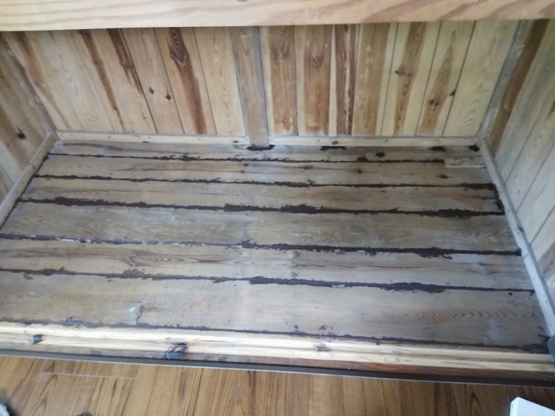

アサヒペンの木部補修材を利用して、床の隙間を埋めてみた。なんで床に隙間がと思われるかもしれないが、対象がめちゃくちゃ古い家だからである。床の隙間の下はダイレクトに地面がある。

古い家だから家の中にムカデやらゴキブリやらがうろちょろしており、リフォームした後にもかかわらず出くわすものだから、こういった隙間を塞がないとダメかなと思っての作業である。

ちなみに、製品説明でやるなと書かれていることをやっているのであまり参考にはならないと思う。そもそもこんなボロ家の補修自体、なんの参考にもならない気はするけれど。

<!--more-->

## きっかけ

最初は木工パテを使って隙間を埋めようとしていたのだが、隙間が開いてる範囲が尋常では無いので、木工パテではまったく量が足りていない。

幅180cm、奥行き90cmの空間の床板の間が隙間空きまくっているのである。木工パテの量で間に合うわけがない。

木工パテを買い直して延々作業するのはあまりにしんどいので、他にいい手がないかと探したところ、コーキングガンを使うこの木部補修材が目についた。量的にもちょうどいいし、範囲が広いのでコーキングガンを使うのは効率がいいかもしれないと思って試したわけである。

ちなみに、この製品はそもそも屋外用のものである。また、床面には使うなと注意書きがある。

しかしながら、今回の補修対象の床面は、私基準ではそこはほぼ外である。なぜなら隙間の空いている空間の下にはダイレクトに地面があるのだから。その隙間を埋めるのに屋外用のものを使って何が悪いのかという感じである。

また、床面に使うなということだが、これは押入れの床面にあたる場所なので別にいいかなと言う感じで深くは考えないことにした。床に使うなというのは多分強度的な問題によるものだと思うが、今回は単に隙間を埋めさえすればよかったので気にせず使うことにした［^1]。

そんなことよりは、コーキングガンを使って補充できることの方がメリットが強い。作業範囲はあまりに膨大なのだから。

## 隙間を埋めてみる

ちなみにどれくらい隙間が空いているかというと、こんな感じである。

左上にあるうにょうにょっとなっているのが、今回紹介する木部補修材だ。写真ではよくわからないが、この隙間の下は何度もいうが、ダイレクトに地面がある。古い家なんでね・・・。

まあこんな隙間がいたるところにあるから、ムカデやらが余裕で入ってくるわけである。たぶん。

一部リフォームしたとはいえ、こんな状態の古いままの部分が大量にあるのだ。バルサンを炊いた数日後に、ムカデの死骸がそのへんにころころ転がっているような古い家なのだ。こういうあからさまな隙間くらい埋めておきたいと思うのは自然だと思うがどうだろう。

## 木部補修材の使い勝手

そもそもコーキングガンを使うのが人生ではじめてだったのだが、最初は結構楽しかった。トリガーを引けば木工パテとは比べ物にならない勢いで隙間に充填できていけるので、結構これが楽しいのである。ただ、施工範囲が広すぎてすぐに飽きたけれども。

製品説明にもあるが、先端部分の切り口を狭くすると補修材を絞り出すのにかなり苦労する。トリガーがめちゃくちゃ重くなるのである。私が使っているコーキングガンは300円くらいのホームセンターで売ってるちゃちいやつだが、トリガーが固くて非常に苦労した。

先端の切り口は狭いほうが補充箇所を細かくコントロールできていいと思うかもしれないが、その考えは捨てたほうがいい。出し口が狭いと隙間に補修材を埋めるのに時間がかかるし、隙間を埋めきれないせいで一度補修材を出した部分に再度補充するハメになる。そうすると、先端部分が補修材まみれになり、細かいコントロールどころの話ではなくなるからだ。

個人的に、補修箇所にあふれるくらいに出してしまい、後はヘラを使ってキレイに整形していくほうがよいと思う。

## 作業時の注意点

まず、トリガーを離してもしばらく先端部分から補修材が漏れ出るので、これには注意が必要である。コーキングガンを使う作業では常識の注意事項なのかもしれない。私はなにぶんはじめての経験だったので、トリガー引いてないのに先端から溢れ出てきてびっくりしてしまった。

後はどんなに気をつけても、作業中に木部補修材が服などにつくので、汚れてもいい格好で作業をすること。これも必須である。私はこのゴミ屋敷のリフォームのためにツナギで常に作業しているので、これは問題なかった。自分ではめちゃくちゃ気をつけていたつもりなのに、見事にツナギに補修材が付きまくっている。

## 補修材の性質

この木部補修材は、パテとかというよりはどっちかというと泥みたいなやつと言ったほうがその性質をよく表している気がする。この木部補修材を使っている間は、どちらかというと左官さんがやる壁にモルタルを塗る作業に近い気分だった。

こんな感じで濃い茶色の部分が床板の隙間をうめた状態になる。Amazonのレビューをみると、この上に塗装しても周りとなじまない、なんていう意見があった。

私の場合は隙間をうめさえすればいいだけで、この後塗装しようという気は一切ないから関係ない話であるが、塗装も含めて検討している人は注意がいるかも知れない。

作業時から結構泥っぽいざらざらした感触であり、乾燥後もやっぱりザラザラした質感を有している。コーキングガンで絞り出した直後は、ややぬるっとしている感じではある。硬化が始まるまでの時間は結構あるので、それなりの間ペタペタと塗り拡げたりすることができる。だから作業性は結構いいと私は思う（床の隙間梅での感想だけれど）。

ちなみにこの床面（90x180cm）を埋めるのに、木部補修材320ml缶一本使った感じである。

ちなみにこれ、壁の部分の板も隙間が空きまくっている。さすがに壁の部分は外にダイレクトに繋がっているわけではないが、とはいえ隙間は埋めたいのでこの作業は現時点では壁の隙間埋めに移って絶賛作業中である。

## その他作業に使ったもの

コーキングガンを使って隙間に補修材をある程度充填した後、左官鏝を使って均し作業をしながら隙間を埋めていった。左官鏝と言っても大きいやつではなく、細かい細工をするための小さいやつである。これはわざわざ買ったのではなく、このボロ屋敷にあったやつをたまたま利用しただけである。

プラスチックの板切れなどを使ってならすのもいいと思うが、作業範囲やこの補修材の材質・質感からいっても、左官鏝での作業がちょうどいいように思う。まあ本来、屋外の隙間埋めの場合には、普通のコーキング作業用のヘラを使えばいいのだろうけれど。

## 電動コーキングガンが欲しくなった

ちなみにこの作業をしていて強く電動コーキングガンが欲しくなった。正直、なんで電動のコーキングガンなんか存在しているのだろうと最初の頃は思っていたのだが、作業範囲が広くなるとコーキング作業を手動でやるのはしんどいというのがよくわかった。

<iframe style="width:120px;height:240px;" marginwidth="0" marginheight="0" scrolling="no" frameborder="0" src="//rcm-fe.amazon-adsystem.com/e/cm?lt1=_blank&bc1=000000&IS2=1&bg1=FFFFFF&fc1=000000&lc1=0000FF&t=illusionspace-22&language=ja_JP&o=9&p=8&l=as4&m=amazon&f=ifr&ref=as_ss_li_til&asins=B00C7GXSWC&linkId=4122f4aa75861bc5dbd8b8229073f733"></iframe>

さすがに300円程度の安物コーキングガンを使っているので、あまりの価格差にさすがに買いはしないけれど・・・。しかし手動でやるのはしんどすぎる。コーキングガンを使っているとはいえ、トリガーは重いし、作業範囲が広いと虚無感に襲われる。

## まとめ

屋外の木部の補修用のものだから、屋内で使うとさすがにかなり補修部が目立つ。しかも質感が木とはまったく異なり、硬化した後もザラザラしているので、なおさら屋内での作業には使わないほうがいいだろう。今回の私の用途はかなり特殊であるため、まったくもって参考にはならないだろう。

ただ、コーキングガンを使って作業できる木部補修材というのはこの製品の絶対的な特徴で、同じような製品は存在していない。木工パテのチューブを絞りながら作業することを考えれば、この作業性の違いはかなり大きい。広範囲の作業をするなら、この木部補修材はかなりコスパがいい思う。まあ1kgの木工パテAを買う方が安上がりかもしれなかったが。しかしやはり、コーキングガンで充填できるのは何者にも代えがたい魅力だろう。

結構レアなのだろう、ホームセンターに行っても取り扱っていないことが多いと思う。まあAmazonで買うとそれなりに安いので、通販で手に入れればよいだろう。

木部の補修というよりは左官作業をしている気分だったが、これで虫の侵入が多少なりとも減ればいいなと思っている。