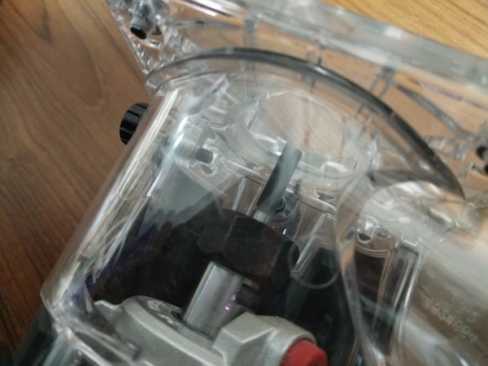
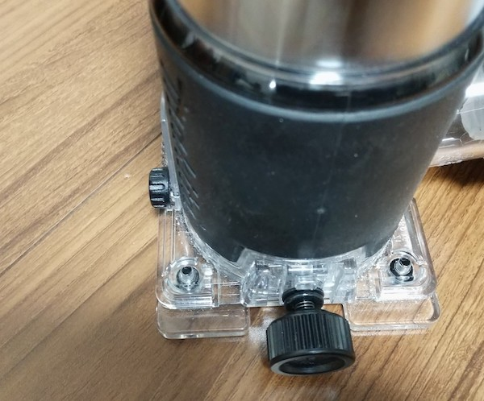
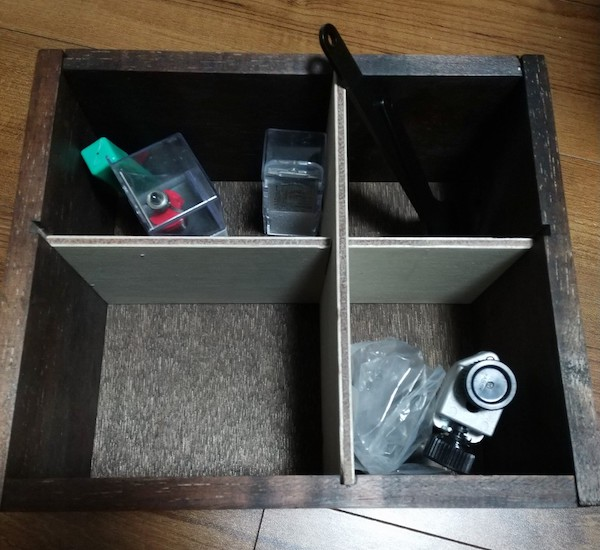
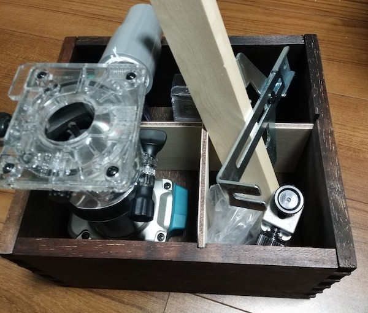

購入自体はしばらく前になるのだが、トリマーを使って加工をいろいろしてみて感じたことをまとめておこうと思う。購入したトリマーはマキタの18V充電式のRT50DZになる。

<!--more-->

## RT50DZについて

電動工具がマキタ製品で揃っているので、トリマーもマキタにした。18Vのバッテリがあるので、本体のみを購入した。他のトリマーを使ったことがないので、精度とか使い勝手の比較はできない。別に安いトリマーを買っても良かったのかもしれないとあとになって思った。

先に使っていて気になったところ、不満点を書いておこうと思う。

### ネジが長すぎない？

これは集塵カバーをトリマーのベースに固定するためのネジの写真だ。このネジがムダに長いと思う。長いと思うなら短く切ってしまってもいいのかなとも思うが、不具合出たら嫌だからそのまま使っている。つけたらつけっぱなしなら気にならないが、カバーを外す際に微妙に手間になる。

### ネジがベースからはみ出てる

ネジが長すぎるのも気になるが、このネジの頭がベースよりはみ出しているのが微妙に気になる。普通に使う分には問題にならないのだが、トリマーで削る範囲を固定するため周囲に当て木をして削る範囲を固定するときに困る。

周りにつけた木材にこのネジ頭が当たるせいで、端までトリマーを動かすことができなくなるのだ。これはトリマーベースの四方に木材を配置して加工するときにのみ影響することではあるのだが、これが地味にめんどくさい。

後述するがトリマーで加工するにはガイドを用意したほうがよい場面が多い。一面だけガイドをつけて削るときには影響しないが、四方を囲って特定の範囲のみ加工したいときに邪魔になる。もっとも、ベニヤ板のようなごく薄い木材を当て木として使えば干渉しなくはなるのだけど。

### ベースをつけたままビットを交換できない

ビットの交換をする際には、ベースを完全に外してからでないと難しい。もっとも集塵カバーを取り付けていると、ベースを外さないといけないのは変わらないのでそこまで気にはならない。しかし、ベースを取り付けた状態でもビットを交換できるようなトリマーもあるらしいので、それと比較すると面倒くさいのは確かだろう。

### ビットの位置を確認しながら加工しづらい

トリマーはそもそもそういうものではないという話かもしれないが、トリマーのビットで削っている場所を確認しながら加工しづらい。

直線に溝を彫るときには何ら問題にならないのだが、ここからここまでの間だけ溝を彫りたい、というときにはこれが困る。

## よいところ

加工精度はよいと思う。特に気になるようなことはないので。

バッテリ式なのでコンセントに気を取られることがないのもよいところだ。

バッテリ式ながらパワーも十分だろう。あまり褒められたことではないが、ビットを3mm以上出して加工してもパワー不足で加工できないと感じたことはない。ただ負荷はそれなりに感じるし、ビットの切れ味にも影響されることなので、基本的には3mmくらい出して加工するようにはしているけれど。

## 加工の幅が広がる

トリマーを使うと加工の幅が広がる。

溝を掘って底板にベニヤをはめ込む、さらに仕切り板を仕込むというのがトリマーを使えば簡単にできる。ついでにこの写真の箱はトリマーを使ってアリ包組加工をして組み上げている[^1]。

トリマーの関連部品、ビットやレンチなどを持ち運ぶのが面倒で箱を作った。ガイドレールにつけた当て木が大きすぎて、当初予定よりなんかはみ出し具合がすごいが。

## 治具づくりが大事

トリマーを使うといろんな加工ができて作れるものの幅が広がるのだが、活用しようと思うとなかなか難しい問題がある。いろんな治具が必要になるということだ。

直線の溝を彫るのは比較的簡単な部類だ。ガイドレールを使ったり、直線の木材もしくは定規を固定してそれに沿わせればよいだけなので。

難しいのは木材の特定の範囲を削りたいというときだ。行き過ぎたら困るので、トリマーの動かせる範囲を制限する必要がある。このような目的の場合は四方にガイドを置いてそれ以上トリマーが進まないようにしてやる必要がある。

さらにその状態でやや深く彫りたい場合はさらに困る。基本的にトリマーのビットは3mm以上出して加工しないほうがよい。負荷が高くなるしマルノコでいうキックバックのような現象が起こるので危ない。説明書にもそう書いてある。

しかしそうなると一度浅めに彫って、そこからさらにビットを長く出して加工することになるのだが、一度彫ってしまうとトリマーのベースが乗る場所がなくなってしまう。すでに3mm低くなっているので。

このような状況に対応するには、トリマーを加工材に直接あてがうのではなく、ガイドとなる治具の上で動かすようにするなどの対策が必要となる。そういう治具をどうやって作るかなぁとか悩みのタネが尽きない。

今のところ、加工するものに特化した治具を作って加工しているが、治具づくりが結構大変で本来の作業になかなか入れないのがネックである。汎用性ある治具を作りたいが、どういう感じで作ればいいんだろうなぁ。

トリマーテーブルがほしいと思うこともしばしば。トリマーを固定して、材を動かして加工するほうが安定するんじゃないかと思う。

## ビットで解決するか

治具を作るとなると、トリマーのベース分も考えてガイドを作る必要があってなかなか面倒くさい。そしてそのような作りをすると、実際に加工したい材の加工位置を合わせるのが難しくなるので、これまた大変である。

そうなるとベアリング付きのガイドビットを利用して対策するという話になってくる。

これはこれで、加工する材の深さが問題になってくるのでなやましいのだが。

## 集塵は必須

集塵機につないで使わないとマルノコ以上に木くずが舞い散ってひどいことになる。マルノコだとチップソーの幅が削れるだけだが、トリマーだとビットの幅で気を削っていくことになる。マルノコで木くずだらけになって困るというレベルなら、トリマーはもっとひどいことになるのだ。もちろん、加工幅や深さによるので、一概にマルノコよりひどいとはいえないのだけれど。

作業場所の周りが木くずだらけになるのはもちろんのこと、自分の服に大量に切り屑が付着する、舞い散る粉塵が目に入って痛い。作業時には防じんメガネ、マスクを装着したほうが無難だ。私は屋外作業なので、風のある日にトリマーを使うと舞い上がる粉塵が目や鼻に入り大変だった。

集塵機をつなげるとこれがかなり軽減される。ちょっと集塵機無しでトリマー使おうとは二度と思えないレベルである。

集塵機のホースとつなげて使うのだから、コードは少ないほうがいいともいえる。一方で集塵機のホースをつなげるのだからコンセント式で十分ともいえる。

## ビットの手入れはこまめにすべし

トリマーのビットはおそらく一度使ったらちゃんと掃除をしないとすぐにだめになる。高速で回転しながら削っていくので、熱をそれなりにもつのだろう。加工した木材の切り屑がべっとり付着したような感じになる。それを放置しておくと刃が錆びたりするのでよくない。

実際もうすでに錆びてきているのでちょっとショックである。3ヶ月ほどしかたってないのにもったいない。

汚いなぁとは思いつつ放置していたので自業自得ではあるのだが、単なる汚れかと思ったらサビが発生していた。刃先ではないのでまだセーフだと思いたい。

小さいし一度の加工で同じ場所を酷使するので、しっかりとしたメンテが必要だろう。

## 海外製のものを買うのもありか

これはなにかの動画で見た受け売りだが、海外製のトリマーやルーターの方が使えるビットが豊富でいいというものを見たことがある。国内メーカーのトリマーはコレットチャックが6mmだが、海外のビットはインチなので6.25mmのものが多く使うことができない。国内メーカーの製品を選んだ時点で、ビットの選択肢が極端に狭まってしまう。

それを考えると、たしかにあの動画のとおり海外製のトリマー・ルーターを選ぶのはありな気がする。私の場合は今更なのでわざわざ買い替えたりはしないけれど。

ルーターの方が細かい加工やりやすそうだからそっちを買えばよかったかなとあとになって思ったけれど、RT50DZをルーターのように使えるようにするベースが別であるらしい。

<table border="0" cellpadding="0" cellspacing="0"><tr><td>
<table><tr><td style="width:240px"></td><td style="vertical-align:top;width:248px;">
<a href="https://hb.afl.rakuten.co.jp/hgc/195bde8c.bada22ea.195bde8d.e8260813/?pc=https%3A%2F%2Fitem.rakuten.co.jp%2Fkentikuboy%2F10151972%2F&link_type=picttext&ut=eyJwYWdlIjoiaXRlbSIsInR5cGUiOiJwaWN0dGV4dCIsInNpemUiOiIyNDB4MjQwIiwibmFtIjoxLCJuYW1wIjoicmlnaHQiLCJjb20iOjEsImNvbXAiOiJkb3duIiwicHJpY2UiOjEsImJvciI6MSwiY29sIjoxLCJiYnRuIjoxLCJwcm9kIjowfQ%3D%3D" target="_blank" rel="nofollow noopener noreferrer" style="word-wrap:break-word;"  >マキタ電動工具 プランジベースセット品　199201-6</a> 価格：10230円（税込、送料別) (2020/3/4時点)

<a href="https://hb.afl.rakuten.co.jp/hgc/195bde8c.bada22ea.195bde8d.e8260813/?pc=https%3A%2F%2Fitem.rakuten.co.jp%2Fkentikuboy%2F10151972%2F%3Fscid%3Daf_pc_bbtn&m=%3Fscid%3Daf_pc_bbtn&link_type=picttext&ut=eyJwYWdlIjoiaXRlbSIsInR5cGUiOiJwaWN0dGV4dCIsInNpemUiOiIyNDB4MjQwIiwibmFtIjoxLCJuYW1wIjoicmlnaHQiLCJjb20iOjEsImNvbXAiOiJkb3duIiwicHJpY2UiOjEsImJvciI6MSwiY29sIjoxLCJiYnRuIjoxLCJwcm9kIjowfQ==" target="_blank" rel="nofollow noopener noreferrer" style="word-wrap:break-word;"  >
楽天で購入
</a>
</td><tr></table>
 

</td></tr></table>

ルーターほしいなって思ったらこれを試してみようと思う。

[^1]: ただし私の作ったアリ包組の精度は悪く、写真でも分かるが蟻継ぎしている部分がはみ出ていたりする。アリ包組する治具の精度が悪く、トリマーだけで加工したわけではないからだ。