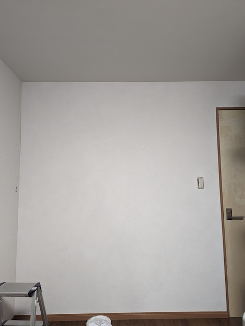

前編では壁に遮音シートを貼るとこまでやった。後編ではそこから壁の仕上げまでをお届けしたいと思う。

<!-- textlint-disable -->
[前編はこちら]()
<!-- textlint-enable -->

<!--more-->

## 防音はほんの少しよくなった

結果から先に書くと、防音面では多少マシになった。100聞こえるのが80くらいにはなった感じで、ほとんど誤差の範囲だけれど。電気のスイッチを押してる音がマイルドになって気にならなくなった程度だろうか。

ただ漆喰仕上げまでやって、壁がきれいになったことについては満足している。

## 石膏ボードを追加する

遮音シートが剥き出しのままになっているので、まずはこれをどうにかしなければならない。思いつくのは上からさらに壁材を取り付ける方法だろう。下地を作るかどうかも考慮する必要がある。

結果もろもろ考えて石膏ボードを新たに取り付けることにした。コスト面からも効果面からもそれが一番よいだろう。コスト的に同サイズの合板と比較して、ものにもよるが3分の1のコストで買える。石膏ボードはとにかく安い。それに防音面でも石膏ボードを貼るだけでそれなりの効果が見込めるらしい。

石膏ボードを重ね張りする際は、目地が重ならないように気をつけること。それだけでいいらしい。

ボードの貼り付けは一日で終わったけれど、とにかく石膏が飛び散って大変だった。これは家の中では作業できないだろう[^1]。切る作業は外でやったが、あたり一面石膏だらけになった。

あと目地を重ねないというのも以外にやっかいだった。石膏ボードの上に直接石膏ボードを貼る関係上、下地が見えないからビスを止める位置に難儀した。今から思えば下地のあるところを基準にボードを配置すればよかったと分かるけれど、作業中はとにかく石膏ボードを切る回数が少なくなるよう配置したからビスの半分くらいは効いてない状態になってしまった。

## 表面仕上

石膏ボードを貼り付けたら遮音シートのゴムの匂いは気にならなくなった。

あとは表面の仕上げ問題が残っている。最初はそのままにしておくかとも思ったけれど、さすがに見てくれが悪い。パテで全面仕上げるのも考えて途中まで作業したけれど、これは漆喰を塗ろうと考え直した。漆喰を塗るのは一度やってみたかったのもあるし、壁紙を貼るよりも作業が楽そうな気がしたからだ。

はじめてなのでうまくヌレールという製品を買ってやることにした。コスト的には高く付くのだけれど、さっさと終わらせたかったのだ。

購入したのは5kgだけど、量としては足りなかった。塗る面積はちゃんと計算してから買わなければならなかったなとあとから反省である。一度塗り＋薄いところに追加塗りでなんとか全面に塗ることはできたけれど。

塗った直後はどうなるかなと思ったけれど、1日も経つと我ながらいい感じじゃないかと自画自賛したくなる程度には思えるほどの仕上がりである。塗りムラがあるのだけど、それがまたいい感じに思える。逆に凸凹してるほうが味があっていい。

しかしながらそれから日が経ってくるとひび割れができたり剥がれてるところがあったりと、徐々にあらが目立ってきた。

ひび割れに関しては石膏ボードの固定が悪かった（下地にビス止めが効いてなかった）のと、漆喰の量が足らなかったのが影響しているように思う。量に関しては倍が必要だったなと思っている。

## 仕上げを経て

作業期間としては1ヶ月かかったことになる。それは仕事しながら、生活しながらの作業だったので時間がかかっただけだが。

壁紙を剥がして石膏ボードを切り開き、やっぱだめだったともとに戻して遮音シートを貼って、石膏ボードを重ね張りして漆喰を塗る。割と行き当りばったりな作業となったが、割と満足行く結果となった。当初の目的であった防音はほんの少ししか変わらなかったけれど。

こればかりはそもそもトイレが横についている時点でだめだった気がする。最終的には引っ越す以外に解決方法はないと思っている。

それでも多少なりとも効果はあったと思えるので、全体的に見てやってよかった。なにより、最後の仕上げの漆喰が思いの外いい仕上がりだったので全部許せるというものだ。終わりよければすべてよしである。

[^1]: 家の中で作業しようにも、石膏ボードを広げるスペースがない。