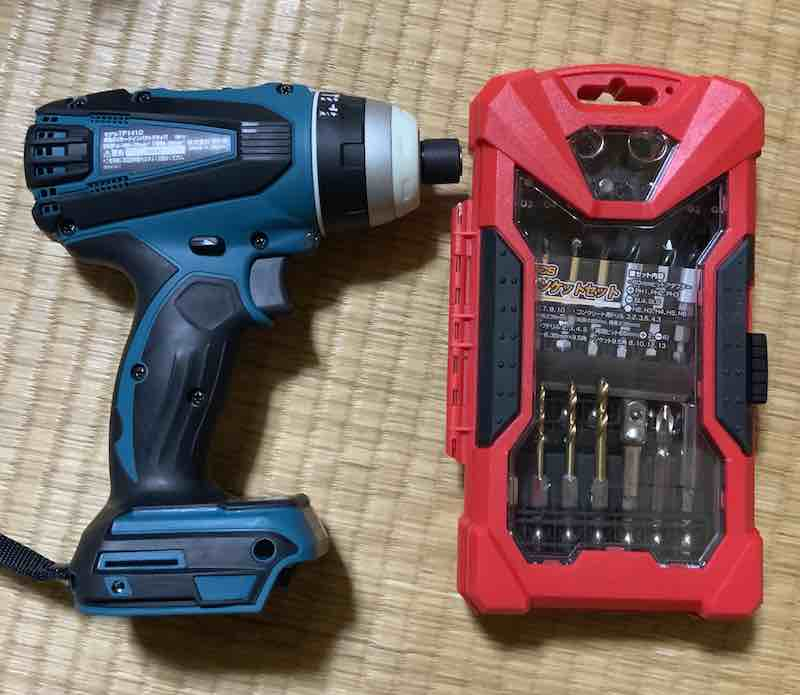

別にDIYに目覚めたというわけではないのだが、どうしようもなく電動ドライバーが欲しくなった。
当然買うなら充電式一択である。電源コードの近くでしか使えないなんて不便極まりないからだ。
趣味レベルで使うが18Vを選んだ。
そしてこれ1台でいろんなパターンに対応できる、4モードのインパクトドライバを選んだのであった。
もうこれが快適でしょうがないのでちょっと話を聞いて欲しい。

<!--more-->

## 工具を揃えたくなるお年頃

特に何を作るわけでもないけれど、無性に工具を揃えたくなる。そんな日が誰しもあると思う。
ものを作るより道具を揃えることのほうが楽しくなるのである。

私の場合、きっかけとなったのは実家のリフォームになる。リフォーム前に片付けをするわけでは、まあ出るわ出るわのゴミの山。使いもせずホコリを被った汚い工具がたくさんでてきた。

そもそも家もゴミ屋敷状態で、私はストレスの限界を迎えていた。リフォームで出てくる廃材を使ってなんか作ってやると、ストレス発散を兼ねて電動工具を買いあさりだしたのであった。

## どれを選ぶか

とりあえず電動ドライバー的なものからそろえることにした。

「的なもの」と書いているが、つまり電動ドライバーにもいろいろあるのである。

インパクトドライバ、ドリルドライバ。電動ドライバとくるとだいたいこの2つが出てくる。

インパクトドライバかそうでないかは、ネジをねじこむパワーの違いと思ってもらえばだいたい合ってるだろう。
私のイメージ的には、インパクトドライバを使うと、ドリルを使っての穴あけがやりづらいよっていうイメージだ。

だからどれを選ぶかも結構悩みどころなのである。最終的には「用途に合わせて買ってください」という話に落ち着く。
しかし、私は別に用途が決まっているわけではない。なぜならとりあえず電動工具が欲しかったからだ。

そこで私は、マキタの4モードインパクトドライバに目をつけて、これを買うことにした。

## 4モードインパクトドライバ

マキタの18Vでインパクトドライバと言っても、これがまた実に種類が豊富である。
ただ私が買うのは4モードのTP141と決めていた。

この製品は他社の製品も含めて唯一、インパクトドライバでありながら、インパクトモードをオフにして単なるネジ回し、ドリルによる穴あけができる万能機なのである。
唯一と言ってしまったが、まあ私が探した範囲ではという話であるので、もしかしたら他にもあるかもしれない。

## 電動ドライバなしの生活には戻れない

電動ドライバを使ったらこれが超楽しいし、超楽ちんである。

特にTP141はインパクトをオフにして単なるネジ回しができる。
つまりちょっとした家具の組み立てなんかに大活躍するということである。
できあいの家具の組み立てにインパクトドライバを使うと、ネジの締めすぎが怖いが、TP141はそのあたりの調整はお手の物である。
初心者の私でも、とりあえずもっとも遅い回転スピードに調整してやれば、とても楽に家具の組み立てや分解ができる。
もう手でドライバーを回すなんて考えられなくなった。
1本のネジを手で回している間に、電動ドライバーなら他のネジ全部閉め終わって余裕です、くらいに違う。

## TP141の弱点

そんな万能機のTP141に欠点があるとすれば、設定がめんどうくさいということだろう。

まず最初に4モード、インパクトモード・インパクトドライバモード・ドリルモード・ネジ締めモードの4種類を選ぶ。

選び終わったら回転スピードを高速・低速の切り替えで設定する。ここはもう面倒くさくて私は触らないことにしている。

そして最後に各モードにおけるインパクトモードの強さ・回転スピードの設定だ。とにかくややこしい。

電動ドライバでしかも18Vの超協力なやつなので、下手に設定を間違えると組み立て対象を破壊するおそれがある。
ここまで設定がややこしいので、絶対に誰にも貸したくない。

DIY用途で自分で使うならコントロールできるが、何も知らない人に貸したら絶対に壊される。そんなややこしいやつなのだ。

私はとりあえず最弱設定にして様子をみながら調整している。ネジ締めモードなら回転数をもっとも遅くする、インパクトモードならインパクトをもっとも弱くするといった具合だ。ネジが最後まで締まらない場合に、徐々にパワーを上げて様子を見るのである。

まあ最初のうちはおっかなびっくり使っていたが、さすがに最近は慣れてきた。まあこれくらいのパワーでやっても大丈夫だろうと当たりをつけて使うようになった。

## インパクトモードは超強力

18Vのハイパワーによるインパクトモードはかなり強力である。

個人の趣味レベルでは、正直なところそんなに出番がない。

一度インパンクとモードの最強パワーでねじ回しをやったことがあるのだが、見事にねじをねじ切ってしまった。
「え、こんなに簡単にねじって折れるの」ってびっくりしてしまった。
インパクトモードの取扱がこんなに難しいとは思わなかった・・・。

ちなみに、試しに中空で回転させるとすごい風圧が起こる。そりゃネジだって途中で折れるわって思う。

ちなみにネジというかビスが、木材の中に埋まった状態でネジ頭だけ折れてしまった。
まだ取り出していないのだけれど、今度これを使ってサルベージしようと思っている。

<iframe style="width:120px;height:240px;" marginwidth="0" marginheight="0" scrolling="no" frameborder="0" src="//rcm-fe.amazon-adsystem.com/e/cm?lt1=_blank&bc1=000000&IS2=1&bg1=FFFFFF&fc1=000000&lc1=0000FF&t=illusionspace-22&language=ja_JP&o=9&p=8&l=as4&m=amazon&f=ifr&ref=as_ss_li_til&asins=B003VUSGNO&linkId=d97c1dc0848b1a30ec705f98caf42a71"></iframe>

インパクトモードの取扱の難しさを実感したできごとであった。

## 総評

設定はめんどうくさいのだけれど、インパクトモードを持ちながら普通のねじ回しにも使える万能機はこのTP141だけだろう。
同じマキタのTD171も4モードを謳っているが、あちらとはモードの種類が異なり、ドリルモードがない。
たまに下穴をあけるためにドリルが必要になることがあるので、ドリルモードがあるTP141の方が、特に個人のDIY用途であれば便利だと私は思う。

もっとも出番が多いのはネジ回しモードだ。さきにも言ったが、ちょっとした家具の組み立てなんかにめちゃくちゃ便利である。まあその程度の作業に18Vの製品が必要なのかといわれると言葉に詰まるけれど。

インパクトモードはあまり出番が無いけれど、ネジ回しモードではパワーが足りないときなどに使ったりしている。一番多いのはグラインダのカバーや砥石の着脱時かもしれない。（グラインダーも買ったのだ、それもまた別に紹介したいと思う）

ネジの下穴のためにドリルモードが便利だったりするし、これ1台あれば大抵のDIYはこなせてしまう便利さがよい。

## ビットはどうするのか問題

電動ドライバを購入してもそれだけでは使えない。電動ドライバの先端にとりつけるビットが必要だ。
またこのビットが種類が豊富である。

TP141にはもとから+2のドライバビットが付属している。今一番使っているビットは実はこれだったりする。

+2というのは十字型のネジの大きさを表している。まあちょっと大きめのプラスネジに対して使えるビットだと思ってもらえばいいだろう。
電動ドライバを使おうと思うようなネジは大体大きい。そしてそんなプラスネジにはだいたい+2が合う。

電動ドライバを買うと、今度はビットをいろいろそろえたくなる。しかしビットセットも結構なお値段がする。そして、いろんな種類がセットになったビットセットを購入しても、結局の所あまり使わないという未来もセットになっている（と私は思う）。

そんな未来が見えたので、私はできるだけ安いビットセットを探して購入した。
私の用途にちょうどぴったりだと思ったのが、コメリで売ってるビットセットである。

<https://www.komeri.com/disp/CKmSfGoodsPageMain_001.jsp?GOODS_NO=843442>

お値段が1000円台で、ドリルビットセットとなっているが、ソケットやドライバビットなんかもある程度ついているお得なやつ。

値段のわりにサイズがでかいでしょう。本当に値段のわりに充実したセットで、かなりオトクなセットではないかと思う。
ただ価格が価格だけに、あまり精度は良くない。電動ドライバのチャックに装着して回すと、ビットがぶれるのがよく分かる、そんな精度。
ネジ回しモードで使う分には、強度的な問題は感じないと思う。
ただ、インパクトモードフルパワーで使うのはちょっと怖いかな。

あとは必要に応じて買い足していけばいいだろう。
ボルトを扱うことが多いなら、ソケットビットが必要になるだろうし。
プラスドライバのビットも、先端が長いものもあるといいかもしれない。
標準付属のビットは短いので、電動ドライバと干渉してしまうからだ。

## バッテリについて

私は18Vを買うことを決定していたので、18V6.0Ahのバッテリ2つがセットになっているやつを購入した。

18Vのバッテリにも3,5,6Ahと種類があって（4もあるんだっけ？）、違いは容量、つまり数字が大きいほうが長く使えるという違いがある。
18Vでパワーが強いので、バッテリの減りも結構早い。
せっかく18V買うなら6Ahのバッテリを選んだほうがいいんじゃないかなと思う。

ちなみに、別にどうでもいいから安いのがいいっていうなら互換バッテリを使うのも手かもしれない。値段がまるで違うからなぁ・・・。

しかしせっかく高いお金出して買った、プロも使うような電動工具なので、ちゃんと純正品を使いたい。当分の間、私は互換バッテリを使うという選択肢を選ぶことはないだろう。

あと注意点として、このバッテリは充電時にものすごいうるさい音がする。バッテリの容量がでかいのと、高速充電を行うために冷却しながら充電するのだが、これがもううるさい。
寝てる間に充電しておこうとか絶対に無理である。
正直室内であまり充電したくない程度にはやかましい。

### バッテリの共用

ちなみにバッテリは単体で見るとめちゃくちゃ高いのだが、他の電動工具と共用できるのがメリットである。
メーカーを揃えるメリットがここにある。

ちなみにこれを書いている時点で、私は次の電動工具でバッテリを共有中だ。

- 電動インパクトドライバ　TP141
- ディスクグラインダ
- 集塵機
- 草刈り機

18V製品はパワーがしっかりしているので、今後もいろいろ買い足していく予定である。