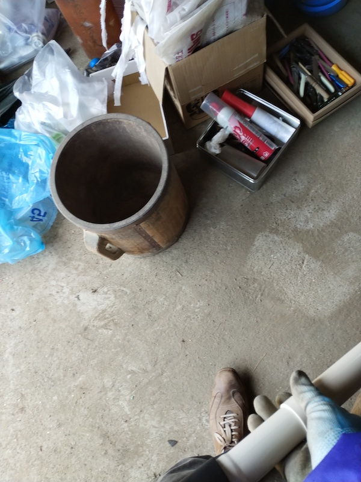
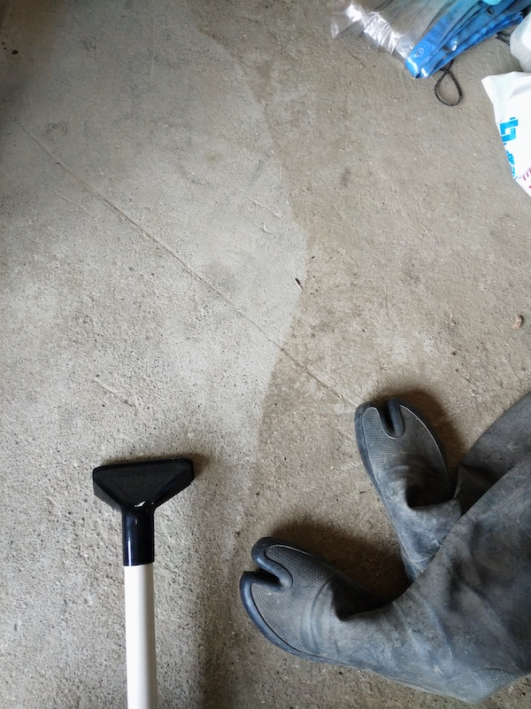
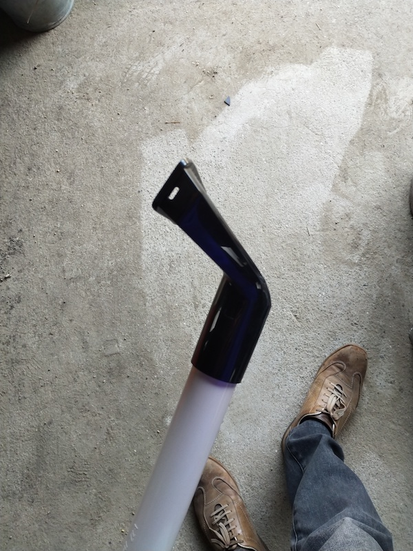
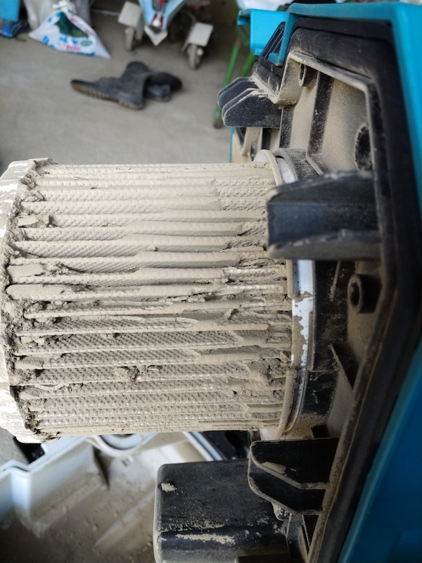
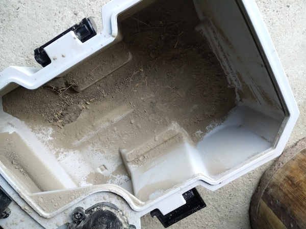

実はマキタの18V充電器シリーズを買おうと決心した原点の商品である

バッテリで駆動する集塵機、つまりは掃除機みたいなものである。バッテリ駆動なので電源を必要としないので、どこでも持ち運んでゴミを吸い込める便利なやつである。乾湿両用で、つまり水などの液体を吸い込むこともできる。

吸引力は若干のコツがいるものの、使い方を理解すればとても強力にゴミを吸い込んでくれる。ホースを逆につなぐとブロアになるという、あれもこれもできる万能機といえるだろう。

・・・とべた褒めだが、そうそううまくいかないのが世の常というもの。弱点も含めて使った感想を綴っていこうと思う。

<!--more-->

## 購入しようと思った経緯

うちには農業用車庫があって、そこの床は土埃が溜まっていて、中でなにかすると目が痛くなるほどである。外で使った農業機械をそのまましまうのでしょうがないのだが。

ほうきで掃き出そうにも土埃が舞い上がるだけで効果がない。大体舞い上がった土埃が目に入って掃除どころではない。そこで、この充電式の掃除機を使ったらキレイにできるのではないかと思って買ったわけである。

購入の決め手は電源が要らないことだ。バッテリで動くし、そのバッテリも18Vと最上位のものだから、いい感じに掃除できそうと思ったのだ。

吸引したゴミは本体ケースに溜まっていく仕組みである。ダストパックなどの消耗品を必要としないので、土埃を吸引するのにちょうどよい。ゴミ袋に入れて捨てるようなものではないかから、車庫の外にそのまま捨てればよいので、本体さえあれば吸い込めるのは私にとっては魅力的だったのだ。

このあたりは人によっては違うかもしれない。

## 実際に掃除してみて

実際に車庫を掃除してみた。

車庫内の片付けをしている最中で丈夫に何やらいろいろ写っているが、注目すべきは床面である。土埃がつもりまくっている。

そしてこれがVC750DZで吸い込んだ後の画像である。

左側が吸い込んだ後だが、見た目がまるで違うことがおわかりいただけるだろう。吸引力は実証された、やったね大勝利！

・・・と、そうは問屋がおろさなかった。

実のところ、使ってみたら思ったのとぜんぜん違うところがいくつかあった。正直に言うと軽くショックを受ける程度には、買ったことを後悔してしまった。

その後に「まあまあ使えるじゃん」と思える程度には評価が回復したとはいえ、このタイミングではちょっとショックを受けたのは事実である。

## 吸引力を発揮させるためのコツ

VC750DZの吸引力を最大限に活かすには、吸込口と掃除をする対象の面とを並行にし、できる限り真空状態になるようにしなければならない。

たとえば標準で付属しているワイドノズル。（ちなみにその下についている白い細長いやつは、私がもともともっていた10.8Vのマキタのハンディクリーナーのパイプである）

このワイドノズルの先端が、床面に平行になるようにしないと土埃はまるで吸い取れなかった。

そしてこのワイドノズルを床面に平行になるように使うのはかなり大変である。なぜなら可動部分が一切ないからだ。私が腰をかがめて、ワイドノズルの底面が床面と並行になるように気を使う必要があるのだ。そんなことしてたら腰が痛くなる。

・・・これはまた別途記事を書くが、マキタのクリーナー用アタッチメントなどを別途買い足すことで対応することとした。

それはともかく、18Vのバッテリを使っていて吸い込み仕事率50Wあるといっても、吸込口にゴミを近づければみるみるうちに吸い込んでいくような力はない。ふわふわ浮いているような綿埃のようなゴミならいざしらず、今回のような土埃を吸い込もうと思ったら工夫がいる。

思ったより吸い込まないなと思ったら、それは吸込口が平行になるようにあたっていなくて、吸引力を十二分に発揮できていないからと思うべきである。

本領を発揮させるには、掃除対象の面と並行になるようにノズルを当てることである。ちなみにノズルの底面には、この写真からはわからないが軽く凸凹がついているので、床面に平行にしても吸い付いて動かなくなることはないので安心してほしい。

しかしこのワイドノズルはわりと使いづらい。手元の近くでかつそれなりに広い平面を掃除するときに、ようやく活躍するようなやつという印象だ。ノズルの接続口の部分が可動してくれれば平行に接地させやすいのだが、たんなるプラスチックのかたまりなので使う本人が工夫して当ててやる必要がある。

## フィルタの目詰まりが早い

そしてびっくりしたのが、フィルタの目詰まりが驚くほど早いということだ。

そもそも吸い込んだのがめちゃくちゃ細かい土埃だったせいなのかもしれない。それにしたって、吸い込みはじめて1分もしないうちに、明らかに吸引力がガタ落ちした。そのときのフィルタの様子がこちらである。

それだけ車庫内の土埃がすいごかったということではあるのだが、一瞬でこのように土埃がみっしり詰まってしまっている。これでは吸引力が落ちるわけである。

ちなみにこの状態にして吸い込んだ土埃の量はこれくらいだ。

乾湿両用だからこそのフィルタの形状だろうし、だからこそのプレフィルタがない構造なのだろうが、正直こんな状態では使いづらくて仕方がない。

うちの車庫はそれなりに広いのだが、こんな状態ではVC750DZで掃除をするのは諦めるレベルである。1分ごとにフィルタの目詰まりを掃除しないといけないのはあまりに非現実的だ。

というかこの目詰まりしやすい構造はもっとなんとかできなかったのかと思う。

単に私が吸い込んだゴミが細かすぎるだけなのだろうか？

## フィルタの掃除

このフィルタはヒダ状になっており、単に揺すっただけでは目詰まりは解消できない。そもそもこの写真の場合、細かい砂の粒子がつまっているのだからなおさらだ。

かといってブラシのようなもので掃除するのは、フィルタを傷つけることになるからやめろと説明書に書いてある。

ではどうするかというと、エアダスターで吹き飛ばすか、洗うかのどちらかである。

ちなみにエアダスター戦法をとってみたが、こちらは現実的ではない。あなたがエアコンプレッサーを持っていて残量を気にすることなくエアダスターが使えるというのなら話は別だが。スプレータイプのエアダスターを使うなら、フィルタを掃除するだけで半分くらい使ってしまうだろう[^1]。

そのため、現実的な落とし所としてはフィルタを水洗いするのがよいだろう。乾湿両用機なので、フィルタを水洗いするのは問題ない。

問題ないが、フィルタを掃除して乾燥するまでの間これが使えなくなる。ということで、こちらの戦法をとるなら予備のフィルタを用意する必要があるだろう。型番はA-68214となる。

<table border="0" cellpadding="0" cellspacing="0"><tr><td>

</td><td>
<table><tr><td style="width:300px"></td><td style="vertical-align:top;">
<a href="https://hb.afl.rakuten.co.jp/hgc/189842f6.5593fcf5.189842f7.a7010ded/?pc=https%3A%2F%2Fitem.rakuten.co.jp%2Fishikana%2Fa-68214%2F&m=http%3A%2F%2Fm.rakuten.co.jp%2Fishikana%2Fi%2F10000982%2F&link_type=picttext&ut=eyJwYWdlIjoiaXRlbSIsInR5cGUiOiJwaWN0dGV4dCIsInNpemUiOiIzMDB4MzAwIiwibmFtIjoxLCJuYW1wIjoicmlnaHQiLCJjb20iOjEsImNvbXAiOiJsZWZ0IiwicHJpY2UiOjAsImJvciI6MSwiY29sIjowLCJiYnRuIjoxfQ%3D%3D" target="_blank" rel="nofollow noopener noreferrer" style="word-wrap:break-word;"  >マキタ　フィルタセット品　A-68214　へパフィルタ</a>

<a href="https://hb.afl.rakuten.co.jp/hgc/189842f6.5593fcf5.189842f7.a7010ded/?pc=https%3A%2F%2Fitem.rakuten.co.jp%2Fishikana%2Fa-68214%2F%3Fscid%3Daf_pc_bbtn&m=http%3A%2F%2Fm.rakuten.co.jp%2Fishikana%2Fi%2F10000982%2F%3Fscid%3Daf_pc_bbtn&link_type=picttext&ut=eyJwYWdlIjoiaXRlbSIsInR5cGUiOiJwaWN0dGV4dCIsInNpemUiOiIzMDB4MzAwIiwibmFtIjoxLCJuYW1wIjoicmlnaHQiLCJjb20iOjEsImNvbXAiOiJsZWZ0IiwicHJpY2UiOjAsImJvciI6MSwiY29sIjowLCJiYnRuIjoxfQ==" target="_blank" rel="nofollow noopener noreferrer" style="word-wrap:break-word;"  >
楽天で購入
</a>
</td><tr></table>
</td></tr></table>

まあどちらにしても予備のフィルタは持っておいて損はない気はするけれど。

しかし、マキタの工具は個人でも買えるのに、オプション品や部品を買おうとするととたんに難易度が上がるのはなんとかならないのだろうか・・・。

## 総評

評価としては3にしているけれど、これは車庫の土埃を掃除しようと思って買ったのに、その用途では思ったように使えなかったというショックによるものである。

その後別の用途で使ってみたが、部屋の大掃除をしたりするときに高い場所を掃除したりするのに活躍する。ハンディクリーナーでいいと思うかもしれないが、こいつは外との境界でも気軽に使えるのがよい。窓の桟を掃除する際などは、部屋の掃除をするハンディクリーナーよりこいつを使ったほうが気が楽だ[^2]。

また、なにげにブロア機能も微妙に役に立つ。ホースを反対側に付け替えるだけでブロアに早変わりするのだが、ホコリだらけの家具を掃除するのに、とりあえずホコリを吹き飛ばすときなんかに使える。

吸引と違って、ブロアについては雑に使ってもその効果は変わらない。結構な勢いで吹き飛ばすので、車庫の土埃も防塵マスク・メガネで完全武装したらブロアで掃除したほうが楽かもしれない。それなりに強力だ。

ただブロアとして使えはするが、吸塵するときに使うホースをそのまま使うことになるので、ブロアの際にホース内に残っている粉塵が一緒に吹き出てしまうことがある。ブロアはブロアで専用機があったほうがいいなと思っている（というか買うつもりである）。

そもそも最初の期待が大きすぎたゆえに、ちょっとがっくり来てしまったというだけで、ゴミ屋敷の掃除にはそれなりに活躍している。吸引力の問題も、使い方のコツさえつかめばとてもキレイに掃除できる。肩にかけてほいほいどこへでも持っていける。

まあ文句を上げるとすればこんなところだろう。

- ワイドノズルの接続部分には多少可動性をもたせて、掃除する面と平行になりやすいような配慮が欲しかった
- ヒダ状のフィルタが露出している構造はやめてほしかった（プレフィルタが欲しかった）
- 対応のアタッチメントがわかりにくい・入手しにくい

<!-- textlint-disable -->

逆に良いところはこんな感じだろうか。

<!-- textlint-enable -->

- 肩に下げて気軽に持ち運べる
- 吸い込めないなら吹き飛ばしてしまえの精神で掃除できる
- マキタのバッテリ（18V限定）を使い回せる
- 乾湿両用で雑に使っても問題ない

## 型番について

最後に余談だが、この記事で紹介しているVC750DZは、集塵機本体のみの販売である。これを使おうと思うと、別途マキタの18Vのバッテリと充電器が必要となる。

充電器・バッテリがセットになったのはVC759DRGという型番になる。例外はあるかもしれないが大体マキタ製品の型番は、最後がDZとなっていたら本体のみ、DRGとなっていたら充電器・バッテリ込のものだ。

VC750DRGの場合バッテリが1つしかついてないので、私は先にバッテリが2つセットになってるインパクトドライバを買ったのである。[TP141の記事］()

[^1]: 私が神経質すぎるから、フィルタの掃除をするだけでスプレー缶使い切る勢いの使用量だったのかもしれない。
[^2]: 部屋の中で使う掃除機で、土や石が混じったような場所の掃除をするのは気がひけるだろう。・・・私だけだろうか？