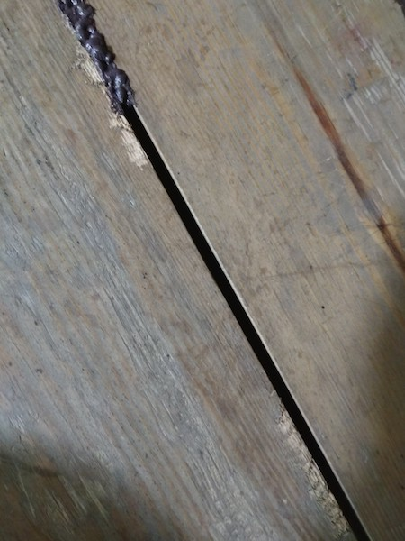
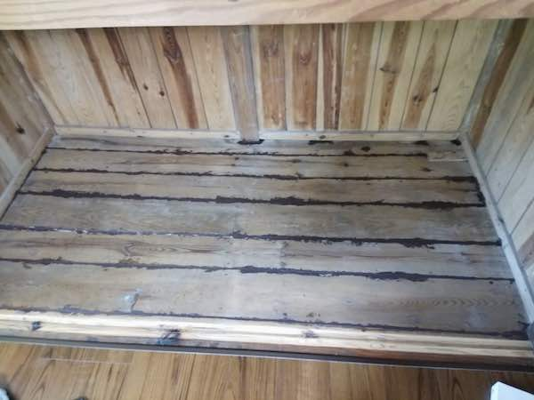
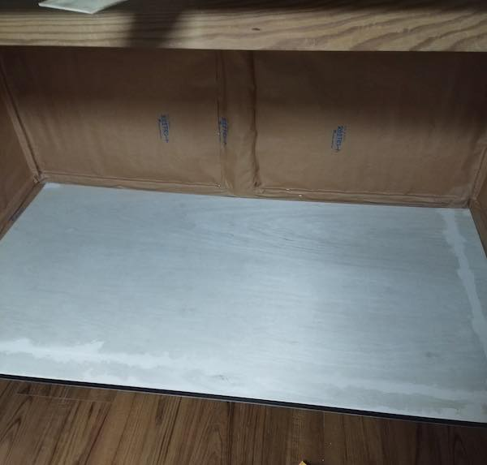
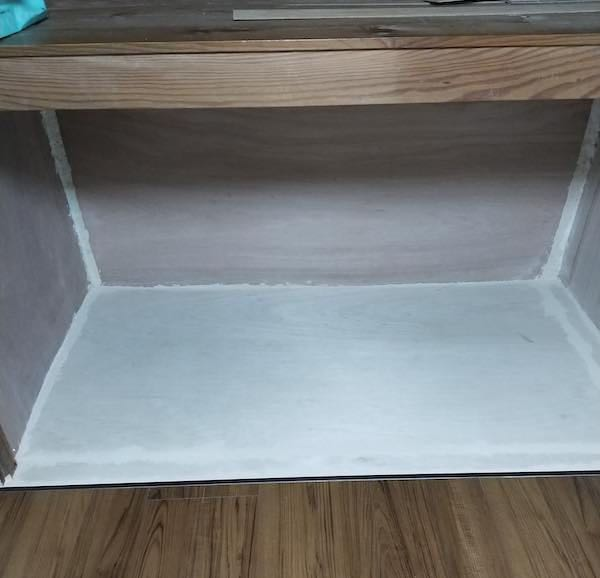

ぼろぼろの押入れの修理で、木工パテやら木工パテAやら木部補修材やらいろいろ使いまくって、これらの製品についてそれなりに分かってきたのでそれをまとめておこうと思う。

基本的には木工パテと木工パテA、Aがついたら何が違うのというのがメインだけども、ついでなんで木部補修材も扱おうと思う。

<!--more-->

## 木部補修材

木工パテシリーズはセメダインが出している製品だけど、木部補修材に関してはアサヒペンが出してる製品。つまりメーカーが違う。さらに用途も違うので注意。

<iframe style="width:120px;height:240px;" marginwidth="0" marginheight="0" scrolling="no" frameborder="0" src="//rcm-fe.amazon-adsystem.com/e/cm?lt1=_blank&bc1=000000&IS2=1&bg1=FFFFFF&fc1=000000&lc1=0000FF&t=illusionspace-22&language=ja_JP&o=9&p=8&l=as4&m=amazon&f=ifr&ref=as_ss_li_til&asins=B004ZK298C&linkId=7975ce40eb356fae77fb5beaa744276f"></iframe>

木部補修材に関しては色のバリエーションはなくて、かなり濃い茶色のみ。

木部補修材については［以前に書いた記事］()を参照してもらったほうが早いかもしれない。

メリットはなんといってもコーキングガンを使って施行できること。広範囲の作業にはこれを使うのが楽ちんである。

粘度はかなり高い。高いと言うかザラザラした感じがするので、左官鏝なんかを使って平にするのがいいと思う。私の場合はちょうど小さい左官鏝がゴミ屋敷の中に転がっていたので、それを使って作業をした。

注意点は服についたらとれないから、本当に汚れてもいい格好で作業をすること。私は汚れるわけはないと思いつつ作業してたけど、結局つなぎにかなり付着した。付着したやつは基本洗濯してもとれないので、間違ってもおしゃれ着で作業とか止めたまえ。

粘度はそれなりにあるが、基本的には柔らかいので垂れる。特にコーキングガンで絞り出した後、気をつけないとその先端からウニョウニョとたれ出すので結構面倒くさい。

私は最終的に、左官屋さんがよく使ってるモルタルなんかを広げて盛っておくコテみたいなやつを自作して、それに補修材を盛る→埋める箇所にコテで埋めるという作業に落ち着いた。左官鏝にこびりついた木部補修材を、この木製コテになすりつけて作業しやすくなるというメリットもあって便利だった[^1]。

また、耐候性があるのでどちらかというと家の外にある木部の補修に向いている。

## 木工パテと木工パテAの違い

公式サイトを見れば分ておくれで終わってしまう話なのだが、公式サイトだけではわからないことをメインに書いていきたい。

### 木工パテ

まず木工パテ、Aがつかない方は有機溶剤が利用されているため、固まりやすいという特徴がある。固まりやすいということは、上塗りしやすいということである。

塗った直後は柔らかいので、ある程度伸ばしたりできる。が、どちらかというと深い穴を埋めるのに適しているのが木工パテの方だ。

注意点としては、有機溶剤が使用されているため、施行中はものすごいシンナー臭い。そして施行後も結構な期間そのシンナー臭が残る。具体的には1週間位は残ると思ってもらったほうがいいかもしれない。もちろん換気状況などにも影響されるだろうが。

そういう意味で、室内で広範囲に木工パテを使うのはあまりお勧めしない。作業中だけでなく、作業後しばらくシンナー臭で気持ち悪くなるからだ。ここがデメリットであろう。

### 木工パテA

木工パテAは有機溶剤などは使われていない、水性タイプの製品になる。水性タイプなので非常に塗りやすく、広範囲に塗り拡げるのに適している。

一方で、水性タイプということでめちゃくちゃ肉痩せする。肉ヤセが少ないとは書いてあるが、深い場所に塗るとめっちゃ肉痩せする。肉ヤセが少ないというのはある程度浅いところに塗った場合の話だと思う。深い箇所をこれで埋めようとすると、二度塗り・三度塗りが必要になる。その点は注意が必要だ。水性ゆえの宿命である。

深い穴は木工パテを使い、広範囲の施行は木工パテAを使うのが適切なんだろうが、そこまで細かく使い分けるのは面倒である。素直に二度塗りとかしたらいいと思う。

当然だが、二度塗りするには1日なりおいて乾燥するのを待つ必要がある。施工方法を工夫すれば、別の場所を作業してる間にある程度固まったのを見計らって上塗りするというのもありだが、素直に固まるのを待ったほうがいいだろう。

固まりさえすれば、水性だろうが有機溶剤だろうが、どっちもそれなりの硬さに固まる。ちゃんと平らにするのは付属のヘラではかなり難しいので、固まった後はサンドペーパーなどで表面処理をしたほうがいいだろう。

ただ気になるのは、木工パテの方は硬化後釘を打ったりできるとは書いてなくて、木工パテAの方は釘打ちができると書いてある点だ。そのあたりも有機溶剤・水性による違いがあるのかもしれない。

ただ、釘打ちとかするにはできる期間が指定されているので、あまり放置しすぎるとどちもできなくなるのかもしれない。理由としては、水性のほうが固まるのがゆっくりなので、1週間以内なら釘を打ち込んだりしても割れないとかそういう理由があるのではないだろうか。

## 結局どう使い分けるわけ

まず、最初に考えるべきはシンナー臭が結構長い時間残っても大丈夫かという点だろう。

室内のちょっとした補修のために木工パテを使うと、しばらくシンナー臭くて気になるはず。普段近寄らない場所ならそれでいいが、寝室の近くで使うのは止めたほうがいいだろう。

次に考えるべきは施工範囲の広さだろうか。ちょっとした傷を埋める程度なら、木工パテだろうがAだろうが変わりはない。

そういう場合は施工場所とできるだけ同じ色の木工パテを選ぶべきだとだけ入っておく。ラワンとタモの2種類があるが、色がだいぶ違うので気をつけたい。

## 補修の経過

一枚目はアサヒペンの木部補修材を使って隙間を埋めた状態の写真となる。まあ見事に汚い。

そして2枚めはこの状態の押し入れに防虫シート、よく畳の下などにしくやつを全面に貼り付け、その後ベニヤ板を貼り付けた状態になる。

ベニヤ板が白いので、木工パテAタモの色とだいたい似通ってるので、そこまで目立たないだろう。

ちなみに防虫シートは防虫・防湿・防ダニ・防カビシートというのを買った。買ったやつとは違うがだいたいこんなやつ。

<table border="0" cellpadding="0" cellspacing="0"><tr><td>
<table><tr><td style="width:240px"></td><td style="vertical-align:top;width:248px;">
<a href="https://hb.afl.rakuten.co.jp/hgc/194dcba0.a9b07a96.194dcba1.204930d7/?pc=https%3A%2F%2Fitem.rakuten.co.jp%2Fkouhin%2Fboutyuu6jyou%2F&m=http%3A%2F%2Fm.rakuten.co.jp%2Fkouhin%2Fi%2F10001473%2F&link_type=picttext&ut=eyJwYWdlIjoiaXRlbSIsInR5cGUiOiJwaWN0dGV4dCIsInNpemUiOiIyNDB4MjQwIiwibmFtIjoxLCJuYW1wIjoicmlnaHQiLCJjb20iOjEsImNvbXAiOiJkb3duIiwicHJpY2UiOjEsImJvciI6MSwiY29sIjoxLCJiYnRuIjoxLCJwcm9kIjowfQ%3D%3D" target="_blank" rel="nofollow noopener noreferrer" style="word-wrap:break-word;"  >防虫・防ダニ・防カビシート 6帖用サイズ：約1m×3.8m×3枚入り防虫紙 防虫シート 防ダニシート 日本製</a> 価格：3960円（税込、送料別) (2019/9/28時点)

<a href="https://hb.afl.rakuten.co.jp/hgc/194dcba0.a9b07a96.194dcba1.204930d7/?pc=https%3A%2F%2Fitem.rakuten.co.jp%2Fkouhin%2Fboutyuu6jyou%2F%3Fscid%3Daf_pc_bbtn&m=http%3A%2F%2Fm.rakuten.co.jp%2Fkouhin%2Fi%2F10001473%2F%3Fscid%3Daf_pc_bbtn&link_type=picttext&ut=eyJwYWdlIjoiaXRlbSIsInR5cGUiOiJwaWN0dGV4dCIsInNpemUiOiIyNDB4MjQwIiwibmFtIjoxLCJuYW1wIjoicmlnaHQiLCJjb20iOjEsImNvbXAiOiJkb3duIiwicHJpY2UiOjEsImJvciI6MSwiY29sIjoxLCJiYnRuIjoxLCJwcm9kIjowfQ==" target="_blank" rel="nofollow noopener noreferrer" style="word-wrap:break-word;"  >
楽天で購入
</a>
</td><tr></table>
 

</td></tr></table>

畳の下に敷く用のものを床下と壁に貼ると、さすがにそのまま使うのもなぁと、追加でベニヤ板を貼り付けたわけである。この辺りは完全にいきあたりばったりである。DIYあるある。

この写真はまだ作業途中なので壁にベニヤが貼られていないが、壁もベニヤを貼り付けている。

この押し入れ自体がガタガタで真四角になってないので、ベニヤの貼り付けは適当である。大きな隙間が合いた場所には発泡ウレタンを流し込んでさらにカオスになった。

・・・話がそれてしまった。

## 木工パテはどっちを使えばいいか

つまりは作業したい用途によるのである。匂いがきつくてもいいから早く固まって欲しい、深い穴を埋めたい場合は木工パテを選んでおけばいいだろう。

そういった用途でないのであれば、とりあえず水性の木工パテAを使うのがいいだろう。失敗したらすぐに拭き取ればきれいになるので。そういった点ではやはり作業のしやすさには木工パテAの方が軍配が上がるかもしれない。

ただし、木工パテAを施行しやすいとするかは人によると思う。いつまでもベタベタとするので、追加で塗ろうとしたらへんに汚くなってしまったということが起こりうるからだ[^2]。

後は量が結構いろいろあるので、施工箇所の範囲の広さに合わせて買うのがいいだろう。私はネット120mlの木工パテAを結局5個くらい買って使った気がする。それくらい使うならバケツタイプを買えばとも思うのだが、バケツタイプは保管が大変らしいので、チューブタイプ買い足しで良かったのかもしれない。とはいえ修繕にちょっと金をかけ過ぎな気がしないでもない。もうこのあたりは意地のレベルになっている。

私の場合は本来なら木材をうまいこと切り刻んでいい感じにはまるように配置すればよかったのだが、そもそも押入れ自体の作りがめちゃくちゃで、柱は飛び出ている壁は凹んでいるという状態だった。そんな状態ではまともに補修もできないので、めんどくさくて最終的に防虫シートを張ってあるしと、ベニヤ板で適当に蓋をした次第である。そしてベニヤで敷き詰めてできた隙間を木工パテで埋める施行を行った。

最終的にはこんな感じである。

最初の状態と比べるといい感じになったのではないだろうか。

まあぶっちゃけると、壁の上の方は防虫シートが丸見えだったりするのでそこまでキレイに仕上がっているわけではない。が、素人DIYでこれくらいに補修できたら十分である。

プロにこの作業を頼んだらどれくらいかかるんだろうか。もう取り壊して1から作り直したほうが早えよってあの棟梁なら言いそうだけれど。まあリフォームした部屋のすぐ目の前の押し入れがこんな状態で平気というか特に何も言ってこないような業者に信用性はゼロだから、自分でやって正解だと私は思っている。

## 実は施行後を書きたかっただけ

というのは伝わっただろうか。

個人的に、ベニヤを敷き詰める際に微妙にあまった隙間を丸のこ使って加工して埋めたところが我ながらいい感じにできたと思っている。木工パテが継ぎ目を表しているのだが、そのあたりのベニヤ板は自分で加工して敷き詰めた。意外となんとかなるもんである。

もっとも一般の方にとってはこんな記事何の約にも立たないだろうが。

最後にまとめとして、木工パテと木工パテAどっちを使ったらいいか迷ったら、Aの方を使っとけば無難ということはお伝えしておこう。

間違っても木工パテがだめだというわけではない。木工パテのほうが施行しやすいとも思うので。水性の木工パテAでは素材同士がきちんとくっついていない場合、素材が動いたせいで剥がれる・隙間が生まれるといったことが発生しうるので。だから本当に施工場所に合わせて選んでくれというのが結論である。

ちなみに、木工パテAは水性で塗りやすいが、だからといって施行しやすいとはイコールではない。ベタベタ広がるということは、ピンポイントで付けたい場所に付けにくいということでもあるからだ。

木工パテを選ぶのはこんな人。

- 匂いが気にならい
- 匂いが残っても気にならない
- さっさと固めたい
- 深い穴など結構な深さを補填したい

木工パテAを選んだほうがいいのはこんな人。

- シンナー臭いのは施行中・施行後ともに耐えられない
- 浅く広い範囲を作業する
- 素材と素材が完全に固定された場所に使う

以上、結構な時間と費用をかけて押し入れを補修した私の実体験を交えて、木工パテと木工パテAの違いについて語ってみた。参考になれば幸いである。

あとひとつ言い忘れたが、付属品のプラスチックのヘラは意外と使いづらいので、小さいサイズの左官鏝を使うほうがいいかもしれない。

[^1]: 適当に木材を用意してきて、持ち手を適当に取り付けただけの簡素なものだったが、そんなものでもあって便利だった。わざわざ木材加工せずとも、水性絵の具のパレットとかで代用が効くのではないだろうか。
[^2]: 固まっている途中の木工パテAが毛羽立ったり剥がれたりしてカオスになるという意味。