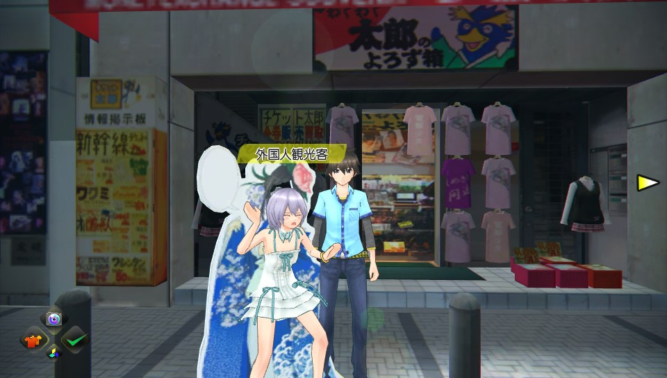
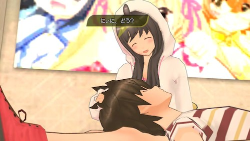
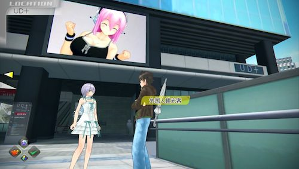
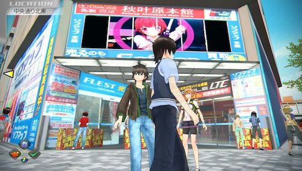

吸血鬼は光に弱い。だから<strong>敵を倒すためには服を脱がせるんだ</strong>よ。そんなゲームです。

PS3版とVita版があるが、私が買ったのはVita版。

秋葉原を舞台にしていて、現実にある建物とかがあるらしいです。私は秋葉原に行ったのは数回（しかも昔）なのでよくわかりませんが・・・。

前作はプレイ済み。今作も冒頭の選択肢でノリノリでいくとゲームオーバーになって、個人的に非常に満足しました。<em>こういうノリ好きです</em>。

## グラフィックが綺麗

前作とは比較にならないほど<strong>グラフィックが綺麗</strong>になっています。

<em>前作はなんかザラザラしている</em>感じでしたが、Vitaのグラフィックの美しさも加わって、<em>なめらかで美しい</em>感じがします。脱がし甲斐があるってもんだぜ。

## ロードが長い

グラフィックで頑張り過ぎたせいか、<strong>ローディングははっきり言って長い</strong>。最近さくさくロードするゲームが多いせいか、ちょっとでも長いといらっと来てしまいます。短気でイカンなぁとは思うけど、<strong>待ち時間のせいでマップの切り替えが面倒くさいなと思う程度には長いです</strong>。イベント始まるのかと思ったら、単にマップの切り替だったというのが、最初のマップ切り替えの印象です。

ゲーム中でお金を稼ぐためにお使いイベントをこなしたりしますが、マップの読込にしばらく待たされ、マップが表示され移動できるようになっても、街を歩くNPCが表示されるまでまた待たされる。<em>お使いの依頼人に会うのも一苦労</em>です。

## 戦闘の爽快感を感じるかは人それぞれ

ゲームの難易度はカジュアル（普通）でやっているはずなのですが、<em>わりとあっけなく敵に殺されてしまいます</em>。ボタン連打だけで戦闘を切り抜けられるほど甘くはないのです。

1vs多数の場面がいきなり訪れたり、こちらの攻撃を敵がかわしまくったりと、状況に合わせた立ち回りをしないとあっさりとやられてしまいます。敵の動きをよく見て適切な行動が要求されるので、<em>初めてやる人は難易度は一番簡単な奴にした方が無難</em>だと思います。

比較的戦闘の難易度は高めに感じますが、敵の動きに対応し切ると面白いし、何より戦闘中に発生する<strong>連続ストリップを決めると非常に気持ちいい</strong>。脱がしの達人になった気分です。

さらに連続ストリップの締めに決め技を発動する時があります。普段は脱がすと言っても服までで、下着までは脱がさないのですが、この決め技が決まると相手の下着まで奪い取ります。脱がされた相手は<strong>神々しく輝く</strong>。<strong>あまりの馬鹿さ加減に爆笑です</strong>。

これは<strong>変に癖になる</strong>いいゲームだ。

## やってることは単純なれど面白い

<em>妹が非常にかわいい</em>。

ゲーム内のスクリーンに動画が流れる。なかなか細かな演出。

ゲーム内ソフマップに、<em>リアルの店舗で流れているあのテーマ曲がかかっている</em>。個人的に懐かしい音楽なのでちょっとニヤリときます。

装備品によって、キャラクターの歩き方や、脱がす時のアクションが変わったりと、細かな演出がにくい。

細かなことを考えずに遊べるゲームだと思います。がっつり構えてじっくりやるより、気が向いた時にちょろっと遊べるVitaで遊ぶのにちょうどいいのではないでしょうか。

  