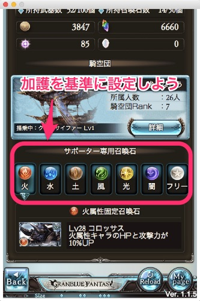
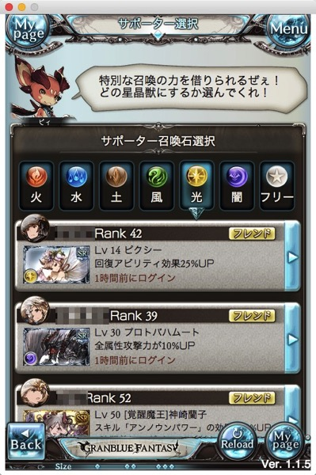
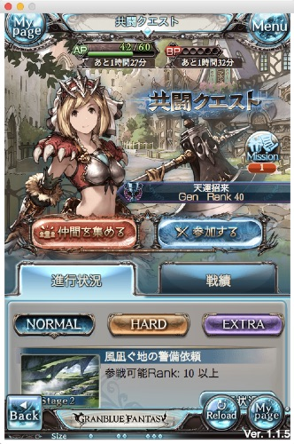
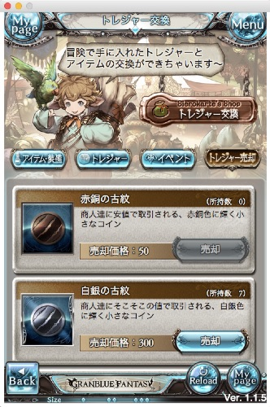

グランブルーファンタジーを無課金で遊んでいます。アイドルマスターシンデレラガールズとのコラボをやっているのがきっかけで遊び始めました。イラストが私好みで気に入っています。

## プレイ環境

Nexus5でのプレイはやや厳しいものがあります。クエストを進めるのはなんとかなりますが、マルチバトルになると処理が重くて、何もできないまま敵が倒されていく様を眺めることになります。描画を一番軽い状態にしてもそうなので、快適にプレイするのに要求されるスペックはかなり高めです。

ただしグランブルーファンタジーはPCでのプレイも可能です。Google Chromeを使っていればWindowsだろうとMacだろうとプレイができるので、パソコンで遊びさえすれば快適です。ただ、Macだとチャットなどで日本語入力ができないのが困りものです。（もっとも日本語打てなくてもさして困りませんけどね）

## AP（スタミナ）の負担がかなり重い

このゲームやってて感じたのは、スタミナ（AP）の負担がかなり重いということです。序盤はクエストにどんどん挑戦していきたいのにAPが足らないなんてことがしょっちゅうでした。

しかしこのゲームは、AP回復手段がいくつか用意されています。たとえばAP回復アイテムを毎日ゲーム内のカジノで交換することができたり、~~Twitterへの投稿ページに移動するだけでAPとBPが回復したりといった具合です~~。いつ頃からか実際にTwitterでTweetしないと回復しないように修正されました。

さらにAPがなくても遊べる要素が多い（共闘クエスト、マルチバトルへの参加、カジノ）ので、APの消耗が激しくてもバランスはとれているのかなと思います。特に前述のとおり、カジノではAP回復アイテムを交換することができるので、早めにメインシナリオ8章まですすめるのがオススメです。

## 序盤の進め方

Wikiの序盤の進め方を見れば大体の進め方は分かると思います。

無課金だと有用な召喚石が手に入りにくいのですが、メインシナリオを進めていくとSRの召喚石をショップで交換できるようになります。
まずはそれを目指してメインシナリオを進めていくとよいでしょう。

たとえば風属性のティアマトは、メインシナリオ4章をクリアすると出現する「ティアマト討伐戦」をクリアすれば、ショップで交換ができるようになります（別途交換に必要なアイテムを集める必要がありますが）。

限りあるAPをメインシナリオと開催されているイベントと、どちらに割り振るかは悩ましい問題なのですが、ある程度メインシナリオ進めていった方がいいのかなと思います。

設定箇所が分かりにくいのですが、固定召喚石の設定はぜひやっておきましょう。メニュー→プロフィールから、下の方にスクロールしていくと「サポーター専用召喚石」という欄があります。ここは自分の持っている一番強い召喚石を設定するのではなく、各属性ごとに加護効果を基準に設定するのがいいと思います。

これはクエストにいくときに、サポーター召喚石として選ぶときに表示されるものです。フレンドになった人を選ぶとその加護効果を得ることができるので、クエストの進行にとても役に立ちます。水属性が有利なクエストに挑むのに、フレンドの人が固定召喚石を設定していないために、どこを選んでも風属性の召喚石しか出てこないと悲しい気持ちになります。ここをちゃんと設定しておくと、フレンド申請のとおりやすさが違うと思います。

無課金だと特にですが、フレンドの召喚石のおかげでクエストの進行が楽になるので、フレンドを増やす意味でぜひぜひ設定しましょう。

## マルチバトル

マルチバトルは積極的に参加すればいいです。序盤だと何もできずにやられてしまうか、何もできないうちに他の人が倒してしまうかで、何やってるのかサッパリかも知れません。とりあえず最初にサポーターの召喚石で召喚を行っておけば、貢献度が入ります。貢献度が入れば経験値とアイテムがちょっとだけ手に入るのです。

この際気をつけるのは、やられても無理して復活する必要はないということです。むしろ復活してもエリクシールがもったいないだけなので、参加者のみんなにエールを送りながら敵が倒されるのを待つといいです。

その際、絶対に「撤退する」は選ばないように気を付けてください。キャンセル押して戦闘状況を眺めるもよし、マイページに戻ってクエストやって倒されるのを待つのもよしです。

## 共闘クエスト

共闘クエストはマルチバトルの4人制限のクエストと考えてもらえばいいと思います。マルチバトルに慣れてある程度パーティが育ってきたら挑戦してみるといいでしょう。

仲間を集めるで、自分がルームオーナーとなって参加者を募集します。参加するで、他の人が作成したルームに参加して共闘クエストに臨みます。

参加者の中で誰かが行くクエストを決めて、他の3人がそのクエストに協力するものになります。・・・のですが、基本的にはルームオーナーがクエスト貼って終わることが多いです。

APを消費するのはクエストを貼った人だけなので、参加者はAP消費0で経験値やアイテム、ルピを入手することができるので、ルームを作成すればすぐに枠が埋まります。そのため他の人が作ったルームに参加しようと思っても、競争率が激しくて張り付いててもなかなか入れません。

序盤の共闘クエストの難易度はそこまで高くはないので、最初はルームオーナーでやってみて感覚を掴むのがいいかもしれません。とりあえず突撃するのもありですが、ものすごい強い敵が出てくる場合もあるので気を付けましょう。

共闘クエストはルピを稼ぐ数少ない手段ですので、積極的に活用していきたいものです。ルーム作って初心者であることを伝え、親切な人に教えを請うといいでしょう。ただし、無視されても泣かない、無言で立ち去られても泣かないように。

## 武器について

武器の育てる優先順位は、運よく手に入ったSSR＞SR＞スキルのついているR＞Rという基準で選んでいけばいいと思います。

無課金だとR武器にもお世話になりますが、育てる場合にスキルがついているかだけは確認した方がいいです。私は気づかずスキルのついてないR武器育ててしまいました。すぐに出番がなくなるので、ちょっと素材がもったいなかったなと思います。

武器所持数の初期値50ではすぐにきつくなるので、ゲーム内で手に入る宝晶石を使って所持数の拡張をした方がいいかもしれません。（倉庫よりは所持数増加の方が優先度高いと思います）

## ルピの稼ぎ方

無課金だとルピガチャが重要なファクターを占めるのですが、稼ぐのが割りと大変です。クエストで手に入るルピはそんなに多くないのがつらいところです。

稼ごうと思ったら共闘クエストに参加して手に入る古紋を売却するのが一番手っ取り早いです。

## ジョブについて

最初のうちは主人公のジョブをプリーストにして進めるのがいいかもしれません。回復スキルがあるとクエスト進めやすいからです。無課金だと回復スキルが使えるのが最初から仲間にいるカタリナだけなので、主人公が回復使えるだけでもかなり違います。

プリーストのジョブをマスターする頃には仲間のLvも上がってくると思うので、自分の好きなジョブをとっていけばいいと思います。

特にこだわりがなければ、Wikiにもお勧めされているダークフェンサーを目指してジョブを習得していくのがいいと思います。

無課金でも少しずつ武器や召喚石を育てていくと、強くなっていくのが実感できて面白いです。

## Android端末向けには最適化されていない？

このゲームはどうもAndroid端末向けには最適化されていないみたいです。

パソコン版（Win,Mac）・iOS版（iPad2）・Android（Nexus5,Nexus9）でプレイしてみましたが、Androidは動作がものすごく重いです。

Androidでは軽量化設定で動かしても戦闘の進み具合がスローモーションです。Androidで戦闘1ターンが経過する間に、パソコン版だと3ターンくらいは先に進んでいる気がします。

ちなみにiOS版（しかも古い端末であるiPad2）だとパソコン版とそう大差ないくらいのスムーズさで動きます。

これはもうAndroid向けに最適化されていないということだと思います。最適化されていないというか、そもそもAndroidでゲームが厳しいという話かもしれませんが。
端末スペックの問題の可能性もありますが、他の環境と比較するとAndroidで快適に遊べる端末はない気がします。（快適に遊べる端末があったらごめんなさい）。

スペック的にはかなり高いであろうNexus9ですら、軽量化設定にしてもなおもっさりです。なので、Androidの最新機種にしたら快適に遊べるようになるわけではないのだと思います。そもそもNexus9だと横幅に対して縦幅が短いので、戦闘の動作以前に遊びづらいんですけどね（戦闘中にキャラクターのスキルアイコンが画面をスクロールさせないと見えないため）。

ちなみにAndroidでもカジノは普通に遊べますが、メインのバトルについては諦める他ないでしょう。素直にパソコン版で遊ぶことをオススメします。
