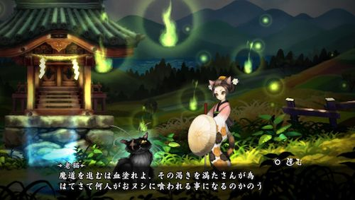

「Vitaの<em>美しいグラフィックを堪能するならこれ</em>」とオススメするゲームが朧村正です。<em>美しい2Dグラフィックの横スクロールアクションゲーム</em>。

ボス戦がかなり楽しい。絶妙なバランスで、難しすぎず簡単すぎず、それでいて<strong>ボスを倒した時の爽快感がたまらない</strong>。

## 難易度

アクションゲームとしての難易度は<em>簡単な部類</em>でしょう。アクションの数がそれほど多いわけではないので、操作が分からなくなるということはありません。かなり単純なので、<em>アクション苦手な人でもなんとかなる</em>のではないでしょうか。難易度は、ゲーム側で無双（簡単）、修羅（ハード）、死狂（HP1のオワタ式）が用意されているので、上級者でも簡単すぎてつまらないということにもなりません。

戦闘は、ボタンを適当に連打しているだけでもなんとかなります。ガチャガチャやっているだけでもコンボが決まったりするので、なかなか爽快です。Vitaのボタンが小さいので、あまりガチャガチャしすぎると指が痛くなります。

もちろん適当にやるばかりではなく、敵の攻撃をかいくぐり、<em>華麗に戦う方が気持ちいい</em>ですけどね。

ボスとの大立ち回りの末に、居合い斬りで止めをさす。かっこいいエフェクトの爽快感がたまりません。

## グラフィック

さすがヴァニラウェアというべき<em>美しいグラフィック</em>がそこかしこに散りばめられています。2Dとは思えない奥行きのある背景。キャラクターの細かな動作。そしてとてつもなく美味しそうな料理。

ゲーム中に体力を回復するために料理を食べることができます。お店で提供される食事、自分で作る食事、それぞれ「なんでそんなに用意してんの？」と言わんばかりのバリエーション。どれも美味しそうです。食べるとプルプル震えるエフェクトが、余計に食欲をそそります。

そして温泉・・・堪能してください。

## ボリューム不足・・・だったがDLCが遂に来た

このゲームを遊んでいると、文句をつけるところがボリューム不足くらいしか見当たりません。

エンディングがいくつかあり、また武器やアイテムなどを揃えるといった収集要素、エクストラステージのようなクリア後にしかいけない場所など、ストーリークリア後にも遊べる要素が用意されてはいます。が、やっぱりすぐに終わってしまい、ちょっと物足りない。

その対策としてか、<em>DLCが用意</em>されています。

主人公がまったく違うので、どうなるのかちょっと心配していたが、これはこれでありだと思います。

基本的なシステムは同じで、朧村正では3本の刀を使い分けていたのが、DLC第1弾では人型、猫型、化猫型の3形態を使い分けるようになっています。

刀を作成していた鍛錬は、単純にキャラクター性能の強化に置き換わっていました。

マップや雑魚敵はそのまま使い回しがありますが、新たなボスもしっかり用意されています。

そして何より・・・温泉は必見。可愛い。猫好きな人にはたまらないかもしれない、これ。

DLCのストーリーは思いの外短く、3章が大詰めになっています。

しかし、ボスは<em>DLC専用のボスが用意</em>されており、本編にもあった特定のアイテムを装備していると<em>結末が変わる仕様</em>もちゃんとあります。クリア後に朧村正本編のボスや、魔窟への挑戦の方がメインとなりそうな感じです。

そしてなにげに嬉しいのが、クリア後に<strong>どこに何のボスや魔窟があるかが、地図を開くことで確認できるようになっている</strong>ことです。

<em>ボスを撃破すると済と表示される</em>ため、どこのボスを倒しているかどうかが分かって非常に便利。本編（朧村正）ではボスを倒したかどうか分からず、<em>各地を回るのが非常に面倒くさかった</em>ので、この変更はすごいうれしいです。欲を言えば祠ワープのときに表示してくれると最高なんですけどね。

手軽に遊べるアクションゲームなので、Vitaで面白いゲームを探している人は試してみてはいかがでしょうか。

  