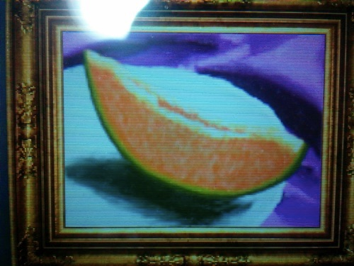

私は小学校のときに図工の時間はわりと好きでした。見たものを見たまま書くのが楽しかった記憶があります。

写生大会で山の色に赤色も使っていたら「山火事だ」なんて同級生に笑われたことを覚えています。紅葉で赤色も混じってたんだよぅ。まぁその絵は賞をとれたんですけどね。

そんな感じで嫌いではなかったのですが、唯一夏休みの宿題のポスター描きだけは嫌いでした。私が塗ると色ムラばかりになってしまい、我ながら自分の描いたポスターが嫌いでした。友達は色ムラのないパリっとしたポスターを仕上げていて、余計みすぼらしく思ったりもしました。

という思い出はともかく、私は学校では画材の使い方を習ったことは一度もありませんでした。現在に至るまで、色の塗り方も絵の描き方もすべてが適当です。何となくです。

そんな状態で今まで来ましたが、ここに来て一度基礎をちゃんと勉強してみるのも悪くないかなと思いました。

そこで、デッサンなどの基礎を学べる良いツールとして紹介されていた新絵心教室を買ってみることにしたのです。

## デジタルで学ぶアナログお絵描き

この新絵心教室がぴったりな人は、おそらく「アナログお絵描きを勉強したい人」です。

水彩画をやってみたいんだけど、いきなり水彩絵の具と画用紙を用意して始めるのではなく、この新絵心教室で基礎を学んでからやってみるのがいいでしょう。画材の消耗を気にすることなく練習できます。

絵の具を付ける量、筆に含ませる水の量を調整することで表現できる色が変わるといった、画材ごとの特徴や使い方を教えてくれます。

実物との差異についてはよく分かりません。しかし、画材の使い方や絵を描く基礎を知るという意味ではとても優秀だと思います。

具体的には、私はこの歳になって初めて「筆に含ませる水の量を調整する」というテクニックの存在を知りました。

人によっては学校で教えてもらうこともなく、高い金を払って絵画教室に通って初めて知るなんて人もいるでしょう。それを考えたら3000円でそういった基礎を学べるこのソフトはかなり優秀なのではないでしょうか。

いまのところ入門コースをやっているだけですが、画材の使い方にとどまらず、物の形の捉え方だったり構図の決め方だったり、教えてくれる内容は多岐にわたります。

## デジタルお絵描きツールとしてはいまいち

3DSを持っていれば3000円くらいで手に入りお手軽ではあります。しかしこれを、「デジタルお絵描きツール」として見ると、その出来はお粗末です。

3DS側でタッチ位置の補正をするしかなく、画面端になればなるほど位置ずれが激しくなります。これは私が液晶保護フィルムをタッチパネルに貼っているせいもあるかもしれません。ただレッスン中に思った位置に線が描けずイライラすることもしょっちゅうでした。

題材がアナログお絵描きの手法を学ぶということからしょうがないのですが、デジタルでは当たり前のレイヤーやアンドゥなどの機能は一切ありません。レイヤー機能はともかく、アンドゥはせめて搭載していて欲しかったなというのが正直なところです。

というのも、描画に熱中しているとタッチパネルに手が当たって、意図しない直線がキャンバスに描かれてしまうことがちょくちょくあるからです。書き始めの段階であればまだリカバリできますが、仕上げの段階で発生するとものすごいブルーな気分になってしまいます。

今どきのデジタルお絵かきツールでは当然のようについているパームリジェクション機能はありません。「せめてアンドゥで取消ができたら・・・」と強く思いました。

デジタルお絵描きをする目的であれば、ペンタブレットを買ってパソコンでお絵かきした方がいいでしょう。

あくまで「絵の描き方の基礎を知りたい・練習したい」という目的で買うべきものです。

## 全体的にもっさり

レッスンに合わせて絵を描いている時とかは気にはならないのですが、もっさり感がものすごく気になるのがギャラリーです。

自分で描き上げた作品を見るにはギャラリーを使うしかないのですが、ムダに美術館風な演出がされていて好みが分かれそうです。美術館に自分の描いた作品を展示する雰囲気が味わえるので、それがいいという人もいると思います。私はもっさりした動きが気になって作品の一覧だけ見せてくれ派です。

ギャラリーにかぎらず動きは全体的にもっさりです。もうちょっとキビキビ動いてくれたらなと、微妙なストレス要因になります。

## お絵描き入門ツールとして優秀

新絵心教室は、デジタルにしろアナログにしろ、お絵描きの基礎を学ぶよい教材だと思います。

題材はアナログなので、漫画チックなイラストだったり3DCGだったりを志す人だと「毛色が違うからちょっと・・・」と敬遠してしまうかもしれませんが、扱われている内容は基礎的なことです。おそらく何を描くにしても共通のものです。

レッスンに合わせてやるだけでそれなりの絵が仕上がったりするので、なんか絵が上手くなった気になれます。楽しみながら学べるのは重要だと思います。

  