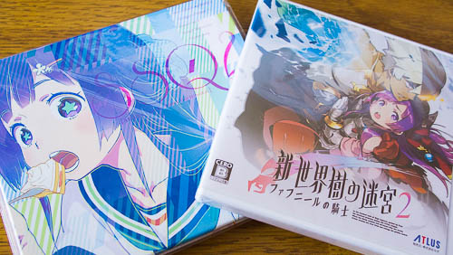
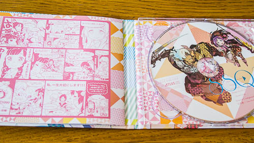

新世界樹の迷宮2を買いました。

体験版やって面白かったので、何となく買ってしまいました。ニンテンドーeショップで体験版をダウンロードできるので、気になる人はやってみるといいと思います。

体験版のデータは製品版へ引き継ぎ可能なのでそのままやればいいと思います。私は適当に転職させてLv上げ直すのが面倒くさくて、製品版で初めからやり直しましたけどね・・・。序盤の流れは全く一緒なので、製品版でやり直す必要性はないと思います。

世界樹の迷宮シリーズは初めてプレイしました。ですので、他のシリーズ作品との違いとかよく分かりません。似たようなタイプのダンジョンを探索していくゲームはやったことありますけどね。

戦闘中にプレイヤーキャラクターたちが派手に動き回るわけでもない、言うなれば地味めな見た目のゲームです。キャラクターは1枚の立ち絵があるだけです。ですが、ヘタに動きまわったり、マップ上にキャラクターが表示されたりするより、こういう方が想像力で補完できて印象がいい気がします。

といっても、製品版のオープニングアニメーションは非常に良く動きまわっていてすごかったですけど。

とりあえず私はストーリーモードで遊んでいます。

## 地図を自分で書いていくのが面白い

面白いと思ったのは、ダンジョンのマップを自分で書いていくところです。「手書きなんてクソ面倒くさい」と最初は思いましたが、いざ書き出すと思いの外熱中してしまいました。

今まで私がやったことのあるダンジョン探索系のRPGでは、自分が歩いたところが自動的にマッピングされるタイプのものでした。そのため、マップを埋めるためには隅々まで歩きまわらないとならないのです。罠が見えているのにあえて踏まなければならないという感じです。

その点、新世界樹の迷宮2は目の前にダメージを受ける床があるなと分かれば床の色を赤で塗ってやったりすればいいだけです。非常に合理的です。

それにマップを書くと言っても、何も壁と床を書いていくだけではありません。ゲーム内時間の1日に1回だけできる採取ポイントや、スイッチを押すことで通行可能・不可能を切り替えるような跳ね橋など、状況によって変化するオブジェクトを手書き地図に配置することができます。これは状況に応じて書いたマップ上で変化してくれるので何かと便利です。

その他、ダンジョン内で怪しい場所があればメモを残したりできるので、探索する楽しみが感じられていいと思います。

## 試行錯誤する楽しみ

ダンジョンに潜って、敵や採取ポイントなどから素材を持ち帰って新しい武器や防具を作っていくのですが、敵によっては「特定の倒し方」をしないと手に入らない素材を持っています。これを考えるのがなかなか面白いです。

酒場で情報を仕入れて試してみたり、モンスター図鑑を利用して試してみたり。ヒントは書いてあるので、大体アタリをつけて試すわけです。

まぁタネが割れてしまえば後は単なる作業になってしまうんですけどね。

## 戦闘の難易度はそこそこ

このゲームでは敵とのエンカウント方式は2つあります。

通常の雑魚敵が出てくるランダムエンカウントと、初見では対処できないような強敵との戦闘になるシンボルエンカウントです。後者をFOEといいます。

FOEの敵はマップ上で姿が見えていて、かつモンスターによって決まった行動をとります。特定の行動パターンを繰り返すやつ、プレイヤーを発見したらどこまでも追いかけてくる奴などです。

基本的にはFOEとは戦わなくてすむよう設計されているので、敵の行動パターンをよく見て、戦わなくて済むように考えながらダンジョンを進んでいきます。ダンジョンの先に進んでLVを上げた状態で戻ってくれば倒せますが、基本的に初めて会う段階では歯が立ちません。素直に避けるのが吉です。

ただしFOEに気を取られるあまりに、ランダムエンカウントを疎かにしてはいけません。FOEは敵との戦闘中にも動くので、ランダムエンカウントによる雑魚戦の最中に乱入してくるのです。初めて乱入された時は泣きたくなりました。

戦闘中であろうとも、目の前の敵だけではなくマップに気を配らないといけないとは、冒険者は大変なお仕事ですね。

後は、戦闘中の状態異常が割と洒落にならないのに驚きました。シリーズを遊んでいる人にとっては常識なのかもしれませんけど、毒のダメージでHP半分吹っ飛ぶ＆容赦なく戦闘不能になるとか、混乱は殴られても正気にならないとか。

攻撃力の高い敵より、状態異常をばらまく敵の方が怖いです・・・。

難易度ノーマルでやっていたのですが、どうしても各階層のボスだけ強さがケタ外れで勝てず、10Fのボスは修行を用いてなんとか勝ちましたが、15Fのボスで心が折れてピクニックに変更しました。もうちょっとでっていうときに状態異常ばら撒くのやめていただけませんかね・・・。

## セーブはこまめに

セーブはこまめにした方がいいです。

というのも、ストーリーモードでイベントを飛ばす手段が用意されていないのです。3DSのバッテリがなくなって強制終了にあい、もう一度以前のセーブポイントからやり直したりするのが面倒くさいです。

まあ私が単にうかつだっただけなんですけどね・・・。

ただ、こまめにセーブをするにしても、体験版と比べて製品版のセーブにかかる時間はものすごく長いです。体験版だと一瞬でセーブ終わっていたのですが、このゲームのセーブはものすごい長いです。

なんか二昔前の初代プレイステーションのゲームでセーブしてるような感覚に陥ります。こまめにセーブしたくなくなります。（ちなみにセーブするスロットを1番上以外にすればセーブにかかる時間が早くなります）

オートセーブ機能を使っていれば宿屋で泊まった時に自動的にセーブしてくれますが、ここにも1つ罠が用意されています。ストーリーモードで宿屋に泊まった時、たまにイベントが発生するのですが、このイベントが発生した時にはオートセーブが実行されないのです。

宿屋に泊まったたしセーブされてるだろうと思って、バッテリが赤点滅した状態で続けてプレイしてた私がうかつなだけなんですけどね・・・。

## おまけのCD

特に予約するでもなく、それでも発売日に購入したこともあっておまけCDも手に入れることが出来ました。

制服姿のアリアンナとクロエがかわいいパッケージとなっています。

CDの中身はオープニングテーマ曲と、体験版の範囲内で聞けるゲーム内BGMのラフバージョンです。オープニングテーマはゲーム内の長さなので、ゲーム音楽を堪能したいならサントラを買えってことです。あくまでおまけですね。

クスっとくるちょっとしたマンガが入っていました。なかなかいいおまけだったと思います。

## ストーリーモードをクリアした感想

とりあえずひと通りストーリーモードをクリアしましたが、なんというかシリーズ未経験者にはハードルの高いゲームなのかなと感じました。

ストーリーモードでクリアしても、自分でキャラクターを作ってメンバーに加入させることができないので、そうなるとクラシックモードでやり直さなければなりません。ですが、私にはクラシックモードでもう一度レベルを上げてキャラクターを育成しようという気が起きませんでした。

マップとかアイテムとか引き継ぎすることができますが、レベル上げが面倒くさかったんです。それこそストーリーモードで嫌というくらいレベル上げしましたからね・・・。

  