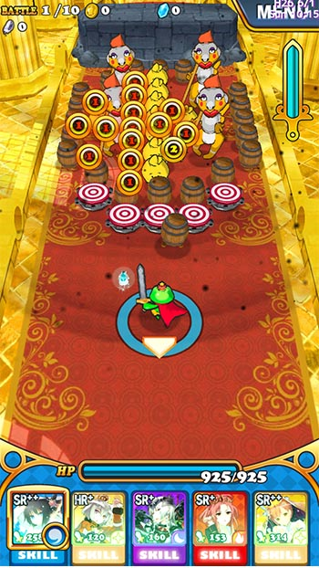
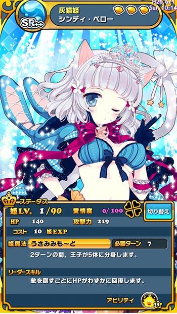
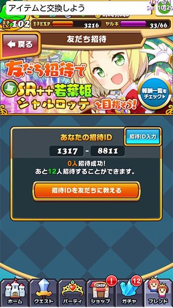
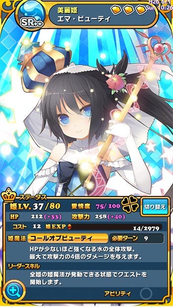

無課金を貫こうという意思は結局長続きしないGenです、ハロー。

最近ハマっているスマホゲーム、それが「<strong>ウチの姫様がいちばんカワイイ</strong>」というゲームです。始めたきっかけは、他のゲームのガチャチケットを手に入れるためだったのですが、今ではこっちがメインになってしまいました。

どういうゲームかというと、<em>ピンボールゲーム</em>のようなものです。カエルになってしまった王子様を操作し、障害物をうまいことかわして敵を倒していき、囚われた姫様たちを救っていくという流れになっています。

<iframe width="480" height="270" src="//www.youtube.com/embed/KoA-rae5Bu8" allowfullscreen=""></iframe>

実際にプレイしている様子を動画に撮りました。画質と音声が残念なことになっていますが、雰囲気だけは伝わるかなと思います。

これまで無課金で楽しんでいたのですが、6月1日限定でSRが確定で手に入るガチャが開催されており、誘惑に勝てずに課金してしまいました。

言い訳させていただきたい。なんせ初回コイン購入特典で、50％分ボーナスコインがつきます（10,800（税込み）で15,000コインになる）。さらに6月1日限定SR確定ガチャが引けます。さらにキャッシュバックがついているので、22連ガチャ→11連ガチャ→22連ガチャと引くと、うまいこと15,000コインぴったりになります。しかもSRの出現確率が普段の3倍です。ここまでコンボをかまされたら課金してしまうのも無理ないでしょう？（あくまで6月1日限定です）

ちなみにSRは6体出ましたが、<em>うち4体は無課金で手に入れた姫様と被りました・・・</em>。

というわけで、課金したついでというわけではありませんが、そんなウチ姫の魅力をツラツラと書き連ねていこうと思います。

## ウチの姫様がかわいい

メインとなる<strong>姫様の絵がとてもキレイでかわいくていい感じ</strong>です。

このゲームのにくいところは、<em>自分で入手していない姫様でもそのグラフィックが図鑑に登録されていく</em>というところです。自分で手に入れなくとも、フレンドさんが使っている姫様をいつでも確認できるのがいいですね。

自分で入手した姫様だとステータス情報ウィンドウを消して姫様の全身を堪能することができます。更に<strong>拡大表示したりもできる</strong>のです。そして、拡大表示してもかなりグラフィックが綺麗です。

画像サイズがタブレット用に最適化されているのでしょう。<em>スマホで拡大してもこんなにキレイ</em>に表示されます。確かにウチの姫様はかわいい。

## 動作がキビキビしてる

そもそもまともにプレイしたことのあるスマホのゲームが、他にはメルクストーリアくらいしかないので比較対象が少ないのですが、<strong>動作がキビキビしている</strong>と思います。

ゲーム起動時のローディングは若干長くて面倒くさいなとは感じるのですが、一旦起動さえしてしまえば後はローディングで待たされるという感覚がなくなります。これはかなり好印象です。

ステージ選択後に長めのローディングは入るのですが、このタイミングで現在実施中のガチャで出現する姫様の一枚絵がどどんと表示されます。そしてこのゲームは頻繁にガチャが入れ替わる（大体2〜3日に入れ替わる感じです）ので、表示される姫さまがいつも同じで<em>飽きてしまうことがありません</em>。それもあってか、<em>ステージ開始時のローディング時間はあまり待たされていると感じない</em>のです。

## 更新が頻繁

このゲーム、更新が頻繁なのです。

ゲーム内イベントは1週間とか長いスパンで開催されますが、ガチャがとにかくすぐに入れ替わります。2〜3日で新しいガチャが出てくるので見ていて飽きません。

毎回新しい姫様が出てくるというわけではなく、既存の姫様でも復刻や、特定の共通点を持った姫様を特集として出てきたりします。

ある意味<em>課金の誘惑が多くて大変</em>なのですが、頻繁にゲーム内で変化が起こるというのはとても良いことだと思います。現在開催中のガチャで出てくる姫様がローディング画面で表示されるので、<strong>課金してガチャを回さずとも見て楽しめる</strong>のがいいですね。

## ゲームの遊び方

### 他のAmebaゲームを遊ぶことで無課金でもガチャを回せる

Amebaのサービスで、チケットというものがあります。Amebaのゲームやサービスを利用することでスタンプが手に入り、これを集めることで交換チケットを手に入れることができます。

この交換チケットを使うことで、<strong>無課金でも比較的頻繁にガチャを回すことができます</strong>。ウチ姫のガチャを回すために、面倒くさいブラウザゲームをポチポチやるのはある意味時間の無駄遣いなのですが、課金しなくともSRの姫様を手に入れる機会があるというのは魅力的です。

ちなみにスタンプ目的でやっているゲームで、唯一面白いなと思ってやっているのは「<em>なぞってピグキッチン</em>」です。

### おすすめフレンド姫

このゲームでは、他のプレイヤーの使っている姫様を助っ人として使わせてもらうことができます。個人的にものすごく助かっているおすすめのフレンド姫は、<em>水属性のSRのシンディ・ペロー</em>という姫様です。

この姫様はステータスが高いだけでなく、敵を倒すごとにHPが少しずつ回復していくというリーダースキルを持っています。これが攻撃しつつHPを回復できるので、ボス戦で際限なく召喚されるザコ敵が回復剤になってくれるので、非常に助かります。

フレンドの姫様のリーダースキルを発動させるには、フレンド登録した相手にもこちらをフレンド登録してもらう必要がありますが、この姫様はステータスが高いのでリーダースキルなしでも活躍してくれます。

### 自己アピール

ちなみに私のフレンドコードは1317−8811です。もしこの記事を見てウチ姫やってみたいなと思った方は、登録してみてください。ガチャチケットが手に入ります。

ちなみに私はエマという姫様をリーダーとしてよく使っています。

一番初めに引いたSRなんです。ちなみに育ちきっていませんが、能力はこんな感じです。

<em>ゲーム開始後からいきなり姫様のスキルを発動できる状態にしてくれる</em>というリーダースキルを持っています。かなり最初の頃からこの恩恵に預かっているため、なかなか他の姫様をリーダーに据えることができないでいます。

## 数少ないストレスを感じるところ

ゲーム部分で障害物の当たり判定がおかしいところがあるのか、それとも端末の処理能力の問題なのか、「<em>そこすり抜けるの！？</em>」という感じで、障害物の中にハマってしまうことがあります。

後は、強いてあげればゲーム起動後に表示されるお知らせ画面が不親切かなということくらいでしょうか。それもガチャ情報が最上部に表示され、現在開催されているイベント情報が下の方に書かれていて分かりづらいと思ったというだけなのですがね。

## 余談

課金をしてしまったわけですが、GooglePlayにクレジットカード情報を保存しておきたくなかったので、<em>カード情報を削除</em>することにしました。

ちなみに私は、Googleに限らず<strong>使用頻度の低いサイトに関しては、クレジットカードを使ったらその都度カード情報を削除するようにしています</strong>。利用時に毎回クレジットカード情報を登録する必要がありますが、<em>その手間が無駄遣いを防ぐ効果</em>があるような気がしています。それに、カード情報を削除しておけば<em>不正利用</em>されることもある程度防げる気もしますし、買うつもりもないのに<em>間違って購入</em>してしまうということも防げると思います。

GooglePlayの場合は、<a href="https://wallet.google.com/manage?hl=ja" target="_blank">Googleウォレット</a>でカード情報の編集・削除ができます。ご参考までに。

  