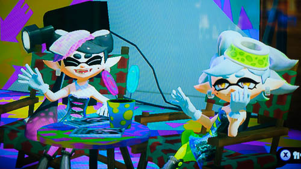

WiiUを持っていない人にとっては本体から購入しないといけないので、気軽に試せないのがネックです。「スプラトゥーンは面白そうだけど、だからといってWiiU買うのもなぁ・・・」って私も思っていました。

オンライン対戦が面白い（というか多分それが全て）なわけで、もしその対戦が楽しめなかったらどうしようとちょっと不安でした。自分でプレイするより、他人のプレイ動画を見ていた方が楽しめるんじゃないのっていうのが一番心配でした。

みんな面白いって言ってるけど、肌に合う合わないはあるわけで。自分には合わないかもしれないじゃなイカ。

ただどうしても頭の隅っこで「やってみたいなぁ・・・」っていう気持ちが居座り続けて、どうにも気持ち悪かったのす。このまま悶々とし続けるのもどうかと思い、結局買ってみることにしました。だって欲しかったんだもの。

<a class="amazonjs_indicator_title" href="#">Wii U ベーシックセット (WUP-S-WAAA)</a>

スプラトゥーン以外遊ぶ予定はないので、ベーシックセットを買いました。スタンドは別になくても困らないし、内蔵メモリもスプラトゥーンだけならベーシックの8Gで十分です。と言っても、プレミアムよりは安いものの、それでもソフトと合わせて3万超える出費です。

これで自分の性に合わなかったらどうしようっていうところですが、そうなればそうなったでヤフオクなりで売ればいいだけの話です。取り返しがつかなくなるわけではないのだから、思い切って買ったというわけです。

そのためスプラトゥーンはダウンロードではなくメディアで購入です。（ダウンロードだと売れないから）

## いきなりオンライン対戦

ゲームを始めると簡単なチュートリアルの後、いきなり「オンライン対戦行って来い」って言われてびっくりしました。

操作もままならないのに、いきなりオンラインの荒波に放り出されたら心がおられるんじゃなイカと思いました。しかしとりあえずやってみんべと遊んでみたらあら不思議。適当にやっててもチーム内1位になれたりしました。

どんどん前に行ってもやられるだけだから、とりあえず自陣の周り塗って、後は塗られていない道をトリガー引きっぱなしで歩いて行く。目の前に敵がいたらとりあえず逃げる。そんなプレイでもそこそこ活躍できるのが面白い。

スペシャルゲージさえたまっていれば、バリア張って特攻すれば敵倒せますし。何これ楽しい。操作適当だけど面白い。操作になれるまでわかばシューター（最初から持ってるブキ）で遊ぶのがいいかもしれないですね。普通にやったら相手にやられるばかりでも、バリアを張れば「ヒャッハー」って突撃できて気持ちいいです。

対戦時間は3分ですが、あっという間に終わってしまいます。

圧勝する試合もあれば、一方的になぶられる試合もありました。負け試合でもボム使って前線抜けられた時はテンション上がりました。終了間際でどうにもなりませんでしたが。

ワンサイドゲームは勝つ側でも負ける側でも面白く無いですけどね。

## 本体ごと買う価値があるか

スプラトゥーンを遊ぶ上でネックなのはWiiUを買うかどうかです。

面白いので本体ごと買う価値はあるというのは頷ける話なのですが、実際に買ってみた身としては「そう思いたいだけなんじゃなイカ」と思います。だって私はスプラトゥーン以外には多分使わないと思います、このWiiU。少なくとも現時点ではそうです。

スプラトゥーンも面白いのは間違いないんですけど、その面白さがオンライン対戦に依存しすぎてる気がして怖いんですよね。

対人戦が楽しめなくなったとき、例えばどうやっても勝てなくてつまらなくなるとか、遊びたいのに過疎ってて遊べなくなるとか。そうなったときにこのゲームに3万出すだけの価値が果たしてある（あった）のだろうかっていう不安。今のところどっちもなさそうな気はしますけれども、買った今でもその不安が拭えないのです。

いや、面白いんですよ、スプラトゥーン。そこ間は違いない。でも、スプラトゥーン専用機としてのWiiUに3万っていうのはちょっとお高くなイカなっていうだけで・・・。

そんな私は「飽きたら売ればいい」と考えることで平静を保つことにしました。

## とりあえず楽しいのは間違いない

オンライン対戦は楽しいです。とりあえずよく分からなくても、適当に塗ってるだけでも楽しい。

操作に慣れてきて、戦況をちゃんと見れるようになったら更に楽しくなるでしょう。アクションは苦手だという人にはちょっとツライカもしれませんが、そう複雑な操作が要求されるわけではないので敷居は低いと思います。敷居は低いかもしれないけど奥は深そう。

シオカラーズの二人を始めとしたイカ（インクリング）のキャラクターはかわいいです。個人的には声も気に入っていて、特にスーパージャンプするときの「うりぃぃ」って声がお気に入りです。

BGMもイカしててテンション上がります。「うぃーふりっほー」ってついつい口ずさんでしまいます。塗ってる最中はそれどころではないですけど。

ちょろっと遊んでみただけですし、WiiU本体ごと買って後悔してないかって聞かれると微妙なところです。しかしとりあえず言えることは、「やってみたい。でもなぁ・・・」という悶々とした気持ちにかたをつけることができたので、その意味では間違いなく買ってよかったなと思います。

## オンライン対戦が楽しめるかがすべて

1人で遊べるヒーローモードもありますが、どっちかというとおまけ要素的なものです。そのためスプラトゥーンを楽しめるかどうかは、オンライン対戦を楽しめるかどうかです。

立ち回りを覚えてくると楽しくなってきますが、慣れないうちは何もできずに死んでばかりで面白く無いかもしれません。それでもめげずに実戦で経験を積んでいく根性がないと楽しめないかもしれません。

使いたいブキがあるけど上手く使いこなせずやられてばかり。それでも練習するには実戦にいくしかなく、やられてもへこたれずに練習する気概があるかどうか。

購入2日目にして「勝ったの失敗したかも」という思いがよぎりましたが、その気持を乗り越えてやり続けられるかが、このゲームを楽しめるかどうかだと思います。

キャラクターの見た目はかわいいですが、そのあたりは結構シビアなゲームな気がします。

私はアオリちゃん派。

  