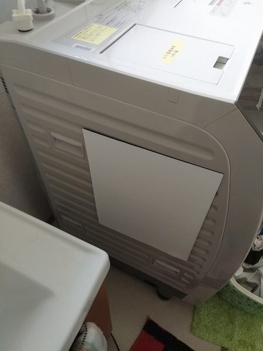

まず最初に断っておきたいが、ドラム式洗濯機を導入することで我が家の洗濯は非常に楽になった。それは間違いない。

その上であえて微妙なところもあるぞという点を揚げ足取りのごとく書くのが今回の趣旨である。

ドラム式を使っていない人に対しては、基本的にはドラム式を買って生活を楽にすべきだといいたい。ただ、これから書く点には注意が要るよということは言っておきたいのだ。

<!--more-->

## 結構うるさいよ

まずは自分の生活環境を考えていただきたい。ドラム式洗濯機の設置場所と、普段の生活場所がどれくらい離れているのか、機密性がどの程度あるのかはあらかじめ考えておいたほうがいい。

普段の生活スペースがドラム式洗濯機の近くだという場合、結構な騒音に悩まされる可能性がある。

特にうるさいのは脱水の際の物理的な揺れ、これは洗濯機の水平を保つことで軽減されるらしいが、水平をとってもかなり揺れる。洗濯物の量や質によるものだからだろう。こればかりはどうしようもない。

また乾燥時のコンプレッサーの重低音もかなり気になる。寝起きにこれが伝わってくるとかなりきついものがある。

私の部屋は洗濯機のある場所とトイレを挟んでいるとはいえ、ほぼすぐとなりにあるといえる。乾燥時には壁が薄いせいもあり、壁ごと振動を伝えてくるので結構キツイ。

## 防振対策

まず揺れに対しては防振ゴムを足に設置している。

<iframe style="width:120px;height:240px;" marginwidth="0" marginheight="0" scrolling="no" frameborder="0" src="//rcm-fe.amazon-adsystem.com/e/cm?lt1=_blank&bc1=000000&IS2=1&bg1=FFFFFF&fc1=000000&lc1=0000FF&t=illusionspace-22&language=ja_JP&o=9&p=8&l=as4&m=amazon&f=ifr&ref=as_ss_li_til&asins=B00D1ITUAY&linkId=a2a430c0a75e092dee4c13e0eff17c4f"></iframe>

ちなみに洗濯機自体が重いので、設置は結構たいへんである。誰か別の人に洗濯機を傾けてもらいながら位置調整をする感じだろうか。しかし、傾けたせいで折角調整した片側がまたずれたりするのでなかなか難しい。

私が購入したタイプは、足の中心がゴムの中心にくるように設置しないと意味がないタイプなので、平たいゴム製のものを設置した方が位置をあまり気にしなくて良くて楽かもしれない。効果は薄れるかもしれないけれども。

## 騒音対策

コンプレッサーの振動による重低音には、日本特殊塗料のオトナシートを利用して対策している。

<iframe style="width:120px;height:240px;" marginwidth="0" marginheight="0" scrolling="no" frameborder="0" src="//rcm-fe.amazon-adsystem.com/e/cm?lt1=_blank&bc1=000000&IS2=1&bg1=FFFFFF&fc1=000000&lc1=0000FF&t=illusionspace-22&language=ja_JP&o=9&p=8&l=as4&m=amazon&f=ifr&ref=as_ss_li_til&asins=B0043CP4VG&linkId=ea43894994e9de6ded34af382d29005c"></iframe>

これは粘着剤で貼り付けるタイプであるが、公式サイトに行くとマグネットタイプが販売されている。

<https://www.nittokudiyshop.net/SHOP/80827/82469/list.html>

粘着剤で貼り付けるタイプだと、さすがに新品のドラム式洗濯機に貼り付けるのは憚られるので、マグネットタイプで試してみたというわけだ。

マグネットタイプは4枚入りなので、側面に1枚ずつ、背面に2枚とりつけている。

ちなみに効果の程は・・・微妙なところである。

まずこのマグネットシートはびっくりするくらい薄い。本当にこれで制振効果があるのか謎である。

また磁力がものすごく弱い。側面は特に顕著だが、貼り付ける面がでこぼこしているので、洗濯機の振動でマグネットシートがずれ落ちていくのである。それで効果があるかと聞かれても困る。

ちなみにこれをしっかりと押さえつけてやると、感じる振動がある程度マシにはなるので、ちゃんと取り付けさえすれば効果はあるものと思われる。

すべては洗濯機の側面が凸凹しているのが悪い。下手にずれるせいで、マグネットが浮いた部分が振動によってペチペチ音を立ててよけいにうるさくなる場合がある。

値段もマグネットタイプのほうが高いので、思い切って粘着タイプのものを買って貼り付けたほうがいいかもしれない。処分するときに困るかもしれないけれど。

## エコとは一体

これはパナソニックのこのモデルに限った話なのかもしれないが、とにかくいろんな機能がたくさんついている。

洗濯モードにエコモードやら時短モードやら、やたらたくさんのメニューが揃っている。実施に利用するメニューはほぼ同じなのだけれど。

またエコモードが搭載されていながら、乾燥終了後にドラム内の温度を下げるために勝手に動き続けることがある。洗濯中にエコモードを使っても、乾燥終了後に無駄に動き続けてはエコモードを使う意味がないじゃないかと思う。

これはパナソニックに問い合わせをしたのである。乾燥終了後に洗濯物をふわっとさせるためにしばらく回転を続けるふわっとキープなる機能があるのだが、それを切っても動き続けるんだけどと問い合わせしたのである。

その結果がドラム内の温度によって最大2時間運転することがあるという回答だった。しかも設定で止めることができないらしい。

なるほど「冷却のためなら勝手に止まるまで放置しとかないとダメなんですね」と聞いたら、別に即座に止めていただいて構いませんと回答された。君たちはエコモードを何だと思っているのかね・・・。

それではこの動作は不必要な動作ではないか。なぜ設定によって止めることができないのかと小一時間問い詰めたい。

各選択モードによってどれくらいの消費電力がかかるかといった一覧表を作る前に、こういう無駄な動作を止めれるようにしておきたまえと思うのは、私だけだろうか。

確かに乾燥直後に洗濯物を取り出したら熱いよ。しかし熱いと言ってもやけどをするほどではない。無駄に動き続けられるよりはさっさと止まってくれたほうがマシだ。停止してからしばらく立って取り出すのと何が違うのか。

必要な回転だと言うなら乾燥が終了したと表示するべきではないだろう。その中途半端さがどうにも納得できない。

## 使えないWi-Fi機能

外から洗濯機を動かして洗濯できる機能がついているが、これがまた使えない。

普通に考えて、外出しているときに洗濯物をドラムの中に入れることはできない。つまり、洗濯物をドラムの中に入れておくのは在宅時にやる作業だ。

洗濯物をドラムに入れたのであれば、その場で洗濯開始すればいいではないか。なぜ外からわざわざ洗濯開始せねばならんのだ。

遠隔操作で乾燥終了後の電源を切る作業をアプリからできないかなと思って設定してみたのだが、そもそも設定自体がわかりにくすぎる。無線親機とWPS接続できるらしいが、WPSって距離が離れてるとできないんじゃなかったっけ？　わざわざ洗濯機の近くまで親機をもってこいとでも言うのか。

そうするとスマホと接続して設定を行うのだが、これがまた手間な上に、なぜか我が家ではそれまでできていた接続が急にできなくなった。

再設定しようと思ってもうまくいかないし、どうせ設定できたところで乾燥終了をお知らせしてくれるのと、洗剤が少なくなってるとかを教えてくれるくらいしか意味がないので設定するのを止めた。

## 引き算を覚えて欲しい

何でもかんでも機能を付け足せばいいというものではない。Wi-Fi機能など本当に必要だったのだろうか。

また多すぎる洗濯メニューも使う側を混乱させるだけでほとんど意味がない。多すぎる選択肢はないのと同じである。

後は本当に納得いかないのが、乾燥終了後の無駄なドラムの回転である。これによる騒音も結構なものなので、本当に腹が立つ。なぜこういうところの設定はできないのか。

無駄なところに力を入れて、必要なところに手が届いていないのは、日本メーカーの衰退を表しているといわれても仕方がないのではないだろうか。

## ただしドラム式は革命をもたらす

しばらく使った上での文句を主に述べたが、間違ってほしくないのがドラム式洗濯機の導入で生活が一変したのは間違いがないということだ。我が家の生活に革命が起きたのは事実である。

洗濯物を干さなくてもいいというこの快適さ。これは何者にも代えがたい利点である。

ただ革命をもたらしてくれるが、細かい部分にあらが目立つ。しかしそのあらを補ってあまりあるほどの便利さがあるのは事実。細かい部分で実に残念だなぁと思う次第である。