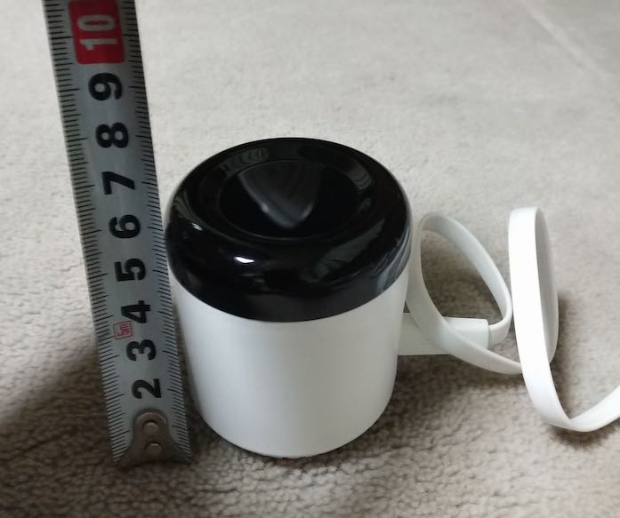

リモコンがたくさん部屋にある。これを集約したかったのだ。前々から学習リモコンというかスマートリモコンというかに興味があったのだが、今回たぶん思いつきで購入した。

思いつきというか、照明のリモコンをスマホで操作できたら楽だなと思ったのがきっかけだったと思う。他の人がどうしているかわからないが、寝床にいくまで部屋の電気をつけた状態にしておいて、そこからリモコンで消すという生活を私はしていた。つい最近からの話だけれど。

電気のスイッチを直接消してしまうと、寝床まで真っ暗闇の状態でいかなければならないので、リモコンがあると便利なのだ。しかし、そのためだけにリモコンを管理しなければならないのは不便なのだ。このさじ加減が分かっていただけるだろうか。

そこでスマートリモコンを買ってみたというわけである。miniを選んだのは、たしか「小さい方がじゃまにならなくていいんじゃね？」程度のお気持ちだったと思う。

<!--more-->

## とりあえずセットアップ

とりあえずは使う予定の引越し先に持っていってセットアップしたんだけど、引越し先はWiFiルーター使っててね、WiMAXね。そのせいでセットアップがうまくいかなかった。そもそもあんまり作業時間なかったから、引越し元に持って返ってセットアプしたよ。普通の無線LANルータ相手だと一瞬でセットアップ完了したわ。

公式サイトのQAにあるけど、WiFiルーター使ってる場合はセットアップがうまくいかないケースが多いみたい。WiFiルーター側の設定変えたりしないといけないので、そういう環境の人はセットアップするときに注意がいるかな。

セットアップが完了したら、とりあえず照明のリモコンを登録してみた。おお、ちゃんと消える・点く。続いてテレビのセットアップ。このあたりはメーカーごとにプリセットが用意されてて、設定はそんなに難しくなかった。

難しくなかったけれど、テレビとかそもそもリモコンが複雑なやつはわざわざスマートリモコンで操作する必要性は薄そう。というのも、アプリの反応がそんなによくないので、リモコン操作したほうが早いからだ。

同じくHDDレコーダーも、こちらは手動セットアップで設定してみた。手動セットアップというのが、スマートリモコンに向けて登録したいリモコンのボタンを押して赤外線飛ばして学習させる方法。これも普通にできたんだけど、やっぱりボタンが多いやつは普通にリモコン操作したほうが早いと思う。登録するボタンの数が多くなるし、スマホ経由の操作はタイムラグが微妙にあるからね。

エアコンもついでにセットアップしてみたんだけど、こっちも普通にリモコン使ったほうがいいかもしれない。そもそも設定温度とかが正しく伝わってるのかどうかがよく分からないので、純正リモコン使ったほうがマシかなっていう印象を受けた。ただマクロ設定みたいなのができるみたいで、たとえばエアコン切るときに送風30分切タイマーで動かす、みたいな設定ができたら使う動機はできるかなとは思う。

引越し先のエアコンはリモコンがわりとシンプルめなので、引越し先でなら使えそうな気がしないでもない。

## アプリの使い勝手

アプリの使い勝手は・・・お世辞にもいいとはいえない。スマホ→無線LANルータ→スマートリモコン→赤外線照射って流れになるから、スマホでボタン押してから反応あるまで微妙にタイムラグがあるのよね。そこが若干気になるかな。

あとはプリセットにはないリモコンを学習させる際に、設定できるアイコンの種類が少ないのが微妙に困った。あんまり良く調べていないのだけど、自分で追加とかできるんだろうか。毛色が違うから単純に追加はできないのかもしれないけど、マテリアルアイコンとか使えると使用できるアイコンの幅がいっきに広がっていいと思うんだけどなぁ。こういう用途にはマテリアルアイコンは利用できないんだっけ？

## スマートスピーカーなくても音声操作可能だよ

スマートスピーカー、AlexaとかGoogle Homeとかがあると音声操作で照明消したりできる。でも別にスマートスピーカーがなくともスマホのGoogleアシスタント経由でも同じことができた。これはちょっと感動するよ。

OK、グーグル照明消して、って言ったら、いちいちアプリを起動しないでも照明消せるからね。ちょっとした感動だよ。そりゃスマートスピーカー便利だって思うのも無理ないわ。これ便利すぎるもの。

音声操作でできることは限られてるけれど、照明のオン・オフができるだけで買ったかいがあるってものよ。久しぶりにええもん買ったかもしれん。

## 小さいけどちゃんと届く

ちなみにeRemote miniのサイズはこんな感じ。

高さ10cmもない。パッケージもめっちゃ小さくてびっくりした。こんなサイズでもちゃんと赤外線は360度、上には180度届く。テレビや照明、エアコンの操作は普通に可能だった。

うちのHDDレコーダーはもともと普通のリモコンですら赤外線の受付範囲がシビアなので、設置場所を工夫しないと反応してくれなかった。これはうちのHDDレコーダーがダメ製品ってことである。まじでSonyのHDDレコーダーは二度と買わないレベルにフラストレーションが溜まっている。eRemote miniまったく関係ないな。

USBケーブルで充電というか電源を取るのだが、コンセントに刺すためのコネクタは存在しない。別途用意するか、USB直接させる電源タップを用意するか、パソコンに繋いどくかってところかな。人によってはUSBケーブルしかないminiはどうしたらいいの・・・と途方にくれるかもしれない。電源がないというのはこういうことだ。

製品サイズが小さいので、どこにおいてもあまり邪魔にはならなそう。ただし、赤外線が使う機器すべてにちゃんと届く位置においておく必要があるのは注意が要る。本体が小さすぎてUSBケーブルのほうが邪魔に感じるかもしれない。

置き場所的には部屋の中央がもっとも適切なんだろうが、そんな場所に置くのは無理そう。本体はともかく確実にケーブルが邪魔だ。

ただ個人的には照明さえしっかり操作できればそれで満足レベルの品物なので、どこに置こうがとりあえずは大丈夫そうな気がする。

## リモコンを1つに集約

リモコンを1つに集約したいという欲求はあったが、使ってみて扇風機とかそういったシンプルで小さいリモコンを集約するにはちょうどいいと思う。テレビやHDDレコーダーなどの複雑なリモコンまで無理にこいつに集約するのは労力の無駄感が強い。ただ、一応登録しといて音声入力でテレビの電源消したりできるのは便利だ。リモコンどこやったっけ・・・っていうのが減らせるのはとても魅力的である。

使用にあたってアカウント登録が必要だが、登録しておけば別の端末にも設定が引き継がれるので、学習のし直しなどをする必要がないのはよいところ。とりあえず無理しない範囲でリモコンを登録しておいて損はないと思う。

そして別にスマートスピーカーを使わなくても利用できるのが便利である。私はスマホがAndroidなのでGoogleアシスタントだが、Siriでは使えないのかな？　ちょっとマニュアルが見つからなかった。

[Google Home(アシスタント)での登録](https://linkjapan.co.jp/question/googlehome/)

Alexaはあったんだけどね。

しかしちょっとしたリモコン群とおさらばできて、しかも音声で操作できるとかすごい便利ですわ。

ちなみにリモコンがない製品の電源オン・オフを制御するための製品も別途あるようだ。

<iframe style="width:120px;height:240px;" marginwidth="0" marginheight="0" scrolling="no" frameborder="0" src="//rcm-fe.amazon-adsystem.com/e/cm?lt1=_blank&bc1=000000&IS2=1&bg1=FFFFFF&fc1=000000&lc1=0000FF&t=illusionspace-22&language=ja_JP&o=9&p=8&l=as4&m=amazon&f=ifr&ref=as_ss_li_til&asins=B078HSBNMT&linkId=413febee5f3dcfe58137a2e8b06b0c78"></iframe>

要するにコンセントに刺して使う、リモートコントロールユニットみたいなやつ。リモコンはないんだけど遠隔操作したい、なんていう機械があればこれを使うと便利っぽい。