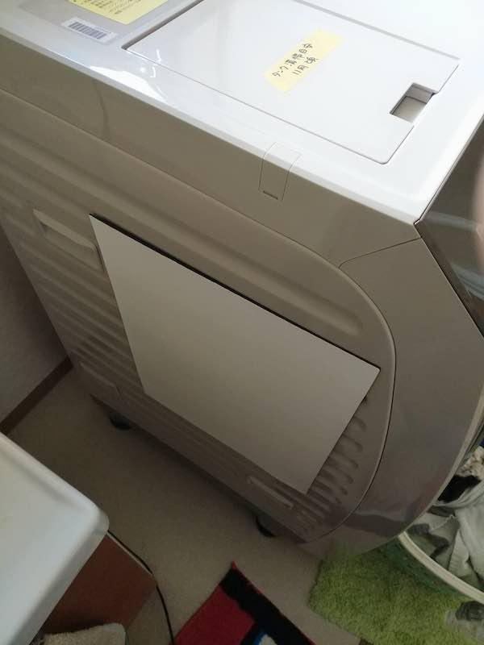

とにかく洗濯機の振動がダイレクトに来るのがどうにかならんかと、制振材としてオトナシートというのがいいらしいというのを知った。しかし新品の洗濯機に粘着剤で貼り付けるのにはどうにも抵抗かあってどうしたものかと思っていたら、マグナットタイプがあるではないか。さっそく試してみたのだが・・・。

<!--more-->

## これ効果あるの？

マグネットタイプは4枚入りである。とりあえず問題のドラム式洗濯機の三方に貼り付けてみた。

ちなみにこれ、びっくりするくらい磁力が弱い。そしてシート自体がめちゃくちゃ薄い。効果があるのか謎である。

それ以前に、この洗濯機、側面がでこぼこしているのである。磁力が弱いせいで洗濯機の振動でこのマグネットシートはずり落ちてしまう。まるで効果がない。

背面に2枚取り付けてそれでおしまいにした。余ったマグネットシートは冷蔵庫に貼り付けた。冷蔵庫の振動もうるさいのでね・・・。

## 買ったの後悔した

まず、このメーカーの対応は非常に気持ちのよいものであった。問合わせのメールにわざわざ丁寧に電話で答えてくれるくらいには丁寧だった。別にメールでもいいのにとは思ったけれど、ちょっとややこしい質問したから電話だったのかな。でも丁寧な対応で気持ちよかったよ。だからこのマグネットタイプがダメなんだと思う。メーカーが悪いとかいう気持ちはあまりない。

ただ、どうせ買うならもっと分厚いマグネット式のゴムシート買った方がマシだったなとは思う。

<iframe style="width:120px;height:240px;" marginwidth="0" marginheight="0" scrolling="no" frameborder="0" src="//rcm-fe.amazon-adsystem.com/e/cm?lt1=_blank&bc1=000000&IS2=1&bg1=FFFFFF&fc1=000000&lc1=0000FF&t=illusionspace-22&language=ja_JP&o=9&p=8&l=as4&m=amazon&f=ifr&ref=as_ss_li_til&asins=B003B2D73G&linkId=2a8cbcaa421fd9adb350a6a4efb7c92e"></iframe>

たとえば和気産業が出しているマグネットゴムシート。分厚いタイプを貼り付けるだけでも違うんじゃないかと思う。こいつの磁力がどの程度なのかは知らないのだが、少なくともオトナシートマグネットタイプの頼りない厚みに比べるとマシな気がする。

WAKIの防振ゴムシートを買って使っているので、こっちでも良かったかなぁという気持ちはないでもない。

<iframe style="width:120px;height:240px;" marginwidth="0" marginheight="0" scrolling="no" frameborder="0" src="//rcm-fe.amazon-adsystem.com/e/cm?lt1=_blank&bc1=000000&IS2=1&bg1=FFFFFF&fc1=000000&lc1=0000FF&t=illusionspace-22&language=ja_JP&o=9&p=8&l=as4&m=amazon&f=ifr&ref=as_ss_li_til&asins=B00D1ITUAY&linkId=4c10a82b7ebd6b907460355419dbd34f"></iframe>

これを使ってるんだけどね。なんかこういう制振材とか防振材使うより、振動になれる方が早い気がしてきてしまった。

## マグネットシートはお勧めしない

日本特殊塗料さんには悪いけど、このマグネットシートはうすすぎて効果があるか疑わしい。磁力も弱すぎて、制振すべき対象からずり落ちるなんてことも起こりうるから。もっとも、洗濯機の側面が凸凹しているせいではあるのだけど、それにしたって磁力は弱すぎる。これで制振ができているとは到底思えない。

だからどうしても制振材を買うなら、評判のいい粘着シートタイプの方がよいと思う。もしくは貼る対象がまっ平らな面しかないなら考えてもいいかもしれない。ただ、曲面だとちゃんとくっつかないかもしれないので注意。

そんなわけで、同じ金額出すならマグネットゴムシート買ってたほうがマシだったかもと思う結果だった。

ただ、今でも洗濯機の背面に2枚貼り付けてはいるんだけどね。相変わらず重低音は響いてくるのでもう気にしないことにするというか慣れてきたって感じである。諦めたというのが正しいか。