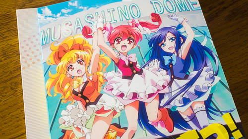

SHIROBAKO第3巻はスランプとそこから抜け出すというのが1つのテーマなのかなと思います。7,8話では絵麻の原画マンとしての苦悩が、9話は（次の10話とセットなのできりが悪いのですが）美沙の自分の将来についての悩みが描かれています。

「壁にぶち当たった時はちょっと引いてみて、周りを見渡してみたら？」っていうのが1ついえるのかなと思います。

次元は違うかもしれませんが、私もつい最近、絵を描いてて（落書きですけど）全体を描いてみたものの顔がおかしくて書き直すんだけど、書き直すたびにどんどん悪い方にいってしまって「うがーっ」ってなったのがタイムリーなところです。

第3巻はSHIROBAKOの中でもっとも見ていて辛いものがある巻だと思います。少なくとも私にとってはそうでした。

それは登場人物たちが壁にぶち当たって苦悩している姿が、過去の自分を思い起こさせてしまうからだと思います。ただその分、自分の内面に語りかけてくる内容だともいえるわけで。

ただし辛いだけではありません。そういう苦悩にぶち当たってもめげずに立ち向かい続ける彼女たちの姿は、応援したくなるし救いでもあります。これは私も負けてられないと思わせてくれます。

## たとえば絵麻の苦悩

上手く描けない、数をこなせない、筆が進まない。

そんな絵麻に杉江さんがアドバイスしますが、悪い方向に働いてしまって余計彼女を苦しませてしまうことに。

その後の絵麻と杉江さんの会話で、絵麻が刺々しかったのは「杉江さんのせいでこうなってしまった」っていう思いがあったらしく（ブックレットに書いてあったんだったかな？）、ちょっと共感できてしまいました。

そういえばテレビ放送で7話を見てた時、「余計なこというんじゃねえ」と思いながら見ていたのを思い出しました。当時は杉江さんが実はすごい人なんてこと分からなかったですし、そもそもアニメーターにスピードが要求されるというのがよく分かってなかった（今でも分かってませんけど）からだと思います。

思い出した繋がりで、他のみんなが遅くまでやってるのにいつもさっさと帰る杉江さんに対して「冷たいなぁ」って思ってたりもしてました。この考え自体が毒されてるせいなのかもしれないですけど。

## 杉江さんの気配り　ほうじ茶

杉江さんの心配りが素敵だなと思います。

いきなり話しかけるんじゃなくて、さり気なくほうじ茶飲むあたりがニクイ。これは職場で使えるテクニックかもしれません。

煮詰まってる人に話しかけても心ここにあらずで届かないでしょうし、イライラの矛先がこっち向いても悲しいですしね。

絵麻が「ほうじ茶」って気づいてしゃべらなくても、リラックスするきっかけになればいいですしね。視野狭窄になってしまっている絵麻の視界がひらけるきっかけになるだけでも儲けものですし。

絵麻が気づかなかったらどうするんだって話ですけど、それはそれで良かったのかもしれません。ただ飲みたかっただけかもしれませんしね。

## 杉江さんの気配り　井口さんに頼む

自分の言葉では届かないと思ったら切り口を変えるわけです。同じ女性で年齢もおそらく近いであろう井口さんの言葉ならきっと届くだろうっていう気配り。老獪です。

（井口さんのアドバイスの仕方もスマートかつかっこ良くて、この回くらいから井口さんへの好感度が急上昇した記憶があります）

オーディオコメンタリーでP.A.WORKSの堀川さんが

> 原画は自分はやったことないから自分の言葉では届かない。だから同じ原画をやっている人の他の人の言葉をストックして「◯◯さんはこう言ってた」という形でアドバイスする

とおっしゃってましたけど、それに通ずるところがあるのかなと思います。

最終的には絵麻のぶち当たってる壁は本人が何とかするしかない問題です。

自分だったら杉江さんのように気配りできるかなって思います。最初のアドバイスをするのはできるかもしれませんが、それも相手からの相談があってからのような気がします。ほうじ茶使うなんてもっての外でしょう（狙ってやったとは思えませんけども）。

しかしその後、絵麻からの刺のある拒絶を受けてまで気配りしようという気になるかといわれると難しい。きっと本人が何とかしなきゃいけない問題だからと、私ならそこで止まってしまうんだろうなと思います。そして悩みぬいた新人君が辞めていくわけですよね・・・あああ。

杉江さんの気配りとってもトラウマが掘り返される、SHIROBAKO恐ろしい。

## 一生懸命が空回り

ずかちゃん先輩の失敗シーンは見る度につらいものがあります。がんばってるのに空回りしてる姿が痛々しいっていうのもありますが、自分の体験がフラッシュバックしてくるってのもあるのかなと思っています。トラウマが抉られるようで辛い・・・。

空回りして失敗した後、落ち込むずかちゃん先輩を見るのも辛い。オーディオコメンタリーでどなたかおっしゃってたかと思いますが、「ひどい」っていうのはよく分かります。

そして、落ち込んでもめげないずかちゃん先輩の姿にちょっと励まされたりもするのです。

## OVAえくそだすっ！　1話について

SHIROBAKO第3巻は普段よりお値段が3000円程高いです。その理由は劇中劇の「えくそだすっ！」第1話が収録されているためです。

そんなもの作ってないで普段のお値段で収めてくださいよと思ってました。SHIROBAKO第7巻も劇中劇を収めるらしくて高くなってまして、SHIROBAKOのBlu-ray買うのに「うっ」とためらったのが正直なところでした。

でも実際に見てみたら思いの外面白くて悔しかったです。なんでトレイシーが警察から逃げてるのかその理由も分かりましたし。

けどやっぱり1話だけじゃ物足りない。物足りないですよ。

SHIROBAKOを見たいから買っているわけであって、劇中劇のために値段が高くなるのはなんか違う気がしなくもありません。かと言って劇中劇ついてるからって買わないという選択肢は、すでに1,2巻買ってるのに選ぶわけもなく。

もやっとしますが面白かったのは間違いない、でもやっぱりもやっとします。

ただ1つだけいえることは、ここまでスタッフロールを注視したアニメは他にないです。普段だとキャストと主題歌のクレジットくらいしかまともに見てないので、「あ、下柳さんの名前がある」とちょっとうれしくなるような見方をしたのは今回がはじめてです。
