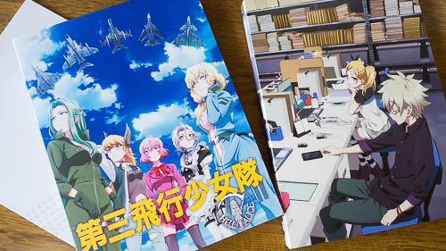

SHIROBAKO第7巻です。いよいよ残すところ後1巻になってしまいました。物語は佳境です。

個人的に一番衝撃だった、演出の円と制作進行の平岡との喧嘩騒ぎのシーンが収録されている巻になります。あの口論のシーンはなんとも真に迫った演技で、声優さんスゲーって思ってました。あの状況に普段どおり入っていけるタローの精神もスゲー。

演技がすごいといえば、その平岡から「女はいいよな」と嫌味をいわれた後のみどりが電車内でぶつぶついうシーンも好きです。

そんな嫌味はいうわ喧嘩はするわヤル気はないわの平岡ですが、私は嫌いじゃないです。最初の頃は「もっとヤル気出せよ、もっと協調しろよ」と気が気でなかったのですけどね。もっとも、実際にこんな人がいたら、私は宮森のように接することはできないと思いますけどね。

## 特典DVD　第三飛行少女隊

作詞のくまのきよみさんが、「私の名前がすごいことに」とつぶやかれてて、いったいどうなってんのかワクワクしながら見ました。クレジット見て納得しましたｗ

「あれでも、えくそだすの作詞もしてなかったっけ・・・？」と疑問に思って、えくそだすの特典DVDを引っ張り出してきました。EDの作詞をされていましたが、ムサニクレジットバージョンでは全部ひらがなであること以外に原型を留めてませんでした。なるほど、三女バージョンでびっくりされたのも頷けます。

ちなみにえくそだすを見返したことで、動画に久乃木の名前がクレジットされていることに気づきました。こんなところから久乃木出てたんだなって気づいてびっくりしました。

私の中で久乃木は後半からいきなり出てきた人だったので、えくそだすを見返したことによって、ちゃんと動画から原画に上がってきた子だったんだと分かりました。細かいところまで作りこんであるなとは思ってはいましたが、本当に細かい。三女のパッケージには「ウエスタンエンタテイメント」の文字が入っていて、こんなところまで芸が細かい。

## 特典DVDの是非

しかしこの特典DVD、クレジットを楽しむ以外の楽しみ方が私には分かりません。いえ、内容は面白いし、続きは見てみたいと思うんですよ。でもそれは特典としてついてるから見ているのであって、見たいから見てるわけではないんですよね。もしこれが3000円の別売りDVDだったら、果たして買っていたのかというとあやしいものがあります。

しかしだからといって、「余計なものつけて高くしてんじゃねえ」というわけでもありません。いや、普段より3000円余計に高いのはどうかと思ってはいますけども、だからといって不要だったとまで断じれるものではないと思います。

この特典DVDがあるからこそ、劇中のムサニメンバーがすったもんだの果てに作り上げた作品が見れて、それが感慨深いものとして見れるわけです。クレジットにムサニのメンバーの名前が出てきて、なんだかうれしくなるわけです。

でも諸手を上げて歓迎できるわけではない。なんかそんなモヤっと感があるんですよねえ。
