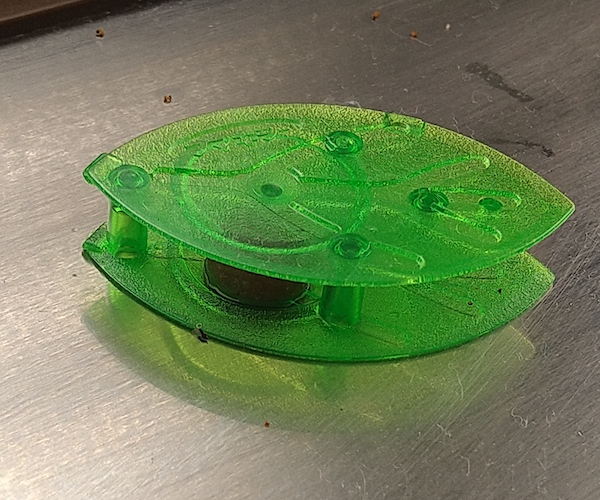
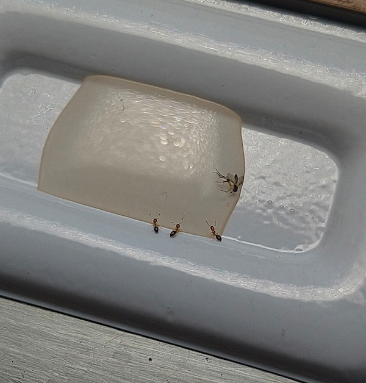
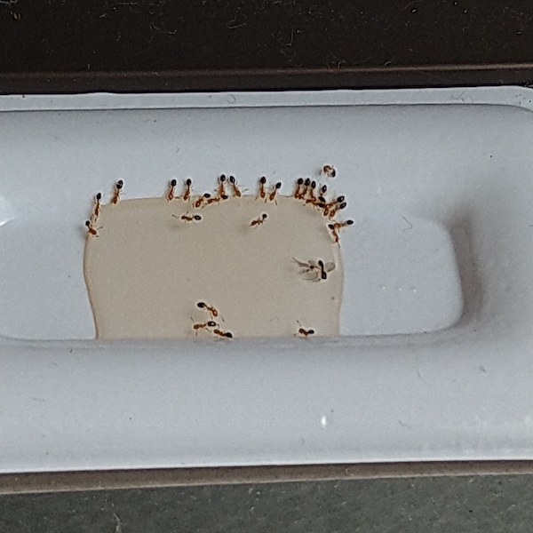

台所にアリが侵入してくる。古い家屋なので侵入経路はいくらでもあるのだろう。

固形タイプの蟻退治グッズを設置してみてもいっこうに見向きもされない。アリの駆除薬を設置してみるも効果がなかったので、お勧めされていたアリメツを使ってみることにした。

<!--more-->

## 侵入してくるアリ

非常に小型で、お腹だけ黒いアリ。ヒメアリというらしい。

確かに見た目はかわいい。これが屋外や飼育環境などであれば大変にかわいがっていただろう。屋外では小さすぎて気づかないだろうけれど。

これまでもちょくちょく見かけていて、その都度退治していた。去年とかも来ていたが、これほど継続的には出没しなかった。

ついには砂糖の容器に群がりだす始末。これは本格的に駆除しないとダメっぽい。

しかし近くのドラッグストアで売っていたアリの駆除薬をおいてみてもまるで寄り付かない。

そもそもヒメアリは対象外なのかもしれない。ヒメアリには大きすぎるとかかもしれない。ネットで調べてみると、こういった固形タイプの駆除薬をさらにすりつぶすとよいみたいなことが書いてあったが、そこまで試すのはちょっと手間である。

そうして調べていると、ヒメアリには液体タイプの駆除薬がよいという情報を見つけた。アリメツという駆除薬が効果抜群とのこと。価格も大したことがないので、とりあえず試してみた。

## アリメツ設置後

設置してみるとしっかり食いついている。

付属のトレーに垂らして設置するだけなので、以前使っていた駆除薬と比較してアリの様子が見やすくてよい。

ぱっと見るとまるでアリが溺れているようにも見えるが、アリメツの上を歩き回る様子も見られる。どうも液体というよりはゼリーのようなものに近いのだろう。固形のものに比べて食べやすいのか、それとも味が好みなのかは分からないが、一心不乱に蜜を吸っているようだ。

それから半日ほどたつと餌の在り処が伝わったのか、徐々に侵入してくるアリが増えてくる。そうなってくるとアリの侵入経路がよく分かるようになる。侵入経路がわかったら、経路の近くにアリメツを動かして1日目は終了した。

2日目になるとたかっているアリの数がぐんと増えた。

アリの隊列もしっかり確認できる。サッシとリフォームした壁の間から湧いて出てくる。

## 即効性はない

2日たっても続々と後続がやってきている。いい感じのおいしいものがあるぞというのが巣に伝わって、回収班がやってきているようだ。

この様子から分かる通り即効性はない。アリメツを設置してからもしばらくはアリがやってくる。というかむしろ明らかにやってくる数が増える。

しかしその行列はあっちこっちにフラフラするのではなく、明確にアリメツに向かってやってくる。アリメツを侵入経路のすぐ近くに設置すれば、以前までのようにアリが無秩序に歩き回ることはなくなる。アリメツにはたかってくるが、それを部屋の隅においていれば影響は軽微にできると思う。

Amazonのレビューを見ていて気になったのが、別のアリを呼び寄せて余計に悪化したというレビューだ。それは私も少し心配していたが、いまのところ来るのはヒメアリだけだ。うちの場合はたまたま他のアリが通れるほど侵入口が広くないからこうなっているだけかもしれない。

他のアリまで呼び寄せる可能性はあるのかもしれないが、屋内のいたるところに進軍されるよりは集まってくる場所を限定できるという意味でやってみる価値はあるだろう。

一心不乱にアリメツにたかっているアリを見ると少し可哀想な気もするが、家の中に侵入されるのを放置するわけにもいかないので仕方がない。ヒメアリに困っている人は試してみてはいかがだろうか。