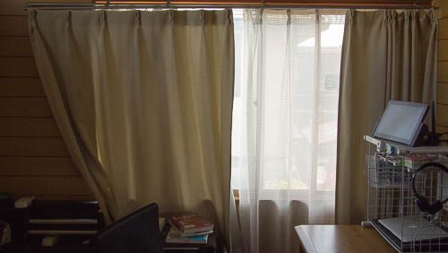
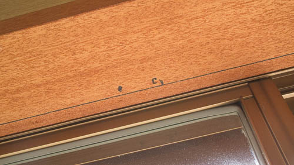
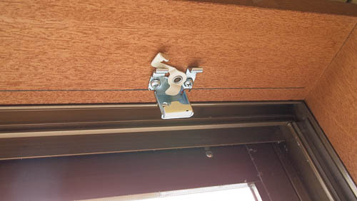
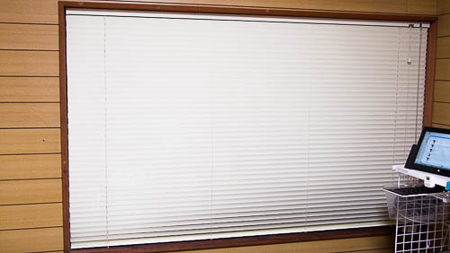

私の部屋のカーテンがですね、こう、部屋にせり出してきていてものすごく邪魔だったんです。

部屋にせり出しているものだから、模様替えの際に窓周辺のスペースを上手く活用することができないのが不満です。

それにカーテンの左側はベッドがあったりするので、思うように開け閉めできません。そのため左側は年中閉めている状態です。これもまた忌々しく感じていました。

カーテンをコンパクトなものに変えようか。いや、いっそのことカーテン取り外してフルオープンにするのはどうだろうか。いろいろ考えました。

さすがにフルオープンは恥ずかしいので他の選択肢を探していたところブラインドに行き着いたのです。しかも都合のいいことに、窓枠のサイズにピッタリの既成品があったのです。幅165cm、高さ98cm、びっくりするくらいにピッタリです。

即座にポチりました。

## 早速取り付け

それからというもの、ブラインドが届くのを心待ちにしておりました。届いたので早速取り付けです。

窓枠に収まるか改めて確認してみると見事にピッタリです。

ブラインドの取り付け位置は、私は窓枠上部に木ネジで固定することにしました。（他にも横付けが可能ですし、カーテンレールに取り付けるための金具もついているので、柔軟な取り付けが可能だと思います）

窓枠に線を引いて、金具の取り付け位置のガイドを用意します。ブラインドをあてがった状態で線を引くのが一番確実ですが、私は作業時には1人でしたので、ものさしを使って直線を引きました。重力に逆らいながらの作業でちょっとしんどいです。

固定用の金具を取り付ける位置も一緒にマーキングします。この際注意しないといけないのが、金具の取り付け位置をどこにするかということです。ブラインドのレール内に紐を格納するための小さなボックスがあるのですが、これに当たらない場所にしなければなりません。かつ、ある程度均等な間隔を空けて取り付ける必要があります。

金具を取り付ける前に、ボックスと金具が干渉しない位置になっているかどうか確認するのが大事です。私は単に数値上均等に割り振って取り付けた後に、ボックスに金具が干渉してしまっていることに気づいて付け直す羽目になりました・・・。

この金具を4箇所取り付けて、ブラインドの設置が完了しました。一人でやって大体1時間くらいかかりました。（カーテンの取り外しなども含めた時間）

ブラインドのレールが結構重いので、2人で作業した方がいいと思いますが、1人で設置できなくもないです。ただ165cmより大きいサイズだったり、部屋の天井付近に取り付ける場合だったりすると、1人でやるのは無理があると思います。

## 快適になった

まるで別の部屋のようにスッキリしました。

カーテンからブラインドに変えたことによって、断熱効果が若干心配ではあります。冬は窓からの冷気が厳しくなるのかなぁ・・・と、その点はちょっと心配です。

しかしそれを差し引いても、カーテンがなくなったことによって部屋がかなり広く感じられます。これは想像以上に快適で、一人でニマニマしているところです。

## さすがにカーテンと比べると寒くなった

さすがにカーテンと比べると、窓側からやってくる冷気が気になります。

<a href="https://wantit.gcreate.jp/sukimakaze-taisaku/" title="手軽に試せるお部屋の隙間風対策グッズを使ってみた感想">ホームセンターで売っている隙間風対策グッズを使って対策してみた</a>ら、かなり窓からくる冷気が抑えられました。「ブラインド良さそうだけど寒いんでしょ？」という方は参考にしてみてください。
