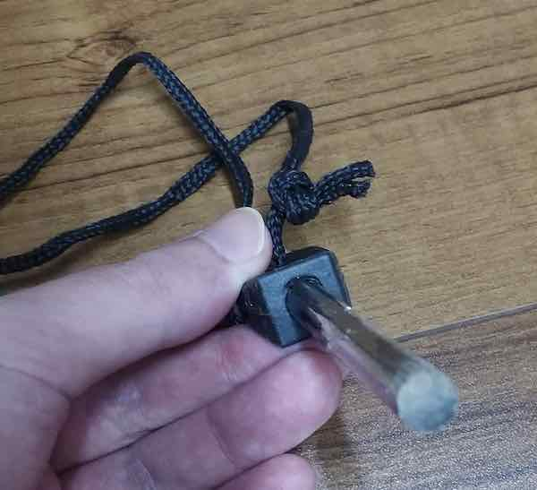
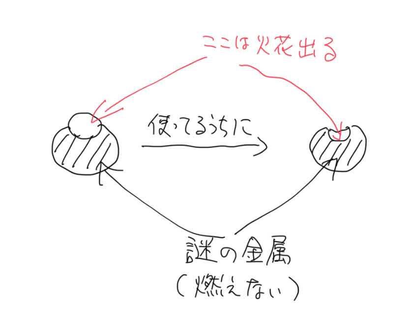

なんちゃって薪ストーブを作成する参考にYouTubeで動画を見ていると、自然とアウトドア系の動画をみるようになった。火をつけるのにファイアスターターを使っている動画をちらほらみかけて、どうせなら自分もやってみたいと買ってみた。

<!--more-->

## 安かろう悪かろう

送料込みで500円程度だったのだが、完全に安かろう悪かろうの製品だった。何がダメだったかと言うと、火花が出る部分がものすごい限定的なのである。

これは使用して2日の状態であるが、すでに火花の出る部分がかなりすり減って、周りの謎の金属の部分に引っかかってストライカーがうまく擦れなくなってきている。

写真だとわかりにくいだろうから、雑ではあるがイラストで補足してみる。

私はファイアスターターの構造に詳しくないので、こういう形が一般的なのかもしれない。しかしこういう形をしているものは周りの金属を削り、それに火花を着火させて点火させる構造なのではないだろうか。

しかしこの製品の周りの金属は、謎の金属である。少なくともマグネシウムではありえない。だって火がつかないもの。

中華製のファイアスターターの比較動画があったので参考に。私の買ったやつも、形は違えどまったくこれと同じである。



## 着火はできるよ

一応火花の出る細い丸棒の部分をこすりさえすれば火花は出る。実際その火花で着火することはできた。

しかしながら、火花の出る部分はすでにだいぶすり減り、周りの謎金属に引っかかってこすりづらくなっている。不良品め。

楽天で星1レビュー送っておいたが、きっと反映されないんだろうなぁと思ってここに供養することにした。

周りの謎金属が本当に謎でな・・・これなんなんだろう。削りたくても硬いからなかなか削れないし、削ったところで着火の役にはまるで立たないし。

火花の出る細い部分が唯一マグネシウムなんだと思う。この部分を露出させたいが、手で削るのは大変な気がする。かと言って金ヤスリで削ると火花が出そうだし。ほんとどうしたらいいんだろうね、これ。

まあちょっと使ってみたかっただけではあるので、今回は勉強代ということで特にダメージはないけれど、買ってはいかんぞという警告を込めてここに供養することにした。この商品写真見ると、全体がマグネシウムだと思うじゃんね？