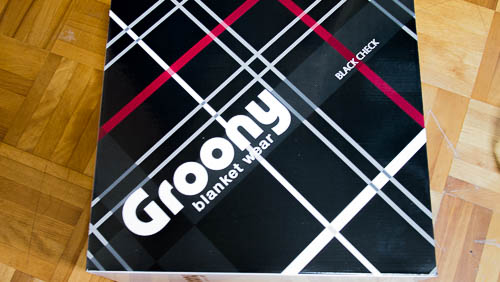
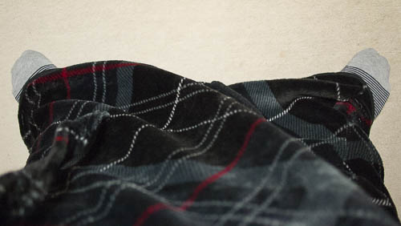
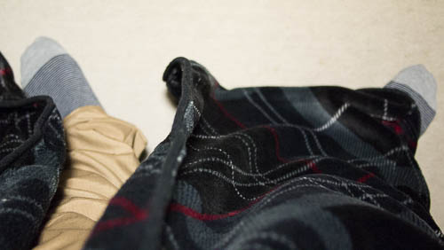
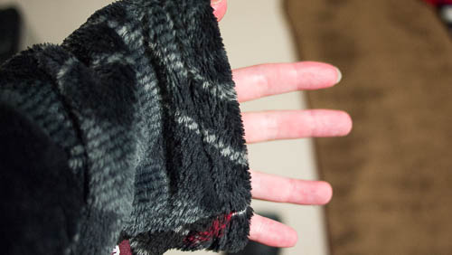

寒くなってきてから、部屋でパソコン作業していると体調を崩してしまいます。

窓の隙間を埋めてみたりしたものの、部屋自体が寒いのはどうしようもありません。

部屋が寒いからといってファンヒーターをつけると、今度は空気が悪くなってきてこれまた体調を崩してしまいます。

そこで目をつけたのが着る毛布です。

毛布を被って暖かくしていれば、ファンヒーターを使わずとも寒い部屋で活動できるのではと考えたのです。

## 着る毛布というより、フワモコなバスローブ

こんな箱に入って届きました。

私が買ったのはロング丈で、長さが170cmあります。

足元はこんな感じになります。

この状態で歩きまわるのはちょっと大変です。裾を踏んづけて転けそうになります。

ちなみに着る毛布というより、ふわふわもこもこした暖かいバスローブという感じの作りです。足元は特に何かで固定しているわけではなく、単に重ねて羽織っているだけの状態です。

袖が通せて、首元にボタンでとめるところが1箇所あるだけです。後は腰紐を使って固定するだけのシンプルな作りです。

ただ、腰紐は着る毛布の外側に一本通っているだけなので、毛布の内側に結びつけてはだけにくくするような作りにはなっていません。

生地は想像していたより薄いのですが、ふわふわモコモコしていてとても暖かいです。

肌触りは滑らかで、静電気防止を歌っているだけあって、糸くずがそこら中にくっつくというようなことがないです。

## とても暖かい、上半身はね

装着するととても暖かいです。特に背中辺りがぬくぬくとして、いい感じに眠くなってきます。

袖が長くて手の甲あたりまでカバーしています。常に萌え袖状態です。

指先はマウス操作などで露出してしまいますが、ちょっと冷たくなってきたら袖の中に引っ込めて暖を取ればいいだけなので、そこまで指先が冷たくて辛いとは思いませんでした。

首元はボタンを止めただけでは寒いですが、襟の部分を重ねて首周りに巻きつけておけば充分暖かいです。

そんな感じで上半身に関してはいい感じに温めてくれてます。

しかし、足元に関してはてんでダメです。椅子に座っていると膝から下あたり（脛の辺り）は寒いです。紐か何かで足元の生地を巻きつければ暖かくはなりますが、固定する紐は標準ではついていません。

ソファに寝転がっている状態などであれば足もカバーできるでしょうが、椅子に座った状態だと厳しいものがあります。

何か固定するものがついていればよかったんですけどね・・・。

私の場合足元はミニホットカーペットを敷いているので、脛の辺りが寒いだけですんでいますが、この着る毛布だけでは足元が寒いということは覚悟しておく必要があると思います。

レッグウォーマーなどを併用しなければ辛いと思います。

## 概ね満足

椅子に座って使う場合は、足元を温めるために別途対策が必要にはなりますが、概ね満足です。

この着る毛布を着ていれば、ファンヒーターを使わなくても寒い部屋の中でのパソコン作業ができそうです。エコかつ換気の必要性もないので、理想的かもしれません。

もうちょっと足元への気配りがあれば最高だったんですけどね。

それでも着ているとあったかくて、ついついウトウトと眠たくなってくるくらい、防寒具としては活躍してくれます。

ただ、生地は軽めと言っても大きいので、ずっと着ていると肩が凝ってくるので注意が必要かもしれません。

  